# Understanding SIFT: Scale-Invariant Feature Transform

*A comprehensive guide to implementing SIFT from scratch*

---

The **Scale-Invariant Feature Transform (SIFT)** is one of the most influential algorithms in computer vision. Introduced by David Lowe in 2004, SIFT detects and describes local features in images that remain stable across changes in scale, rotation, and illumination.

This article walks through the complete SIFT pipeline, from mathematical foundations to practical implementation.

---

## Table of Contents

1. [Overview](#1-overview)
   - [1.1 What is SIFT?](#11-what-is-sift)
   - [1.2 What is a Keypoint?](#12-what-is-a-keypoint)
   - [1.3 Why SIFT?](#13-why-sift)
   - [1.4 Input Image](#14-input-image-used-in-this-tutorial)
   - [1.5 Pipeline Summary](#15-sift-pipeline-summary)
2. [Detection Phase](#2-detection-phase)
   - [2.1 Gaussian Scale-Space Pyramid](#21-gaussian-scale-space-pyramid)
   - [2.2 Difference of Gaussians (DoG)](#22-difference-of-gaussians-dog)
   - [2.3 Keypoint Detection](#23-keypoint-detection)
   - [2.4 Keypoint Filtering & Refinement](#24-keypoint-filtering--refinement)
3. [Description Phase](#3-description-phase)
   - [3.1 Description Phase Overview](#31-description-phase-overview)
   - [3.2 Orientation Assignment](#32-orientation-assignment)
   - [3.3 Descriptor Extraction](#33-descriptor-extraction)
4. [Summary](#4-summary)
   - [4.1 Complete Pipeline](#41-complete-sift-pipeline)
   - [4.2 Quick Reference: All Formulas](#42-quick-reference-all-formulas)
   - [4.3 Key Properties](#43-key-properties)
   - [4.4 What's Next? Matching](#44-whats-next-matching-descriptors)
5. [Common Mistakes & FAQ](#5-common-mistakes--faq)
6. [References](#6-references)

---

## 1. Overview

### 1.1 What is SIFT?

**SIFT (Scale-Invariant Feature Transform)** finds and describes unique "interest points" in an image that can be recognized even when the image is:
- **Scaled** (zoomed in/out)
- **Rotated**
- **Partially occluded**
- **Under different lighting**

> **Real-World Analogy**: Think of SIFT like finding distinctive landmarks in a city. If you take photos of the Eiffel Tower from different distances, angles, and lighting conditions, you can still recognize it. SIFT does the same thing automatically for any image.

### 1.2 What is a Keypoint?

A **keypoint** is a distinctive location in an image - typically corners, blobs, or edge junctions that are easy to find again in other images.

```
Example: Keypoint locations in an image
┌────────────────────────────────┐
│       ●                        │   ● = keypoint (corner of building)
│           ●                    │   ● = keypoint (window corner)
│                    ●           │   ● = keypoint (texture blob)
│   ●                            │
│              ●         ●       │
└────────────────────────────────┘

Each keypoint has:
  - Position (x, y)
  - Scale (σ) - size of the feature
  - Orientation (θ) - dominant direction
  - Descriptor - 128 numbers describing appearance
```

### 1.3 Why SIFT?

| Problem | How SIFT Solves It |
|---------|-------------------|
| Object at different distances | Multi-scale pyramid detects features at any size |
| Object rotated | Orientation assignment makes descriptors rotation-invariant |
| Different lighting | Gradient-based descriptors ignore absolute brightness |
| Partial occlusion | Local features can match even if object is partially hidden |

### 1.4 Input Image Used in This Tutorial

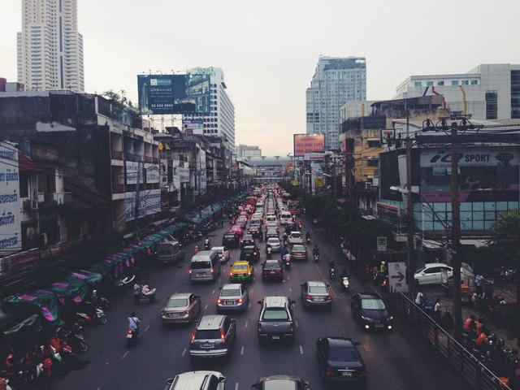

### 1.5 SIFT Pipeline Summary

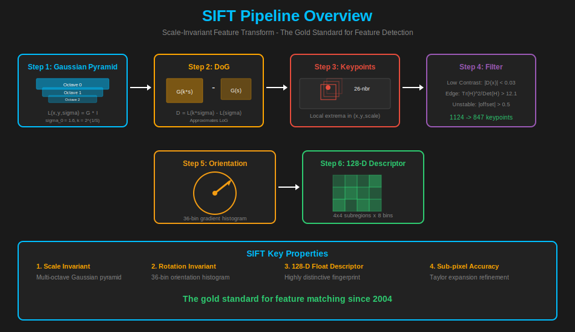

SIFT operates in two main phases:

| Phase | Step | Description | Math |
|-------|------|-------------|------|
| Detection | 2.1 | Gaussian pyramid | `L(x,y,σ) = G(x,y,σ) * I(x,y)` |
| Detection | 2.2 | DoG | `D = L(kσ) - L(σ)` |
| Detection | 2.3 | Keypoint detection | 26-neighbor extrema |
| Detection | 2.4 | Refinement & Filtering | Taylor expansion + edge removal |
| Description | 3.1 | Overview | Phase summary |
| Description | 3.2 | Orientation | 36-bin histogram |
| Description | 3.3 | Descriptor | 128-D |

---

<div align="center">


### **Find WHERE the keypoints are in the image**

`Gaussian Pyramid` | `DoG` | `Keypoint Detection` | `Filtering`

</div>

---

## 2. Detection Phase

**Goal**: Find stable, repeatable keypoints in the image that can be detected regardless of scale, rotation, or illumination changes.

```
INPUT: Image (H × W)
        ↓
Step 2.1: Build Gaussian Scale-Space Pyramid
        ↓
Step 2.2: Compute Difference of Gaussians (DoG)
        ↓
Step 2.3: Detect Keypoints (26-neighbor extrema)
        ↓
Step 2.4: Filter & Refine Keypoints
        - Remove low contrast keypoints (noise-sensitive)
        - Remove edge keypoints (poorly localized)
        - Remove unstable keypoints (offset > 0.5 pixel)
        ↓
OUTPUT: Stable keypoints with (x, y, scale)
```

*Example: For a 640×480 image, detection might find 1124 candidates, filtering keeps ~847 stable keypoints.*

---

## 2.1 Gaussian Scale-Space Pyramid

**Why do we need this?** To detect features at any scale, we must analyze the image at multiple resolutions.

> **Intuition**: Imagine looking at a building from far away vs. up close. From far away, you see the whole building shape. Up close, you see window details. SIFT looks at the image at multiple "distances" (scales) to find features of all sizes.

```
┌─────────────────────────────────────────────────────────────┐
│  INTUITION: Why Multiple Scales?                            │
├─────────────────────────────────────────────────────────────┤
│                                                             │
│  Original Image     Blurred (small σ)    Blurred (large σ) │
│  ┌───────────┐      ┌───────────┐        ┌───────────┐     │
│  │ ▓▓▓░░▓▓▓ │      │ ▒▒▒░░▒▒▒ │        │ ░░░░░░░░░ │     │
│  │ ▓▓▓░░▓▓▓ │  →   │ ▒▒▒░░▒▒▒ │   →    │ ░░░░░░░░░ │     │
│  │ ░░░░░░░░░ │      │ ░░░░░░░░░ │        │ ░░░░░░░░░ │     │
│  └───────────┘      └───────────┘        └───────────┘     │
│                                                             │
│  Fine details        Medium details      Only large shapes  │
│  visible             visible             visible            │
└─────────────────────────────────────────────────────────────┘
```

### 2.1.1 The Mathematics

The scale-space representation is created by convolving the image with Gaussian kernels of increasing width:

**Scale-Space Equation:**
```
L(x,y,σ) = G(x,y,σ) * I(x,y)
```

**2D Gaussian Kernel:**
```
G(x,y,σ) = 1/(2πσ²) × exp(-(x² + y²)/(2σ²))
```

**Scale Levels within Each Octave:**
```
σ(s) = σ₀ × k^s

where:
  σ₀ = 1.6 (initial scale)
  k = 2^(1/S)  where S = number of scales per octave (typically 3)
  s = 0, 1, 2, ..., S+2
```

**Example Calculation (S=3, σ₀=1.6):**
```
k = 2^(1/3) = 1.2599

Scale 0: σ = 1.6 × 1.2599⁰ = 1.600
Scale 1: σ = 1.6 × 1.2599¹ = 2.016
Scale 2: σ = 1.6 × 1.2599² = 2.539
Scale 3: σ = 1.6 × 1.2599³ = 3.200
Scale 4: σ = 1.6 × 1.2599⁴ = 4.032
```

**Variables:**
| Symbol | Meaning |
|--------|---------|
| `L(x,y,σ)` | Scale-space representation at scale σ |
| `G(x,y,σ)` | 2D Gaussian kernel with standard deviation σ |
| `I(x,y)` | Input image intensity at pixel (x,y) |
| `σ` | Scale parameter (blur level) |
| `*` | Convolution operation |

### 2.1.2 Pyramid Structure

```
OCTAVE 0 (H×W):      G(σ₀) → G(σ₁) → G(σ₂) → G(σ₃) → G(σ₄)
    ↓ downsample
OCTAVE 1 (H/2×W/2):  G(σ₀) → G(σ₁) → G(σ₂) → G(σ₃) → G(σ₄)
    ↓ downsample
OCTAVE 2 (H/4×W/4):  G(σ₀) → G(σ₁) → G(σ₂) → G(σ₃) → G(σ₄)
```

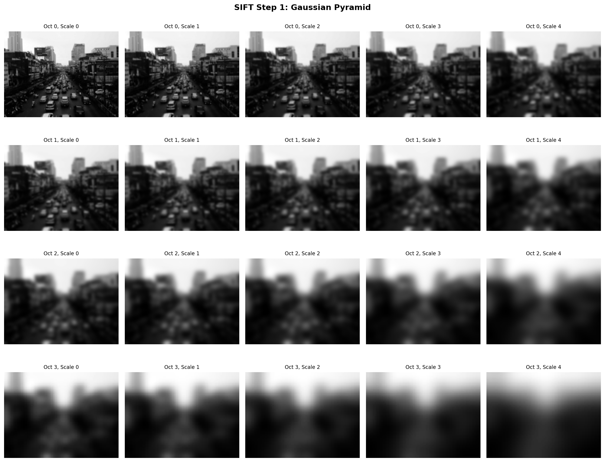

> **Key Takeaway**: The Gaussian pyramid gives us the same image at different blur levels. More blur = larger features visible, small details gone.

---

## 2.2 Difference of Gaussians (DoG)

**Why DoG?** The Difference of Gaussians approximates the Laplacian of Gaussian, which is an excellent blob detector.

> **Intuition**: By subtracting two blurred images, we highlight the features that exist at one scale but not another. This is like asking "what changed when I blurred the image more?" The answer: features of a specific size disappeared!

```
┌─────────────────────────────────────────────────────────────┐
│  INTUITION: What Does Subtraction Show?                     │
├─────────────────────────────────────────────────────────────┤
│                                                             │
│    G(σ₁)          -        G(σ₂)         =       DoG        │
│  ┌─────────┐            ┌─────────┐           ┌─────────┐   │
│  │●●●░░░░░░│            │○○○░░░░░░│           │■■■░░░░░░│   │
│  │●●●░░░░░░│     -      │○○○░░░░░░│     =     │■■■░░░░░░│   │
│  │░░░░░░░░░│            │░░░░░░░░░│           │░░░░░░░░░│   │
│  └─────────┘            └─────────┘           └─────────┘   │
│                                                             │
│  Less blur             More blur              Shows where   │
│  (fine details)        (details gone)         details were! │
└─────────────────────────────────────────────────────────────┘
```

### 2.2.1 The Mathematics

**Difference of Gaussians Definition:**
```
D(x,y,σ) = L(x,y,kσ) - L(x,y,σ)
```

**Why DoG Approximates Laplacian of Gaussian (LoG):**
```
∇²G = ∂²G/∂x² + ∂²G/∂y²    (Laplacian of Gaussian)

DoG ≈ (k-1) × σ² × ∇²G * I

where k = 2^(1/S) ≈ 1.26 for S=3
```

**Mathematical Derivation:**
```
Using heat diffusion equation:
  ∂G/∂σ = σ × ∇²G

Therefore:
  G(x,y,kσ) - G(x,y,σ) ≈ (k-1) × σ × ∂G/∂σ
                        = (k-1) × σ² × ∇²G

DoG(x,y,σ) = L(x,y,kσ) - L(x,y,σ)
           = [G(x,y,kσ) - G(x,y,σ)] * I(x,y)
           ≈ (k-1) × σ² × ∇²G * I
```

**Blob Detection Property:**
```
LoG response is maximum when blob radius ≈ √2 × σ

For a blob of radius r:
  Optimal detection scale: σ = r/√2
```

### 2.2.2 DoG Computation

```
Gaussian Images:    G(σ₀)  G(σ₁)  G(σ₂)  G(σ₃)  G(σ₄)
                      ↓      ↓      ↓      ↓
DoG Images:         DoG₀   DoG₁   DoG₂   DoG₃
                    (σ₁-σ₀) (σ₂-σ₁) (σ₃-σ₂) (σ₄-σ₃)
```

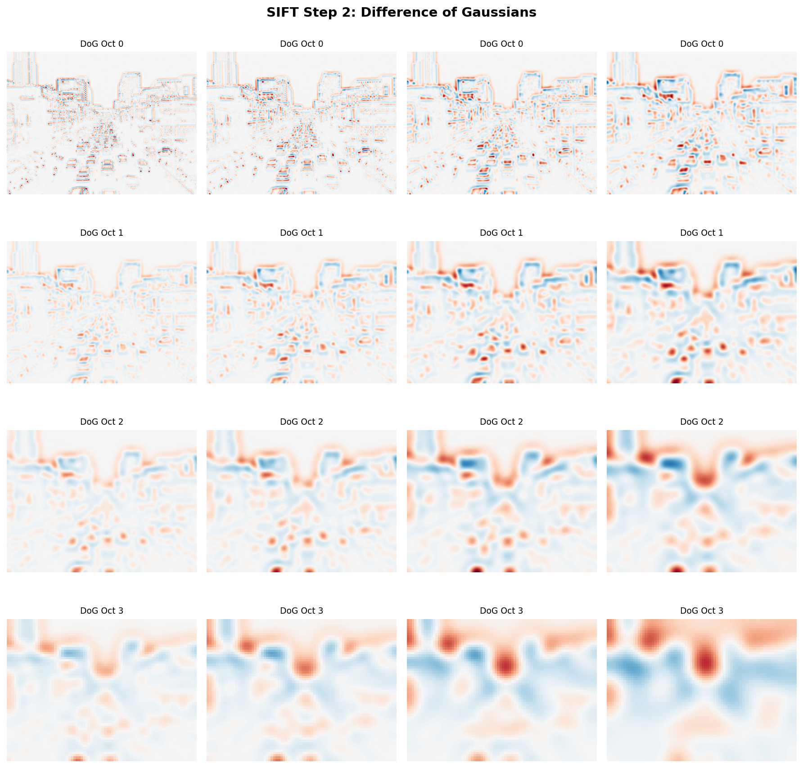

> **Key Takeaway**: DoG highlights blob-like features. Bright spots in DoG = features at that scale. Dark spots = features too (inverted blobs).

---

## 2.3 Keypoint Detection

Keypoint detection uses **26-neighbor comparison** across three consecutive DoG images.

> **Intuition**: A keypoint is a "peak" in 3D space (x, y, scale). We want to find pixels that are the maximum (or minimum) compared to ALL their neighbors - both spatially (left, right, up, down) and across scales (above, below in the pyramid).

```
┌─────────────────────────────────────────────────────────────┐
│  INTUITION: Finding Peaks in 3D                             │
├─────────────────────────────────────────────────────────────┤
│                                                             │
│  Think of it like finding mountain peaks on a 3D map:       │
│                                                             │
│        Scale σ+1    ░░░░░░░░░                              │
│                    ░░░░░░░░░                                │
│        Scale σ     ░░░█░░░░░  ← Peak! Higher than all      │
│                    ░░░░░░░░░     26 surrounding points      │
│        Scale σ-1   ░░░░░░░░░                                │
│                    ░░░░░░░░░                                │
│                                                             │
│  █ = candidate keypoint (must be max/min in all directions) │
└─────────────────────────────────────────────────────────────┘
```

### 2.3.1 Three DoG Scales

We need three consecutive DoG images for scale-space extrema detection:

```
Why 3 consecutive DoG images?
  - To find local extrema in scale-space
  - Compare pixel at scale σ with neighbors at scales σ-1 and σ+1
  - Only middle DoG levels can be checked (first and last have no neighbors)

For S=3 scales per octave:
  DoG levels: DoG₀, DoG₁, DoG₂, DoG₃ (4 DoG images)
  Checkable:  DoG₁, DoG₂ (2 middle levels only)
```

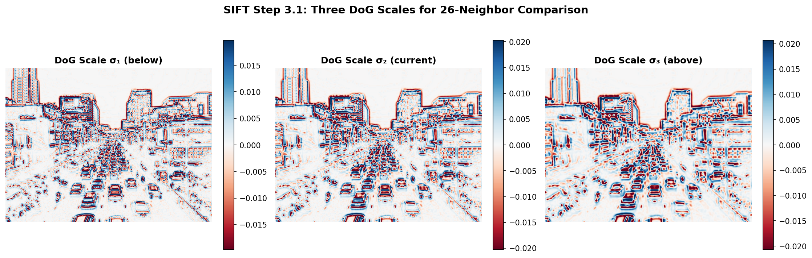

### 2.3.2 Understanding the 26 Neighbors

For each pixel, we compare against **26 neighbors**:
- 9 at scale σ-1 (including pixel directly below)
- 8 at scale σ (same scale, exclude center)
- 9 at scale σ+1 (including pixel directly above)

```
    SCALE σ-1 (below)        SCALE σ (current)        SCALE σ+1 (above)
    ┌───┬───┬───┐            ┌───┬───┬───┐            ┌───┬───┬───┐
    │ 1 │ 2 │ 3 │            │10 │11 │12 │            │19 │20 │21 │
    ├───┼───┼───┤            ├───┼───┼───┤            ├───┼───┼───┤
    │ 4 │ 5 │ 6 │            │13 │ ★ │14 │            │22 │23 │24 │
    ├───┼───┼───┤            ├───┼───┼───┤            ├───┼───┼───┤
    │ 7 │ 8 │ 9 │            │15 │16 │17 │            │25 │26 │27 │
    └───┴───┴───┘            └───┴───┴───┘            └───┴───┴───┘
      9 neighbors            8 neighbors + ★           9 neighbors

    Total: 9 + 8 + 9 = 26 neighbors
```

**Mathematical Extrema Condition:**
```
For pixel p at position (x, y, σ):

Local Maximum if:
  D(x,y,σ) > D(x+i, y+j, σ+k)  for all (i,j,k) ∈ N₂₆
  where N₂₆ = {(i,j,k) : i,j ∈ {-1,0,1}, k ∈ {-1,0,1}, (i,j,k) ≠ (0,0,0)}

Local Minimum if:
  D(x,y,σ) < D(x+i, y+j, σ+k)  for all (i,j,k) ∈ N₂₆

Both maxima and minima are valid keypoint candidates.
```

**Example: Detecting a Maximum:**
```
DoG values at scale σ-1:           DoG values at scale σ:
┌──────┬──────┬──────┐             ┌──────┬──────┬──────┐
│  45  │  52  │  48  │             │  55  │  62  │  58  │
├──────┼──────┼──────┤             ├──────┼──────┼──────┤
│  50  │  58  │  53  │             │  60  │ [85] │  65  │  ← center = 85
├──────┼──────┼──────┤             ├──────┼──────┼──────┤
│  47  │  54  │  49  │             │  57  │  64  │  59  │
└──────┴──────┴──────┘             └──────┴──────┴──────┘

DoG values at scale σ+1:
┌──────┬──────┬──────┐
│  40  │  48  │  44  │
├──────┼──────┼──────┤
│  46  │  54  │  50  │
├──────┼──────┼──────┤
│  42  │  50  │  46  │
└──────┴──────┴──────┘

Check: 85 > max(45,52,48,50,58,53,47,54,49) = 58? YES
       85 > max(55,62,58,60,65,57,64,59) = 65? YES
       85 > max(40,48,44,46,54,50,42,50,46) = 54? YES

Result: 85 > ALL 26 neighbors → KEYPOINT DETECTED!
```

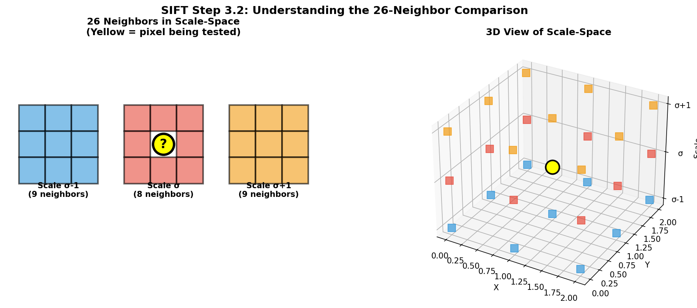

### 2.3.3 Multi-Octave Processing

The process repeats at multiple octaves (resolutions):

| Octave | Resolution | Processing |
|--------|------------|------------|
| 0 | H × W | Full resolution keypoints |
| 1 | H/2 × W/2 | Half resolution, scaled back 2× |
| 2 | H/4 × W/4 | Quarter resolution, scaled back 4× |

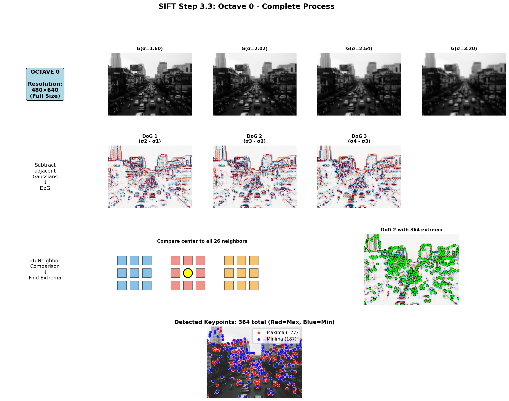

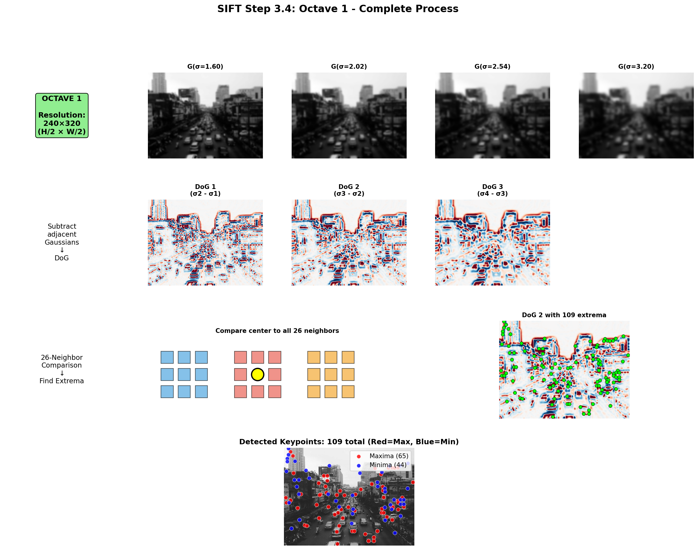

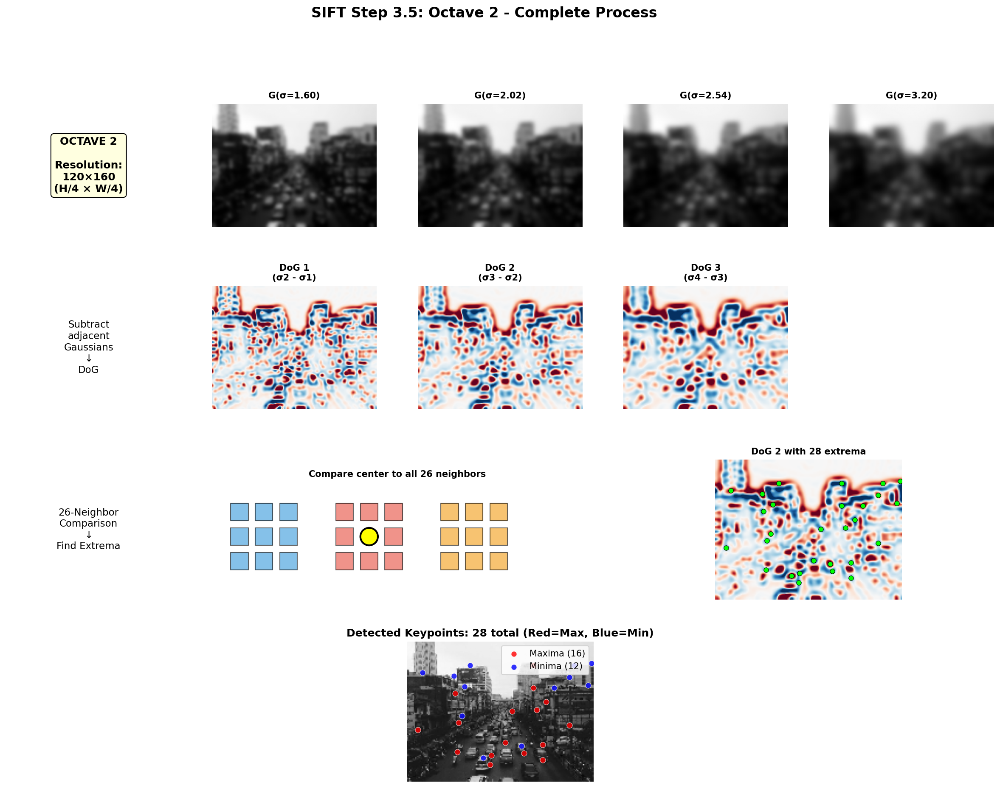

### 2.3.4 Complete Pyramid Structure

```
OCTAVE 0 (H×W):      G(σ₁) → G(σ₂) → G(σ₃) → G(σ₄)  →  DoG → 26-nbr → KP
    ↓ downsample
OCTAVE 1 (H/2×W/2):  G(σ₁) → G(σ₂) → G(σ₃) → G(σ₄)  →  DoG → 26-nbr → KP
    ↓ downsample
OCTAVE 2 (H/4×W/4):  G(σ₁) → G(σ₂) → G(σ₃) → G(σ₄)  →  DoG → 26-nbr → KP
```

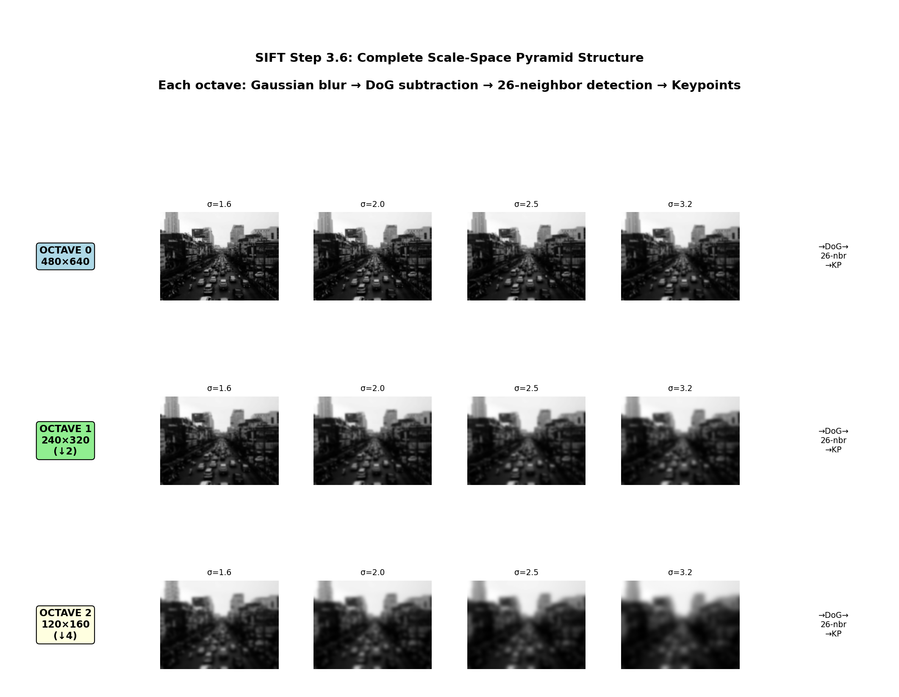

### 2.3.5 Combining Keypoints from All Octaves

Keypoints from different octaves must be scaled back to the original image coordinates.

**Coordinate Transformation Mathematics:**
```
For octave o:
  Image resolution: (H/2^o) × (W/2^o)
  Scale factor: 2^o
  
  Keypoint in octave coordinates: (x_oct, y_oct, σ_oct)
  Keypoint in original coordinates: (x, y, σ)
  
  x = x_oct × 2^o
  y = y_oct × 2^o
  σ = σ_oct × 2^o
```

| Octave | Resolution | Scale Factor | Coordinate Transform |
|--------|------------|--------------|---------------------|
| 0 | H × W | 2⁰ = 1 | (x, y) → (x, y) |
| 1 | H/2 × W/2 | 2¹ = 2 | (x, y) → (x×2, y×2) |
| 2 | H/4 × W/4 | 2² = 4 | (x, y) → (x×4, y×4) |
| n | H/2ⁿ × W/2ⁿ | 2ⁿ | (x, y) → (x×2ⁿ, y×2ⁿ) |

**Example: Keypoint at (25, 30) in Octave 2:**
```
Octave 2 resolution: 160×120 (from 640×480 original)
Scale factor: 2² = 4

Original coordinates:
  x_original = 25 × 4 = 100
  y_original = 30 × 4 = 120

If σ_oct = 2.0 in octave 2:
  σ_original = 2.0 × 4 = 8.0
```

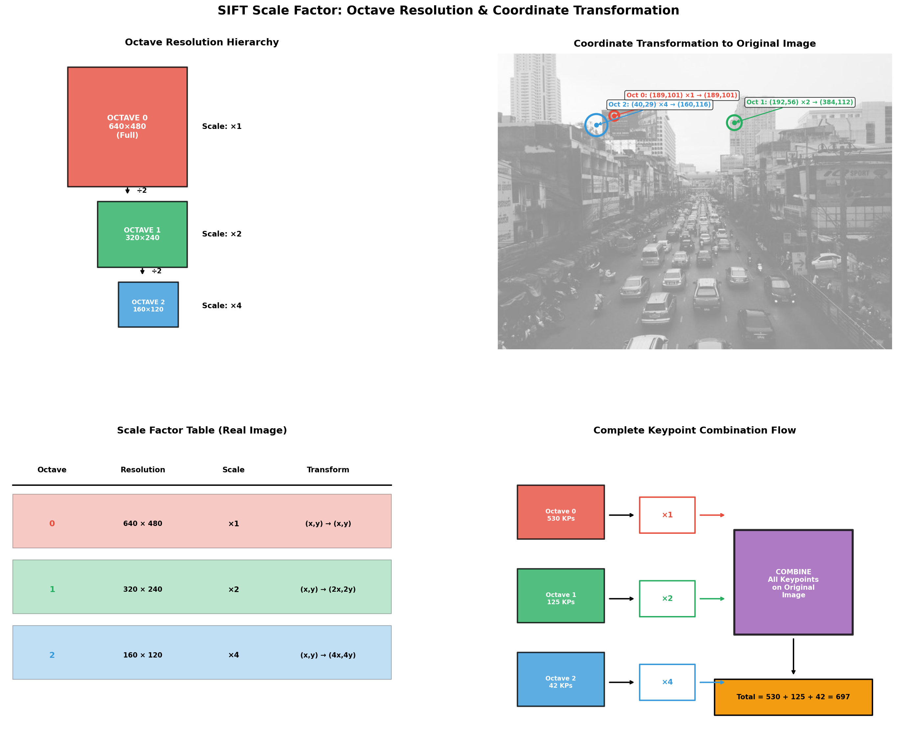

### 2.3.6 Pseudocode

```python
# Octave 0: no scaling
kp0 = detect_keypoints(gray)  # [(x, y, type), ...]

# Octave 1: scale by 2
gray1 = gray[::2, ::2]  # Downsample
kp1_local = detect_keypoints(gray1)
kp1 = [(x*2, y*2, t) for x, y, t in kp1_local]  # Scale back

# Octave 2: scale by 4
gray2 = gray[::4, ::4]  # Downsample
kp2_local = detect_keypoints(gray2)
kp2 = [(x*4, y*4, t) for x, y, t in kp2_local]  # Scale back

# Combine all
all_keypoints = kp0 + kp1 + kp2
```

### 2.3.7 All Octaves Combined

Circle size and color indicate detection scale:
- **Red small circles**: Octave 0 (Fine-scale) - 856 keypoints
- **Green medium circles**: Octave 1 (Medium-scale) - 213 keypoints
- **Blue large circles**: Octave 2 (Coarse-scale) - 55 keypoints

```
OCTAVE 0 (H × W):      → 856 keypoints (Red, Small)
OCTAVE 1 (H/2 × W/2):  → 213 keypoints (Green, Medium)
OCTAVE 2 (H/4 × W/4):  →  55 keypoints (Blue, Large)
                       ─────────────
TOTAL DETECTED:        1124 keypoints
```

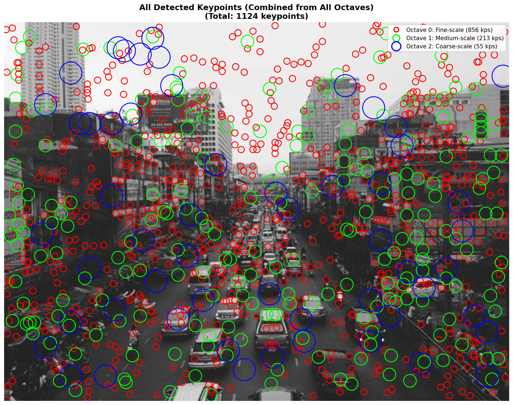

> **Key Takeaway**: We find keypoints by looking for local maxima/minima in 3D (x, y, scale). This gives us MANY candidates - most are noise or unstable. Next step: filter them!

---

## 2.4 Keypoint Filtering & Refinement

> **Why Filter?** Not all detected keypoints are good. Some are:
> - Too weak (low contrast) → sensitive to noise
> - On edges → poorly localized (can slide along the edge)
> - Unstable → true peak is in a different pixel
>
> We keep only the "best" keypoints that will match reliably.

```
┌─────────────────────────────────────────────────────────────┐
│  INTUITION: Why Each Filter?                                │
├─────────────────────────────────────────────────────────────┤
│                                                             │
│  Stage 1: Low Contrast     "Is this keypoint strong enough?"│
│  ┌─────┐      ┌─────┐                                       │
│  │weak │  vs  │STRONG│   Weak signals get lost in noise    │
│  │ · · │      │ ■■■ │                                       │
│  └─────┘      └─────┘                                       │
│                                                             │
│  Stage 2: Edge Response    "Is this a blob or just an edge?"│
│  ┌─────┐      ┌─────┐                                       │
│  │═════│  vs  │  ●  │   Edges are poorly localized        │
│  │═════│      │     │                                       │
│  └─────┘      └─────┘                                       │
│                                                             │
│  Stage 3: Sub-pixel        "Is the peak really here?"       │
│  ┌─────┐      ┌─────┐                                       │
│  │  ·● │  vs  │  ●  │   Peak should be in THIS pixel       │
│  │(off)│      │(here)│                                      │
│  └─────┘      └─────┘                                       │
└─────────────────────────────────────────────────────────────┘
```

The initial keypoints are filtered through three stages:

```
Step 2.3 Complete: 1124 keypoints detected
        ↓
Stage 1: Low Contrast Removal     |D(x̂)| < 0.03      → removes weak responses
        ↓
Stage 2: Edge Response Removal    Tr(H)²/Det(H) > 12.1 → removes edges
        ↓
Stage 3: Sub-pixel Refinement     |offset| > 0.5      → removes unstable
        ↓
FINAL: 847 stable keypoints (75.4% retention)
```

### 2.4.1 Understanding the Filtering Coordinates

**(x, y) refers to keypoint coordinates, NOT all image pixels.**

```
Image size: 640 × 480 = 307,200 total pixels

Step 2.3 detected: 1124 keypoints (blob points)
  - Each keypoint has coordinates (x, y) where it was detected

Filtering is applied ONLY to these 1124 points:
  - For each keypoint:
    1. Look at 3×3 neighborhood around (x, y) in DoG image
    2. Compute derivatives using neighboring pixels
    3. Apply filtering tests
    4. Keep or reject
```

### 2.4.2 How Filtering Works for ALL Keypoints (Full Image)

The filtering process **loops through each keypoint individually**, NOT like a convolution sliding across all pixels:

```
Full DoG Image (640 × 480):
┌─────────────────────────────────────────────────────────────┐
│                                                             │
│     ┌───┐ Keypoint 1 at (50, 80)                           │
│     │3×3│ Extract neighborhood → Compute → KEEP             │
│     └───┘                                                   │
│                                                             │
│              ┌───┐ Keypoint 2 at (120, 45)                 │
│              │3×3│ Extract neighborhood → Compute → KEEP    │
│              └───┘                                          │
│                                                             │
│                           ┌───┐ Keypoint 3 at (350, 200)   │
│                           │3×3│ Extract → REJECT (edge)     │
│                           └───┘                             │
│                                                             │
│     ┌───┐ Keypoint 4 at (80, 420)                          │
│     │3×3│ Extract neighborhood → REJECT (unstable)          │
│     └───┘                                                   │
│                                    ... 1120 more keypoints  │
└─────────────────────────────────────────────────────────────┘
```

**Key Difference from Convolution:**

```
Conv Layer (S=1):               SIFT Filtering:
Slide 3×3 over EVERY pixel      Extract 3×3 at EACH keypoint location
307,200 positions               1124 positions (only detected keypoints)

┌─────────────────┐             ┌─────────────────┐
│█████████████████│             │                 │
│█████████████████│             │  ■    ■        │
│█████████████████│             │      ■    ■    │
│█████████████████│             │  ■        ■    │
│█████████████████│             │    ■  ■        │
└─────────────────┘             └─────────────────┘
  Check ALL pixels               Check ONLY keypoint locations (■)
```

### 2.4.3 Pseudocode: Processing All Keypoints

```python
# Step 2.3 output: list of 1124 keypoint coordinates
keypoints = [(50, 80), (120, 45), (350, 200), (80, 420), ...]  # 1124 total

# Step 2.4: Filter each keypoint
filtered_keypoints = []

for (x, y) in keypoints:  # Loop through ALL 1124 keypoints
    
    # Extract 3×3 window around THIS keypoint from DoG image
    window = DoG[y-1:y+2, x-1:x+2]
    #        ┌────────────────────┐
    #        │ D(x-1,y-1) ... ... │
    #        │ D(x-1,y)   C   ... │  C = center = D(x,y)
    #        │ D(x-1,y+1) ... ... │
    #        └────────────────────┘
    
    # Compute derivatives from this 3×3 window
    Dx = (window[1,2] - window[1,0]) / 2
    Dy = (window[2,1] - window[0,1]) / 2
    Dxx = window[1,2] + window[1,0] - 2*window[1,1]
    Dyy = window[2,1] + window[0,1] - 2*window[1,1]
    Dxy = (window[2,2] - window[0,2] - window[2,0] + window[0,0]) / 4
    
    # Stage 1: Low Contrast Test
    # ... compute D(x̂) ...
    if abs(D_hat) < 0.03:
        continue  # REJECT, go to next keypoint
    
    # Stage 2: Edge Response Test
    ratio = (Dxx + Dyy)**2 / (Dxx*Dyy - Dxy**2)
    if ratio > 12.1:
        continue  # REJECT, go to next keypoint
    
    # Stage 3: Sub-pixel Stability Test
    if abs(offset_x) > 0.5 or abs(offset_y) > 0.5:
        continue  # REJECT, go to next keypoint
    
    # Passed all tests
    filtered_keypoints.append((x, y))

# Result: 847 keypoints remain
```

### 2.4.4 Example: Processing 4 Keypoints from Different Image Locations

| Keypoint | Location | 3×3 Center Value | Test Results | Decision |
|----------|----------|------------------|--------------|----------|
| KP1 | (50, 80) | 45 | \|D(x̂)\|=45.1 > 0.03, ratio=8.2 < 12.1, offset=0.3 | **KEEP** |
| KP2 | (120, 45) | 38 | \|D(x̂)\|=37.8 > 0.03, ratio=5.1 < 12.1, offset=0.2 | **KEEP** |
| KP3 | (350, 200) | 52 | \|D(x̂)\|=51.9 > 0.03, **ratio=21.7 > 12.1** | **REJECT** |
| KP4 | (80, 420) | 28 | \|D(x̂)\|=27.5 > 0.03, ratio=6.3 < 12.1, **offset=0.86** | **REJECT** |

### 2.4.5 Why a 3×3 Window?

We need a **3×3 window** around each keypoint to compute derivatives using **finite differences**:

```
Keypoint at (x, y):

       x-1    x    x+1
      ┌─────┬─────┬─────┐
y-1   │ NW  │  N  │ NE  │   ← Need y-1 for Dy, Dyy, Dxy
      ├─────┼─────┼─────┤
y     │  W  │  C  │  E  │   ← Need x-1, x+1 for Dx, Dxx
      ├─────┼─────┼─────┤
y+1   │ SW  │  S  │ SE  │   ← Need y+1 for Dy, Dyy, Dxy
      └─────┴─────┴─────┘

C = Center (keypoint location)
```

### 2.4.6 Derivative Computations

**First Derivatives (Gradient):**

```
Dx = [D(x+1,y) - D(x-1,y)] / 2    ← uses E and W
Dy = [D(x,y+1) - D(x,y-1)] / 2    ← uses S and N
```

**Second Derivatives (Curvature):**

```
Dxx = D(x+1,y) + D(x-1,y) - 2×D(x,y)    ← uses E, W, C
Dyy = D(x,y+1) + D(x,y-1) - 2×D(x,y)    ← uses S, N, C
Dxy = [D(x+1,y+1) - D(x+1,y-1) - D(x-1,y+1) + D(x-1,y-1)] / 4
```

### 2.4.7 Stage 1: Low Contrast Removal (Taylor Expansion)

**Purpose**: Remove keypoints sensitive to noise using sub-pixel refinement.

**Taylor Expansion of DoG Function:**
```
D(x) ≈ D + (∂D/∂x)ᵀ × x + (1/2) × xᵀ × (∂²D/∂x²) × x

where:
  D = D(x₀, y₀, σ₀) = DoG value at detected location
  x = [Δx, Δy, Δσ]ᵀ = offset from detected location
```

**Gradient Vector (First Derivatives):**
```
∂D/∂x = [Dx, Dy, Dσ]ᵀ

Dx = [D(x+1,y,σ) - D(x-1,y,σ)] / 2
Dy = [D(x,y+1,σ) - D(x,y-1,σ)] / 2
Dσ = [D(x,y,σ+1) - D(x,y,σ-1)] / 2
```

**Hessian Matrix (Second Derivatives):**
```
H = ∂²D/∂x² = | Dxx  Dxy  Dxσ |
              | Dxy  Dyy  Dyσ |
              | Dxσ  Dyσ  Dσσ |

Dxx = D(x+1,y,σ) + D(x-1,y,σ) - 2×D(x,y,σ)
Dyy = D(x,y+1,σ) + D(x,y-1,σ) - 2×D(x,y,σ)
Dσσ = D(x,y,σ+1) + D(x,y,σ-1) - 2×D(x,y,σ)
Dxy = [D(x+1,y+1,σ) - D(x-1,y+1,σ) - D(x+1,y-1,σ) + D(x-1,y-1,σ)] / 4
```

**Sub-pixel Location (Setting derivative to zero):**
```
∂D(x)/∂x = ∂D/∂x + H × x = 0

Solving for x:
  x̂ = -H⁻¹ × (∂D/∂x)
```

**Contrast at Sub-pixel Location:**
```
D(x̂) = D + (1/2) × (∂D/∂x)ᵀ × x̂

REJECT if: |D(x̂)| < 0.03
```

**Example - Keypoint KEPT:**

```
DoG neighborhood around (50, 80):
       x=49   x=50   x=51
      ┌──────┬──────┬──────┐
y=79  │  15  │  18  │  12  │
      ├──────┼──────┼──────┤
y=80  │  20  │  45  │  25  │  ← Center = 45 (strong response)
      ├──────┼──────┼──────┤
y=81  │  14  │  22  │  16  │
      └──────┴──────┴──────┘

Step 1: Compute gradient
  Dx = (25 - 20) / 2 = 2.5
  Dy = (22 - 18) / 2 = 2.0

Step 2: Compute Hessian
  Dxx = 25 + 20 - 2×45 = -45
  Dyy = 22 + 18 - 2×45 = -50
  Dxy = (16 - 14 - 12 + 15) / 4 = 1.25

Step 3: Solve for offset
  x̂ = -H⁻¹ × ∇D = [0.05, 0.04]ᵀ

Step 4: Compute refined contrast
  D(x̂) = 45 + 0.5 × (2.5×0.05 + 2.0×0.04) = 45.10

Test: |45.10| < 0.03? NO → KEEP
```

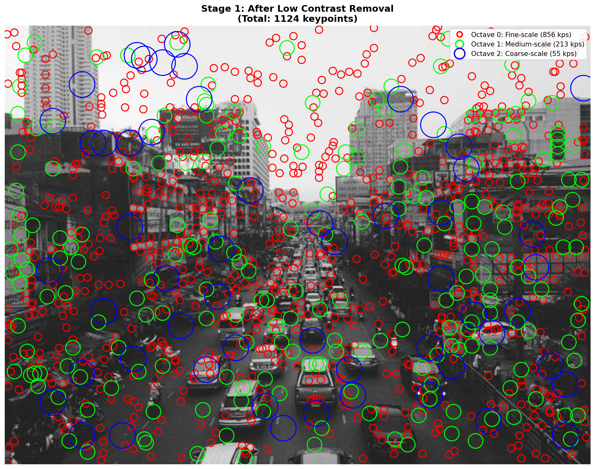

### 2.4.8 Stage 2: Edge Response Removal (Hessian Eigenvalue Analysis)

**Purpose**: Remove keypoints on edges (poorly localized along edge direction).

**Hessian Matrix (2D spatial only):**
```
H = | Dxx  Dxy |
    | Dxy  Dyy |
```

**Eigenvalue Analysis:**
```
Eigenvalues λ₁, λ₂ of H represent principal curvatures:
  - Blob: λ₁ ≈ λ₂ (similar curvature in all directions)
  - Edge: λ₁ >> λ₂ (strong curvature in one direction only)

Let α = λ₁ (larger), β = λ₂ (smaller), r = α/β
```

**Efficient Computation (Avoid eigenvalue calculation):**
```
Trace:      Tr(H) = Dxx + Dyy = α + β
Determinant: Det(H) = Dxx × Dyy - Dxy² = α × β

Key Identity:
  Tr(H)²/Det(H) = (α + β)²/(α × β)
                = (r + 1)²/r
                
where r = α/β = ratio of eigenvalues
```

**Threshold Derivation:**
```
For r = 10 (Lowe's default):
  Threshold = (r + 1)²/r = (10 + 1)²/10 = 121/10 = 12.1

REJECT if: Tr(H)²/Det(H) > 12.1  (edge-like response)
KEEP if:   Tr(H)²/Det(H) ≤ 12.1  (blob-like response)
```

**Example - Edge Rejected:**

```
Keypoint at (350, 200) - on an edge:
       x=349  x=350  x=351
      ┌──────┬──────┬──────┐
y=199 │  50  │  52  │  51  │   Very similar values along x
      ├──────┼──────┼──────┤
y=200 │  80  │  85  │  82  │   Strong gradient along y
      ├──────┼──────┼──────┤
y=201 │  48  │  50  │  49  │
      └──────┴──────┴──────┘

Step 1: Compute second derivatives
  Dxx = 82 + 80 - 2×85 = -8   (small: flat along x)
  Dyy = 50 + 52 - 2×85 = -68  (large: curved along y)
  Dxy = (49 - 48 - 51 + 50) / 4 = 0

Step 2: Compute trace and determinant
  Tr(H) = -8 + (-68) = -76
  Det(H) = (-8)×(-68) - 0² = 544

Step 3: Edge ratio test
  Ratio = (-76)² / 544 = 5776 / 544 = 10.62

Test: 10.62 > 12.1? NO → This example would actually KEEP

For a clearer REJECT example (stronger edge):
  Dxx = -3, Dyy = -59, Dxy = 0  (strong curvature only in y)
  Tr(H) = -3 + (-59) = -62
  Det(H) = (-3)×(-59) - 0² = 177
  Ratio = (-62)² / 177 = 3844 / 177 = 21.72

Test: 21.72 > 12.1? YES → REJECT (it's an edge!)
```

**Geometric Interpretation:**
```
              Blob (KEEP)                      Edge (REJECT)
         λ₁ ≈ λ₂ → r ≈ 1                   λ₁ >> λ₂ → r >> 1
         
         ┌───────────┐                     ════════════════
         │    ●●●    │                     ════════════════
         │   ●●●●●   │                     ════════════════
         │    ●●●    │
         └───────────┘
         Ratio ≈ 4 < 12.1                  Ratio > 12.1
```

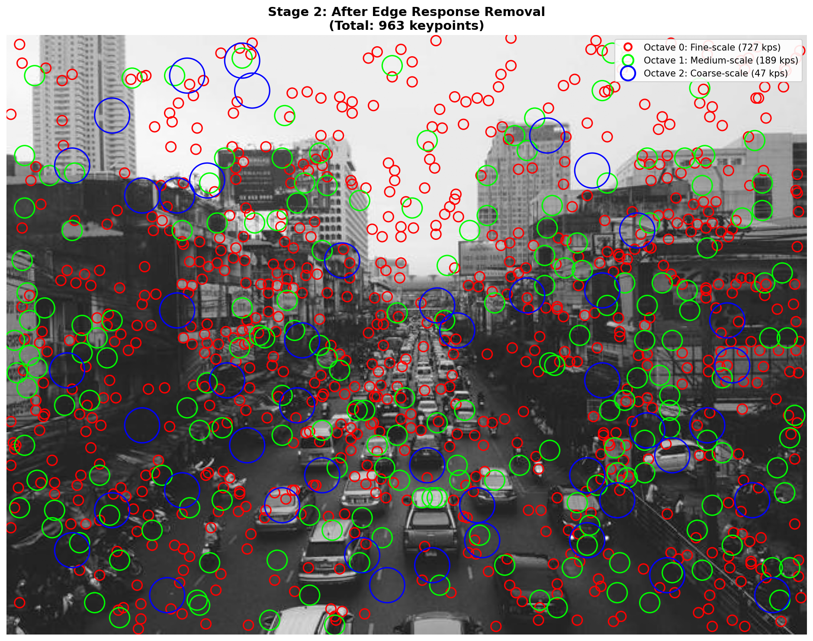

### 2.4.9 Stage 3: Sub-pixel Refinement

**Purpose**: Remove unstable keypoints where the true extremum is in a different pixel.

**Offset Computation (from Stage 1):**
```
x̂ = -H⁻¹ × ∇D = [offset_x, offset_y, offset_σ]ᵀ
```

**Stability Test:**
```
REJECT if: |offset_x| > 0.5 OR |offset_y| > 0.5 OR |offset_σ| > 0.5
```

**Why 0.5 threshold?**
```
If |offset| > 0.5, the true extremum is closer to a neighboring pixel:

         x-1        x         x+1
    ┌─────────┬─────────┬─────────┐
    │         │    ●    │         │   offset = 0.0 (perfect)
    │         │ detected │         │
    └─────────┴─────────┴─────────┘

         x-1        x         x+1
    ┌─────────┬─────────┬─────────┐
    │         │  ●      │         │   offset = -0.3 (OK, within pixel)
    │         │ detected │         │
    └─────────┴─────────┴─────────┘

         x-1        x         x+1
    ┌─────────┬─────────┬─────────┐
    │     ●   │         │         │   offset = -0.86 (REJECT!)
    │ true    │ detected │         │   True extremum in different pixel
    └─────────┴─────────┴─────────┘
```

**Example - Unstable Rejected:**

```
Keypoint at (80, 420):
       x=79   x=80   x=81
      ┌──────┬──────┬──────┐
y=419 │  35  │  42  │  38  │
      ├──────┼──────┼──────┤
y=420 │  55  │  50  │  45  │   ← Detected maximum, but...
      ├──────┼──────┼──────┤
y=421 │  40  │  38  │  32  │
      └──────┴──────┴──────┘

Step 1: Compute gradient
  Dx = (45 - 55) / 2 = -5.0
  Dy = (38 - 42) / 2 = -2.0

Step 2: Compute Hessian
  Dxx = 45 + 55 - 2×50 = 0
  Dyy = 38 + 42 - 2×50 = -20
  Dxy = (32 - 40 - 38 + 35) / 4 = -2.75

Step 3: Solve for offset (simplified 2D case)
  offset_x = -H⁻¹ × ∇D
  
  After matrix inversion:
  offset_x = -0.86  ← True maximum is almost 1 pixel to the left!
  offset_y = -0.12

Test: |−0.86| > 0.5? YES → REJECT (unstable!)
```

**Iterative Refinement Option:**
```
If |offset| > 0.5:
  Option 1: REJECT keypoint (used here)
  Option 2: Move to neighboring pixel, recompute (up to N iterations)
```


### 2.4.10 Detection Phase Complete

```
Summary (example numbers for 640×480 image):
  After Step 2.3:  1124 keypoint candidates detected
  After Stage 1:   ~1124 remain (few removed - most have sufficient contrast)
  After Stage 2:   ~963 remain  (161 edges removed)
  After Stage 3:   ~847 remain  (116 unstable removed)
  
  Final retention: ~75% of detected candidates
```

**Why These Numbers Vary:**
- Different images produce different keypoint counts
- Textured images → more keypoints
- Smooth images → fewer keypoints
- The percentages (not absolute numbers) are more consistent


*Note: This image shows keypoints from all octaves. After filtering, 847 stable keypoints remain.*

> **Key Takeaway**: Filtering ensures we keep only high-quality, stable keypoints. This is crucial because matching works better with fewer, stronger keypoints than many weak ones.

---

<div align="center">


### **Create unique fingerprints for each keypoint**

`Orientation Assignment` | `128-D Descriptor` | `Normalization`

</div>

---

## 3. Description Phase

**Goal**: Create unique, rotation-invariant, scale-invariant fingerprints (descriptors) for each detected keypoint.

> **Intuition**: Detection found WHERE keypoints are. Now we need to describe WHAT they look like. This is like creating a "fingerprint" for each keypoint - unique enough to recognize it in other images.

```
┌─────────────────────────────────────────────────────────────┐
│  INTUITION: Why Descriptors?                                │
├─────────────────────────────────────────────────────────────┤
│                                                             │
│  Image 1                    Image 2 (rotated, scaled)       │
│  ┌─────────────┐            ┌─────────────┐                │
│  │     ●A      │            │         ●?  │                │
│  │  ●B    ●C   │            │    ●?       │                │
│  │      ●D     │            │  ●?    ●?   │                │
│  └─────────────┘            └─────────────┘                │
│                                                             │
│  Question: Which keypoint in Image 2 matches keypoint A?    │
│  Answer: Compare their 128-D descriptors! Closest match wins│
│                                                             │
│  Descriptor A = [0.12, 0.08, 0.15, 0.03, ...]  (128 numbers)│
│  Descriptor ? = [0.11, 0.09, 0.14, 0.04, ...]  ← Similar!   │
└─────────────────────────────────────────────────────────────┘
```

```
INPUT: 847 stable keypoints with (x, y, scale)
        ↓
Step 3.2: Orientation Assignment
        - 36-bin gradient histogram around each keypoint
        ↓
Step 3.3: Descriptor Extraction
        - 16×16 region → 4×4 subregions → 8-bin histograms
        - 128-D vector
        ↓
OUTPUT: 847 keypoints with (x, y, scale, orientation, 128-D descriptor)
```

---

## 3.1 Description Phase Overview

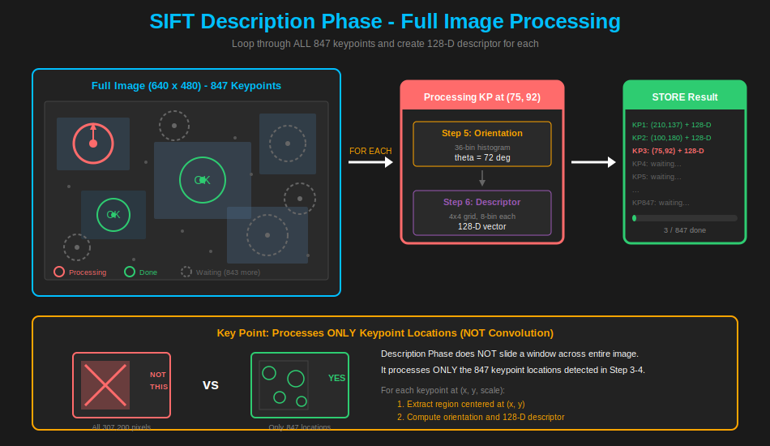

The Description Phase transforms 847 stable keypoints into unique, matchable fingerprints:

| Step | Process | Output |
|------|---------|--------|
| **Step 3.2** | Orientation Assignment | Dominant direction (0°-360°) per keypoint |
| **Step 3.3** | Descriptor Extraction | 128-D normalized vector per keypoint |

**Final Output:** 847 keypoints with `(x, y, scale, orientation, 128-D descriptor)`

### 3.1.1 How Description Phase Works for ALL Keypoints (Full Image)

The Description Phase **loops through each keypoint individually**, processing only at keypoint locations (NOT sliding across all pixels):

```
Full Image (640 × 480):
┌─────────────────────────────────────────────────────────────┐
│                                                             │
│     ┌───┐ Keypoint 1 at (55, 55)                           │
│     │16×16│ Step 3.2: theta=72° → Step 3.3: 128-D → STORE   │
│     └───┘                                                   │
│                                                             │
│              ┌───┐ Keypoint 2 at (165, 95)                 │
│              │16×16│ Step 3.2: theta=135° → Step 3.3: 128-D │
│              └───┘                                          │
│                                                             │
│                           ┌───┐ Keypoint 3 at (80, 135)    │
│                           │16×16│ Step 3.2 → Step 3.3 → STORE│
│                           └───┘                             │
│                                                             │
│     ┌───┐ Keypoint 4 at (210, 50)                          │
│     │16×16│ Step 3.2 → Step 3.3 → STORE                     │
│     └───┘                                                   │
│                                    ... 843 more keypoints   │
└─────────────────────────────────────────────────────────────┘
```

**Key Difference from Convolution:**

```
Conv Layer (S=1):               SIFT Description:
Slide 16×16 over EVERY pixel    Extract 16×16 at EACH keypoint location
307,200 positions               847 positions (only detected keypoints)

┌─────────────────┐             ┌─────────────────┐
│█████████████████│             │                 │
│█████████████████│             │  ■    ■        │
│█████████████████│             │      ■    ■    │
│█████████████████│             │  ■        ■    │
│█████████████████│             │    ■  ■        │
└─────────────────┘             └─────────────────┘
  Check ALL pixels               Check ONLY keypoint locations (■)
```

### 3.1.2 Algorithm Overview: Processing All Keypoints

```python
# Input: 847 keypoints from Detection Phase
keypoints = [(55, 55, 1.6), (165, 95, 2.4), (80, 135, 1.2), ...]  # 847 total

# Output storage
descriptors = []

# Loop through ALL 847 keypoints
for (x, y, scale) in keypoints:
    
    # Step 3.2: Compute orientation (see Step 3.2 section for details)
    theta = compute_orientation(x, y, scale)
    
    # Step 3.3: Extract descriptor (see Step 3.3 section for details)
    descriptor = extract_descriptor(x, y, scale, theta)
    
    # Store result
    descriptors.append({
        'x': x, 'y': y, 'scale': scale,
        'orientation': theta,
        'descriptor': descriptor  # 128-D vector
    })

# Result: 847 keypoints, each with 128-D descriptor
```

### 3.1.3 Example: Processing 4 Keypoints from Different Image Locations

| Keypoint | Location (x, y, scale) | Step 3.2: θ | Step 3.3: Descriptor | Output |
|----------|------------------------|-------------|---------------------|--------|
| KP1 | (55, 55, 1.6) | 72° | [0.12, 0.08, 0.15, ...] | 128-D |
| KP2 | (165, 95, 2.4) | 135° | [0.05, 0.15, 0.09, ...] | 128-D |
| KP3 | (80, 135, 1.2) | 45° | [0.09, 0.11, 0.07, ...] | 128-D |
| KP4 | (210, 50, 1.8) | 280° | [0.14, 0.06, 0.12, ...] | 128-D |
| ... | ... | ... | ... | ... |
| **Total** | **847 keypoints** | | | **847 × 128 = 108,416 values** |

---

## 3.2 Orientation Assignment

**Purpose**: Achieve rotation invariance by assigning a dominant orientation to each keypoint.

### 3.2.1 The Process

1. Take a region around the keypoint
2. Compute gradient magnitude and direction for each pixel
3. Build a 36-bin histogram (each bin = 10°)
4. Dominant peak → keypoint's orientation

### 3.2.2 The Mathematics

**Gradient Computation (Central Difference):**
```
Gx(x,y) = I(x+1, y) - I(x-1, y)
Gy(x,y) = I(x, y+1) - I(x, y-1)
```

**Gradient Magnitude:**
```
m(x,y) = √(Gx² + Gy²)
```

**Gradient Direction:**
```
θ(x,y) = atan2(Gy, Gx) × (180/π)

If θ < 0:
  θ = θ + 360    (convert to 0°-360° range)
```

**Region Size (Scale-Dependent):**
```
Region radius = 1.5 × σ × k

where:
  σ = keypoint scale
  k = number of samples (typically 8)
  
For σ = 2.0: radius = 1.5 × 2.0 × 8 = 24 pixels
```

**Gaussian Weighting:**
```
w(dx, dy) = exp(-(dx² + dy²) / (2 × (1.5 × σ)²))

This gives more weight to gradients near the keypoint center.
```

**36-bin Histogram:**
```
Bin width = 360° / 36 = 10° per bin

For gradient direction θ:
  bin_index = floor(θ / 10) mod 36

Weighted vote:
  histogram[bin_index] += m(x,y) × w(dx, dy)
```

**Dominant Orientation Selection:**
```
1. Find maximum bin: peak_bin = argmax(histogram)
2. Dominant orientation = peak_bin × 10 + 5  (center of bin)

Multiple Orientations:
  If any other bin > 0.8 × peak_value:
    Create additional keypoint with that orientation
```

**Example Calculation:**
```
Keypoint at (100, 150) with σ = 2.0
Region radius = 24 pixels

At pixel (103, 152), offset = (3, 2):
  I(104, 152) = 180, I(102, 152) = 150 → Gx = 30
  I(103, 153) = 170, I(103, 151) = 165 → Gy = 5
  
  m = √(30² + 5²) = √925 = 30.41
  θ = atan2(5, 30) × (180/π) = 9.46°
  
  bin_index = floor(9.46 / 10) = 0
  
  Gaussian weight:
  w = exp(-(3² + 2²) / (2 × 9)) = exp(-13/18) = 0.486
  
  Vote: histogram[0] += 30.41 × 0.486 = 14.78
```

### 3.2.3 Pseudocode

```python
def compute_orientation(x, y, scale):
    """
    Compute dominant orientation for keypoint at (x, y, scale)
    """
    # Step 3.2.a: Define region radius
    region_radius = int(1.5 * scale * 16)
    
    # Step 3.2.b: Initialize 36-bin histogram (each bin = 10 degrees)
    histogram = [0] * 36
    
    # Step 3.2.c: Loop through pixels in circular region
    for dy in range(-region_radius, region_radius + 1):
        for dx in range(-region_radius, region_radius + 1):
            
            # Check if inside circle
            if dx*dx + dy*dy <= region_radius*region_radius:
                px, py = x + dx, y + dy
                
                # Step 3.2.d: Compute gradient
                Gx = Image[py, px+1] - Image[py, px-1]
                Gy = Image[py+1, px] - Image[py-1, px]
                
                # Step 3.2.e: Compute magnitude and direction
                magnitude = sqrt(Gx*Gx + Gy*Gy)
                direction = atan2(Gy, Gx) * 180 / pi
                if direction < 0:
                    direction += 360
                
                # Step 3.2.f: Apply Gaussian weight
                weight = exp(-(dx*dx + dy*dy) / (2 * (1.5*scale)**2))
                
                # Step 3.2.g: Vote to histogram bin
                bin_idx = int(direction / 10) % 36
                histogram[bin_idx] += magnitude * weight
    
    # Step 3.2.h: Find dominant orientation (peak)
    dominant_bin = argmax(histogram)
    theta = dominant_bin * 10 + 5  # Center of bin (degrees)
    
    return theta
```

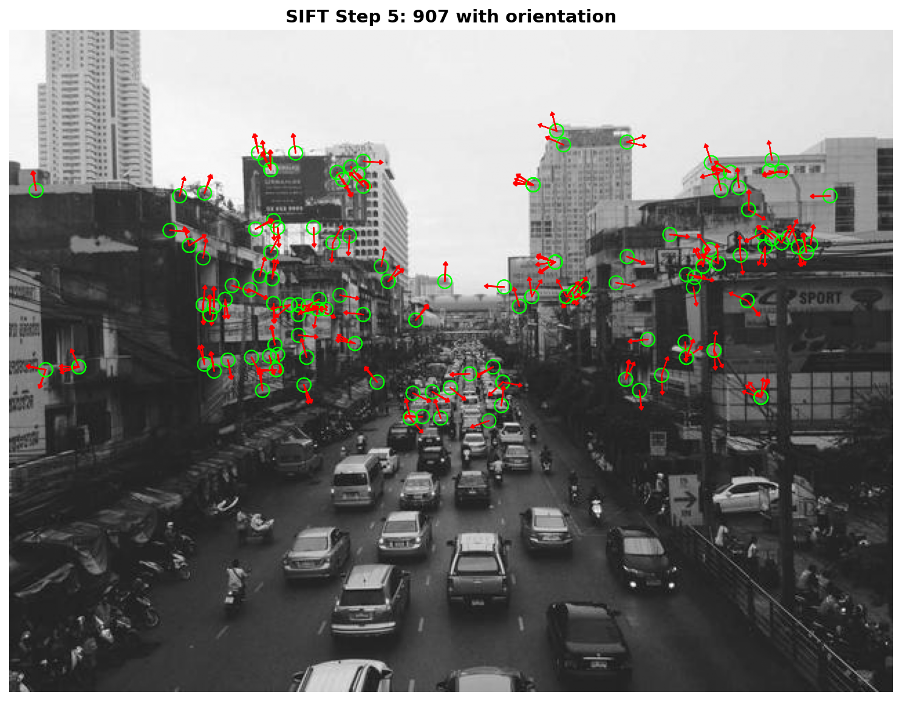

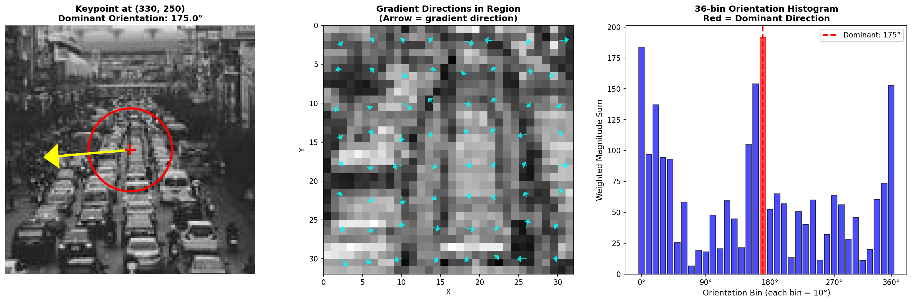

> **Key Takeaway**: Orientation assignment gives each keypoint a dominant direction, making the descriptor rotation-invariant. Multiple peaks create multiple keypoints, improving matching robustness.

---

## 3.3 Descriptor Extraction

**Purpose**: Create a unique 128-dimensional fingerprint for matching across images.

### 3.3.1 Descriptor Overview

The SIFT descriptor captures local gradient information in a structured way:

```
16×16 Region around keypoint
        ↓
Divide into 4×4 = 16 subregions
        ↓
Each subregion → 8-bin gradient histogram
        ↓
16 subregions × 8 bins = 128 values
        ↓
L2 Normalize → Final 128-D descriptor
```

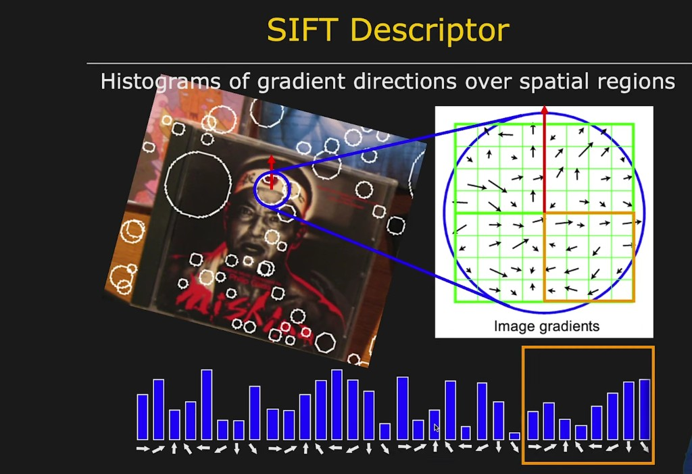

### 3.3.2 Extract 16×16 Region

Center a 16×16 pixel region on the keypoint, rotated according to the dominant orientation:

```
16×16 Region:
  - Centered on keypoint position (x, y)
  - Rotated by dominant orientation θ
  - Total: 256 pixels
```

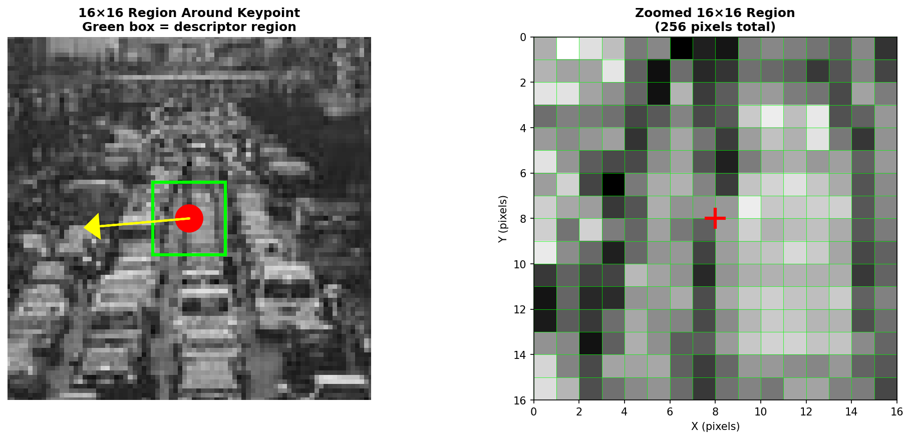

### 3.3.3 Divide into 4×4 Subregions

```
┌────┬────┬────┬────┐
│ S0 │ S1 │ S2 │ S3 │   Each subregion = 4×4 pixels
├────┼────┼────┼────┤
│ S4 │ S5 │ S6 │ S7 │   Total subregions = 16
├────┼────┼────┼────┤
│ S8 │ S9 │S10 │S11 │   Each subregion → 8-bin histogram
├────┼────┼────┼────┤
│S12 │S13 │S14 │S15 │
└────┴────┴────┴────┘
```

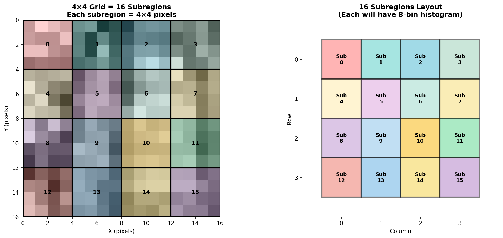

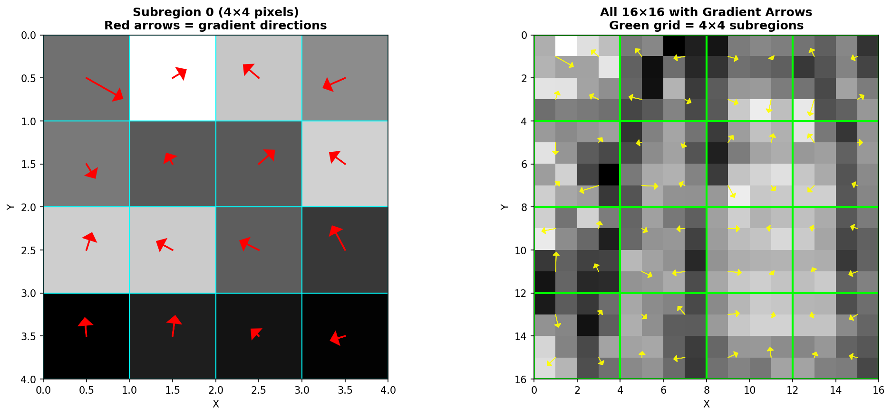

### 3.3.4 Build 8-bin Histogram per Subregion

**8-bin Histogram Structure:**
```
8 bins (45° each):
  Bin 0: 0° - 45°      Bin 4: 180° - 225°
  Bin 1: 45° - 90°     Bin 5: 225° - 270°
  Bin 2: 90° - 135°    Bin 6: 270° - 315°
  Bin 3: 135° - 180°   Bin 7: 315° - 360°
```

**Relative Gradient Direction:**
```
θ_relative = θ_pixel - θ_keypoint

This makes descriptor rotation-invariant:
  - All gradients measured relative to keypoint orientation
  - Same object rotated → same descriptor
```

**Trilinear Interpolation (Soft Assignment):**
```
Instead of hard assignment to single bin, interpolate across:
  - Spatial: 4 neighboring subregions (x and y)
  - Orientation: 2 neighboring bins

Weight contribution:
  w = (1 - dx) × (1 - dy) × (1 - dθ)

where dx, dy, dθ are fractional distances to bin centers
```

**Example: Gradient at (2.3, 1.7) with θ=52°:**
```
Spatial interpolation:
  Subregion (2,1) gets weight: 0.7 × 0.3 = 0.21
  Subregion (2,2) gets weight: 0.7 × 0.7 = 0.49
  Subregion (3,1) gets weight: 0.3 × 0.3 = 0.09
  Subregion (3,2) gets weight: 0.3 × 0.7 = 0.21

Orientation interpolation (52° between bins 1 and 2):
  Bin 1 (45°) gets weight: 1 - (52-45)/45 = 0.84
  Bin 2 (90°) gets weight: (52-45)/45 = 0.16
```

**Result:**
```
16 subregions × 8 bins = 128 values
```

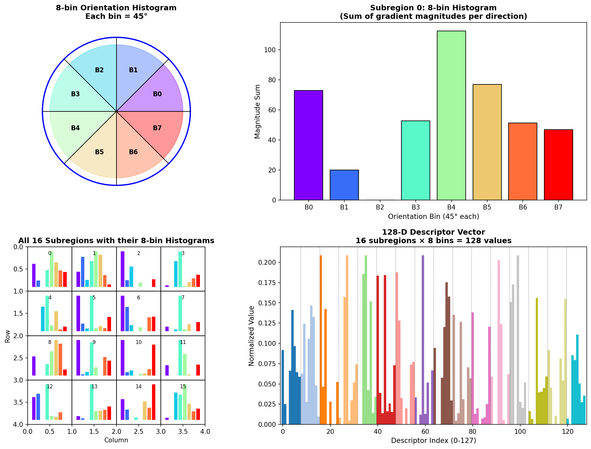

### 3.3.5 Create Final 128-D Descriptor

**Descriptor Structure:**
```
Descriptor = [S0: b0-b7][S1: b0-b7]...[S15: b0-b7]
             └────────────────────────────────────┘
                        128 values

S0-S3:   Row 0 (top 4 subregions)
S4-S7:   Row 1
S8-S11:  Row 2
S12-S15: Row 3 (bottom 4 subregions)
```

**L2 Normalization:**
```
Step 1: Compute L2 norm
  ||d|| = √(d₀² + d₁² + ... + d₁₂₇²)

Step 2: Normalize
  d_normalized[i] = d[i] / ||d||
```

**Illumination Invariance (Threshold Clipping):**
```
Step 3: Clip large values
  d_clipped[i] = min(d_normalized[i], 0.2)

Why 0.2? Large gradient magnitudes often caused by:
  - Specular highlights
  - Saturation effects
  - Non-linear illumination changes

By clipping at 0.2, we reduce sensitivity to these.
```

**Re-normalization:**
```
Step 4: Normalize again after clipping
  ||d_clipped|| = √(Σ d_clipped[i]²)
  d_final[i] = d_clipped[i] / ||d_clipped||
```

**Complete Normalization Example:**
```
Raw descriptor (first 8 values): [45, 12, 8, 23, 5, 67, 3, 15, ...]

Step 1: L2 norm = 142.7 (example)

Step 2: Normalized = [0.315, 0.084, 0.056, 0.161, 0.035, 0.469, 0.021, 0.105, ...]

Step 3: Clip at 0.2 = [0.200, 0.084, 0.056, 0.161, 0.035, 0.200, 0.021, 0.105, ...]
                           ↑ clipped                        ↑ clipped

Step 4: Re-normalize → Final descriptor
```

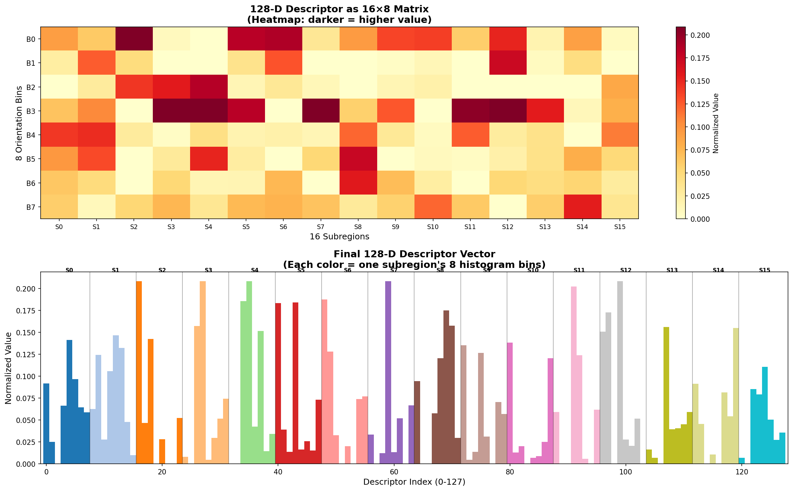

### 3.3.6 Pseudocode

```python
def extract_descriptor(x, y, scale, theta):
    """
    Extract 128-D descriptor for keypoint at (x, y, scale) with orientation theta
    """
    descriptor = []
    
    # Step 3.3.a: Setup rotation
    cos_t = cos(theta * pi / 180)
    sin_t = sin(theta * pi / 180)
    
    # Step 3.3.b: Loop through 4×4 = 16 subregions
    for sub_row in range(4):
        for sub_col in range(4):
            
            # Step 3.3.c: Initialize 8-bin histogram for this subregion
            sub_histogram = [0] * 8
            
            # Step 3.3.d: Loop through 4×4 pixels in this subregion
            for i in range(4):
                for j in range(4):
                    
                    # Pixel offset from center (in rotated coordinates)
                    px_offset = (sub_col - 1.5) * 4 + j - 1.5
                    py_offset = (sub_row - 1.5) * 4 + i - 1.5
                    
                    # Step 3.3.e: Rotate back to image coordinates
                    img_dx = px_offset * cos_t - py_offset * sin_t
                    img_dy = px_offset * sin_t + py_offset * cos_t
                    
                    # Apply scale
                    img_x = int(x + img_dx * scale)
                    img_y = int(y + img_dy * scale)
                    
                    # Step 3.3.f: Compute gradient at this pixel
                    Gx = Image[img_y, img_x+1] - Image[img_y, img_x-1]
                    Gy = Image[img_y+1, img_x] - Image[img_y-1, img_x]
                    
                    magnitude = sqrt(Gx*Gx + Gy*Gy)
                    
                    # Direction relative to keypoint orientation
                    direction = atan2(Gy, Gx) * 180 / pi - theta
                    if direction < 0:
                        direction += 360
                    
                    # Step 3.3.g: Vote to 8-bin histogram (45 degrees per bin)
                    bin_idx = int(direction / 45) % 8
                    sub_histogram[bin_idx] += magnitude
            
            # Step 3.3.h: Add subregion histogram to descriptor
            descriptor.extend(sub_histogram)
    
    # Step 3.3.i: L2 normalize
    norm = sqrt(sum(v*v for v in descriptor))
    descriptor = [v / norm for v in descriptor]
    
    # Step 3.3.j: Clip values > 0.2
    descriptor = [min(v, 0.2) for v in descriptor]
    
    # Step 3.3.k: Re-normalize
    norm = sqrt(sum(v*v for v in descriptor))
    descriptor = [v / norm for v in descriptor]
    
    return descriptor  # 128-D vector
```

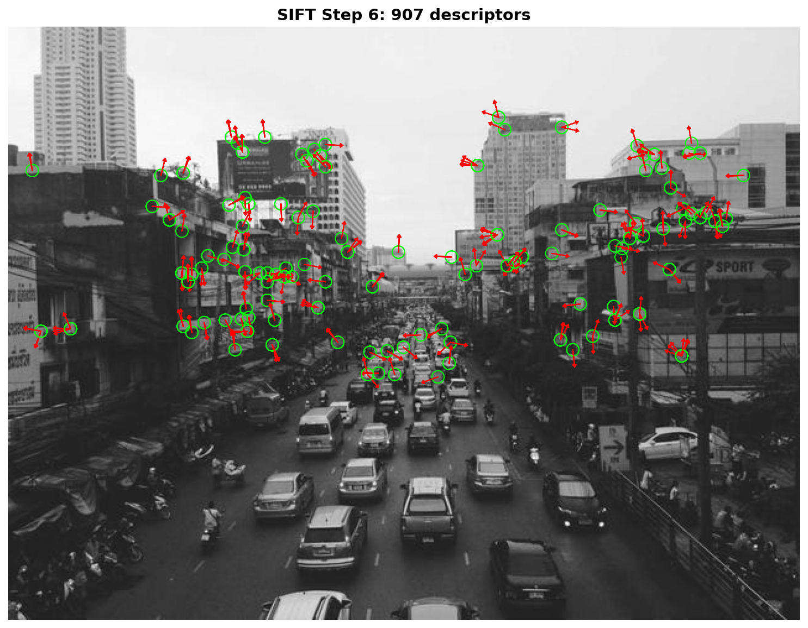

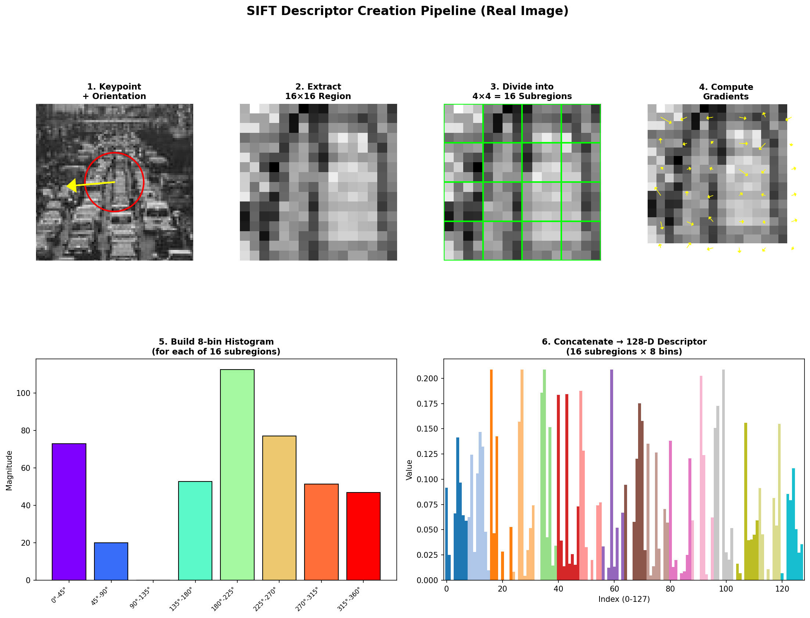

> **Key Takeaway**: The 128-D SIFT descriptor captures local gradient patterns in a rotation and scale-invariant way. L2 normalization and clipping at 0.2 make it robust to illumination changes.

---

<div align="center">


### **Complete SIFT Pipeline Overview**

`Detection` | `Description` | `Output: 847 keypoints with 128-D descriptors`

</div>

---

## 4. Summary

### 4.1 Complete SIFT Pipeline

```
INPUT: Image (H × W)

═══════════════════════════════════════════════════════════════════
                        DETECTION PHASE
═══════════════════════════════════════════════════════════════════
        ↓
STEP 2.1: Gaussian Scale-Space Pyramid
        ↓
STEP 2.2: Difference of Gaussians (DoG)
        ↓
STEP 2.3: Keypoint Detection (26-neighbor extrema)
        ↓
STEP 2.4: Keypoint Filtering & Refinement → 847 keypoints

═══════════════════════════════════════════════════════════════════
                        DESCRIPTION PHASE
═══════════════════════════════════════════════════════════════════
        ↓
STEP 3.1: Description Phase Overview (loop through each keypoint)
        ↓
STEP 3.2: Orientation Assignment → θ per keypoint
        ↓
STEP 3.3: Descriptor Extraction → 128-D per keypoint
        ↓
OUTPUT: Keypoints with (x, y, scale, orientation, 128-D descriptor)
```

### 4.2 Quick Reference: All Formulas

**Step 2.1: Gaussian Scale-Space**
```
L(x,y,σ) = G(x,y,σ) * I(x,y)
G(x,y,σ) = 1/(2πσ²) × exp(-(x² + y²)/(2σ²))
σ(s) = σ₀ × k^s, where k = 2^(1/S)
```

**Step 2.2: Difference of Gaussians**
```
D(x,y,σ) = L(x,y,kσ) - L(x,y,σ) ≈ (k-1)σ² × ∇²G * I
```

**Step 2.3: 26-Neighbor Extrema**
```
Keypoint if: D(x,y,σ) > ALL 26 neighbors OR D(x,y,σ) < ALL 26 neighbors
```

**Step 2.4: Filtering Formulas**

| Stage | Formula | Threshold | Action |
|-------|---------|-----------|--------|
| Taylor Expansion | `D(x) ≈ D + ∇Dᵀx + ½xᵀHx` | - | Foundation |
| Sub-pixel offset | `x̂ = -H⁻¹ × ∇D` | - | Refinement |
| Stage 1: Contrast | `D(x̂) = D + ½∇Dᵀx̂` | \|D(x̂)\| < 0.03 | REJECT |
| Stage 2: Edge | `Tr(H)²/Det(H)` | > (r+1)²/r = 12.1 | REJECT |
| Stage 3: Stability | `offset = x̂` | \|offset\| > 0.5 | REJECT |

**Step 3.2: Orientation Assignment**
```
Gx = I(x+1,y) - I(x-1,y)
Gy = I(x,y+1) - I(x,y-1)
m(x,y) = √(Gx² + Gy²)
θ(x,y) = atan2(Gy, Gx)
36-bin histogram, each bin = 10°
```

**Step 3.3: Descriptor Extraction**
```
16×16 region → 4×4 subregions → 8-bin histograms
16 × 8 = 128 dimensions
L2 normalize → clip at 0.2 → re-normalize
```

### 4.3 Key Properties

| Property | Value |
|----------|-------|
| Year | 2004 (Lowe) |
| Speed | Slower than SURF |
| Detection | DoG extrema → 1124 keypoints |
| Filtering | 1124 → 847 (75.4% retention) |
| Description | 128-D descriptor per keypoint |
| Key Innovation | Scale-space pyramid + sub-pixel accuracy |

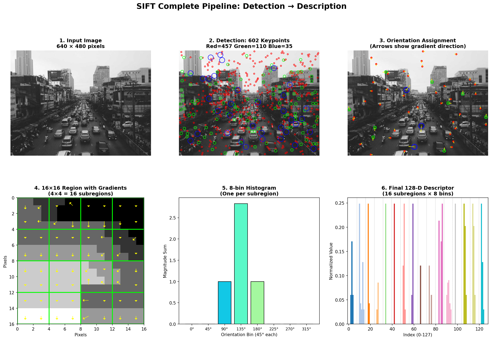

### 4.4 What's Next? Matching Descriptors

After extracting descriptors, you can **match keypoints between images**:

```
Image 1: 847 keypoints, each with 128-D descriptor
Image 2: 923 keypoints, each with 128-D descriptor

For each keypoint in Image 1:
  1. Compute distance to ALL keypoints in Image 2
  2. Find nearest neighbor (smallest distance)
  3. Apply ratio test: d1/d2 < 0.8 (Lowe's ratio)
```

**Distance Metric (Euclidean):**
```
distance(d1, d2) = √(Σ(d1[i] - d2[i])²)  for i = 0 to 127
```

**Lowe's Ratio Test:**
```
d1 = distance to best match
d2 = distance to second-best match

GOOD MATCH if: d1/d2 < 0.8
BAD MATCH if:  d1/d2 ≥ 0.8 (ambiguous, reject)
```

**Example Matching Result:**
```
Image 1 keypoint at (100, 150):
  Descriptor: [0.12, 0.08, 0.15, ...]
  
  Distance to Image 2 keypoint at (95, 148):  0.32 (best)
  Distance to Image 2 keypoint at (200, 50):  0.58 (second-best)
  
  Ratio: 0.32 / 0.58 = 0.55 < 0.8 → GOOD MATCH!
```

---

## 5. Common Mistakes & FAQ

### 5.1 Frequently Asked Questions

| Question | Answer |
|----------|--------|
| **Why 26 neighbors, not 8?** | We check in 3D (x, y, scale). 8 spatial neighbors × 3 scales = 27 total, minus the center = 26 |
| **Why clip descriptor at 0.2?** | Large gradient values from lighting effects would dominate the descriptor. Clipping makes it robust to illumination changes |
| **Why 128 dimensions?** | 4×4 subregions × 8 orientation bins = 128. This balances distinctiveness vs. computation |
| **Why Gaussian blur, not other filters?** | Gaussian is the only filter that doesn't create new features (edges, artifacts) as you blur more |
| **Can SIFT handle affine transformations?** | Partially. It handles scale and rotation, but not shear or non-uniform scaling. Use ASIFT for that |

### 5.2 Common Implementation Mistakes

```
❌ WRONG: Using σ = 0.5 as initial scale
✓ RIGHT: Use σ = 1.6 (Lowe's recommended value)

❌ WRONG: Checking only 8 neighbors (same scale)
✓ RIGHT: Check all 26 neighbors (3 scales × 9 positions - center)

❌ WRONG: Hard assignment of gradients to histogram bins
✓ RIGHT: Use trilinear interpolation for smooth descriptors

❌ WRONG: Forgetting to rotate descriptor by keypoint orientation
✓ RIGHT: Rotate the 16×16 region before computing histograms

❌ WRONG: Normalizing only once
✓ RIGHT: Normalize → clip at 0.2 → normalize again
```

### 5.3 When NOT to Use SIFT

| Situation | Better Alternative |
|-----------|-------------------|
| Real-time applications | ORB (much faster, similar quality) |
| Large viewpoint changes | ASIFT (affine-invariant) |
| Texture-less objects | Edge-based methods or deep learning |
| Very large images | Use GPU-accelerated SIFT or feature pyramids |
| Commercial products | ORB or AKAZE (SIFT was patented until 2020) |

---

## 6. References

1. Lowe, D. G. (2004). "Distinctive Image Features from Scale-Invariant Keypoints." International Journal of Computer Vision, 60(2), 91-110.
2. [OpenCV SIFT Documentation](https://docs.opencv.org/4.x/da/df5/tutorial_py_sift_intro.html)
3. [VLFeat SIFT Tutorial](https://www.vlfeat.org/overview/sift.html)
