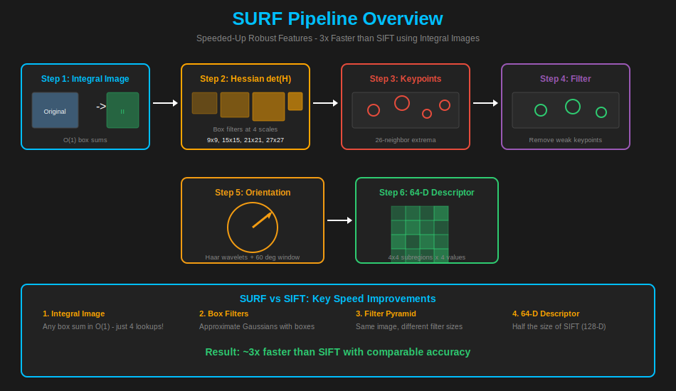
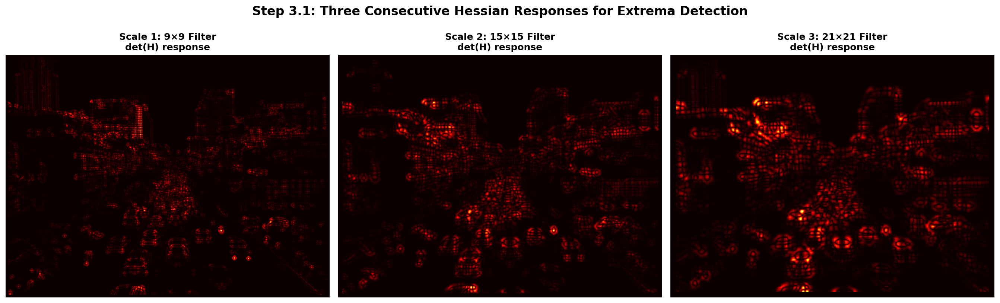
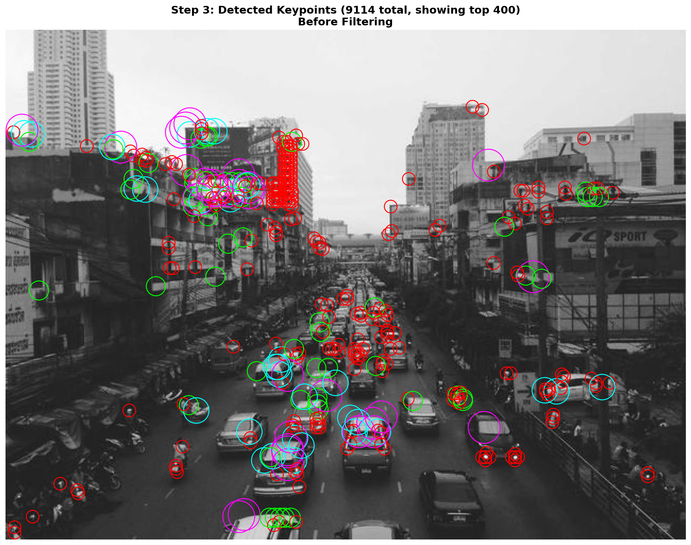
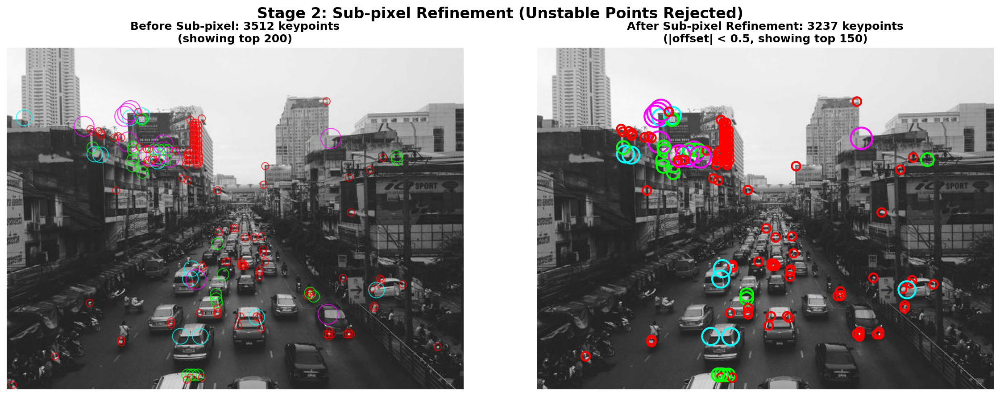
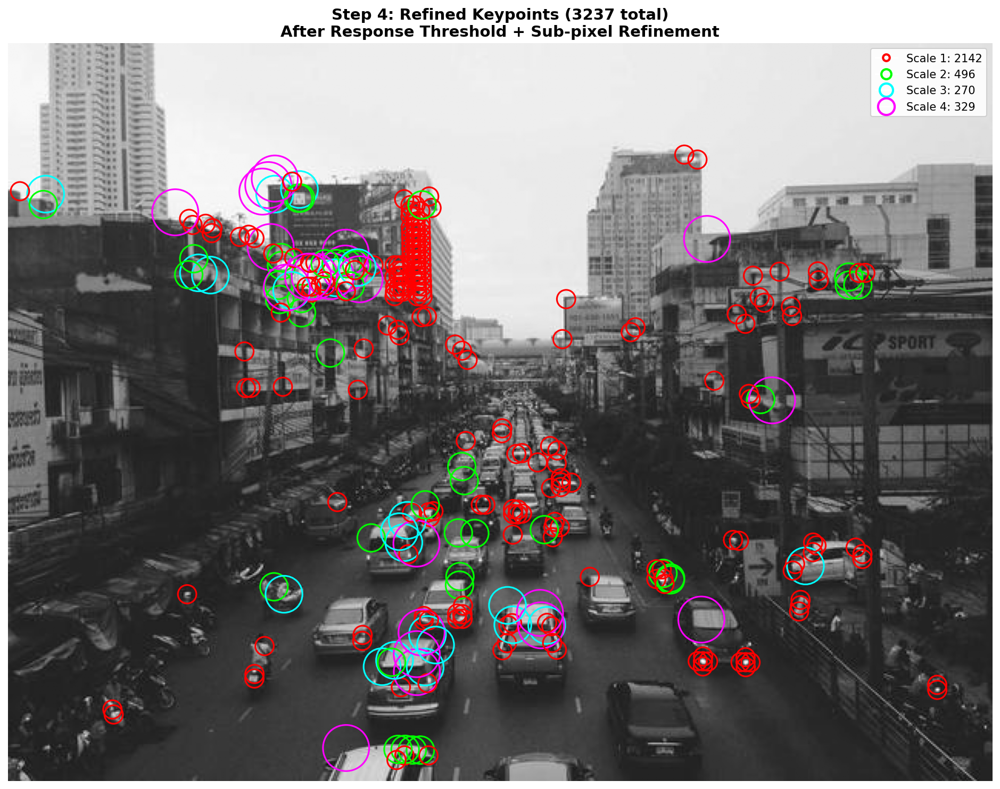
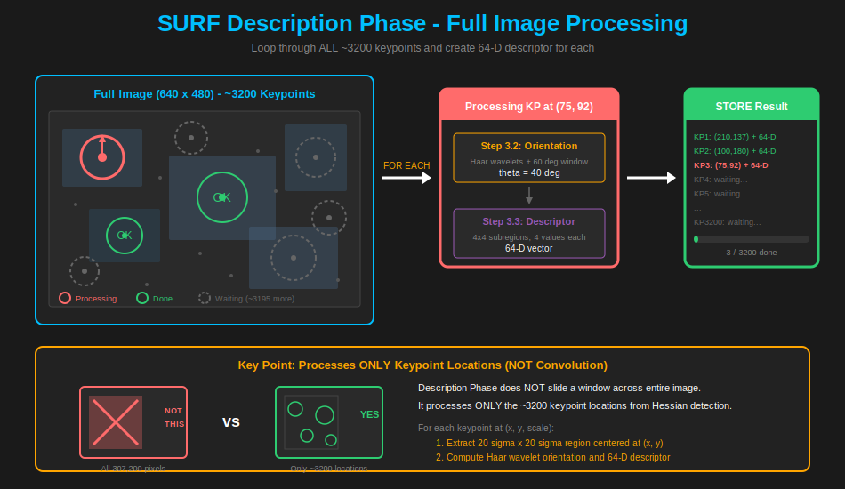
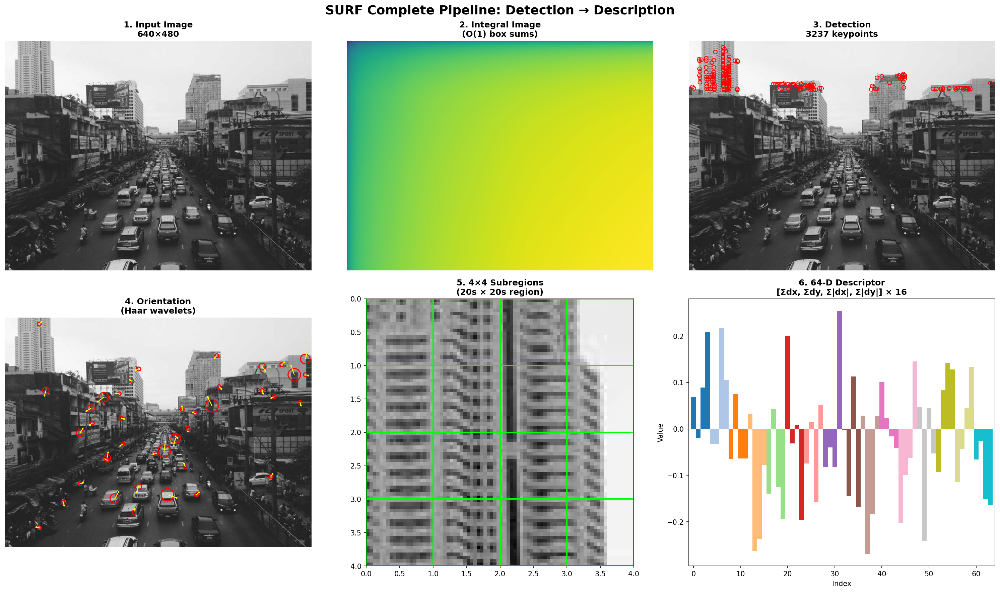
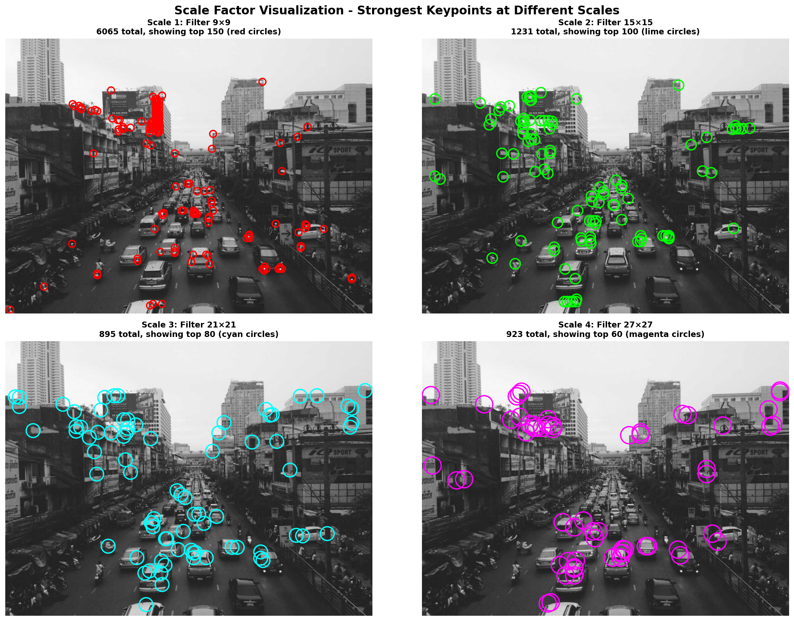

# Understanding SURF: Speeded-Up Robust Features

*A comprehensive guide to implementing SURF from scratch*

---

The **Speeded-Up Robust Features (SURF)** algorithm is a fast and robust feature detector and descriptor, introduced by Bay et al. in 2006. SURF provides similar functionality to SIFT but achieves approximately 3× faster performance through clever use of integral images and box filters.

This article walks through the complete SURF pipeline, from mathematical foundations to practical implementation.

---

## Table of Contents

1. [Overview](#1-overview)
   - [1.1 What is SURF?](#11-what-is-surf)
   - [1.2 What is a Keypoint?](#12-what-is-a-keypoint)
   - [1.3 Why SURF?](#13-why-surf)
   - [1.4 Input Image](#14-input-image-used-in-this-tutorial)
   - [1.5 Pipeline Summary](#15-surf-pipeline-summary)
2. [Detection Phase](#2-detection-phase)
   - [2.1 Integral Image](#21-integral-image)
   - [2.2 Hessian Determinant](#22-hessian-determinant)
   - [2.3 Keypoint Detection](#23-keypoint-detection)
   - [2.4 Keypoint Filtering & Refinement](#24-keypoint-filtering--refinement)
3. [Description Phase](#3-description-phase)
   - [3.1 Description Phase Overview](#31-description-phase-overview)
   - [3.2 Orientation Assignment](#32-orientation-assignment)
   - [3.3 Descriptor Extraction](#33-descriptor-extraction)
4. [Summary](#4-summary)
   - [4.1 Complete Pipeline](#41-complete-pipeline)
   - [4.2 Quick Reference: All Formulas](#42-quick-reference-all-formulas)
   - [4.3 Key Properties](#43-key-properties)
   - [4.4 What's Next? Matching](#44-whats-next-matching-descriptors)
5. [Common Mistakes & FAQ](#5-common-mistakes--faq)
6. [References](#6-references)

---

## 1. Overview

### 1.1 What is SURF?

**SURF (Speeded-Up Robust Features)** is a high-performance feature detection and description algorithm that finds and describes unique "interest points" in images. Like SIFT, these points remain stable across:
- **Scale changes** (zoomed in/out)
- **Rotation**
- **Partial occlusion**
- **Different lighting**

> **Real-World Analogy**: Think of SURF as a faster way to recognize landmarks. While SIFT carefully examines every detail with a magnifying glass, SURF uses a quick scanning technique that's almost as accurate but 3× faster—perfect when you need results in real-time.

### 1.2 What is a Keypoint?

A **keypoint** is a distinctive location in an image—typically corners, blobs, or textured regions that are easy to find again in other images.

```
Example: Keypoint locations in an image
┌────────────────────────────────┐
│       ●                        │   ● = keypoint (corner of building)
│           ●                    │   ● = keypoint (window corner)
│                    ●           │   ● = keypoint (texture blob)
│   ●                            │
│              ●         ●       │
└────────────────────────────────┘

Each keypoint has:
  - Position (x, y)
  - Scale (σ) - size of the feature
  - Orientation (θ) - dominant direction
  - Descriptor - 64 numbers describing appearance
```

### 1.3 Why SURF?

| Problem | How SURF Solves It |
|---------|-------------------|
| SIFT is too slow | Integral images enable O(1) box filter computation |
| DoG computation is expensive | Box filters approximate second derivatives quickly |
| 128-D descriptor is large | 64-D descriptor (or 128-D extended) is more compact |
| Scale-space pyramid is costly | Filter size changes instead of image resampling |

> **Key Innovation**: SURF's main insight is that box filters + integral images can approximate Gaussian derivatives at ANY scale with constant computation time!

### 1.4 Input Image Used in This Tutorial


### 1.5 SURF Pipeline Summary



SURF operates in two main phases:

| Phase | Step | Description | Math |
|-------|------|-------------|------|
| Detection | 2.1 | Integral Image | `II(x,y) = Σ I(i,j)` for i≤x, j≤y |
| Detection | 2.2 | Hessian Determinant | `det(H) = Dxx×Dyy - (0.9×Dxy)²` |
| Detection | 2.3 | Keypoint Detection | 26-neighbor extrema |
| Detection | 2.4 | Refinement & Filtering | Taylor expansion + offset check |
| Description | 3.1 | Overview | Phase summary |
| Description | 3.2 | Orientation | Haar wavelet responses |
| Description | 3.3 | Descriptor | 64-D |

---

<div align="center">


### **Find WHERE the keypoints are in the image**

`Integral Image` | `Hessian` | `Keypoint Detection` | `Filtering`

</div>

---

## 2. Detection Phase

**Goal**: Find stable, repeatable keypoints in the image that can be detected regardless of scale, rotation, or illumination changes.

```
INPUT: Image (H × W)
        ↓
Step 2.1: Build Integral Image (for O(1) box sums)
        ↓
Step 2.2: Compute Hessian Determinant at Multiple Scales
        ↓
Step 2.3: Detect Keypoints (26-neighbor extrema)
        ↓
Step 2.4: Filter & Refine Keypoints
        - Remove low response keypoints
        - Remove unstable keypoints (offset > 0.5 pixel)
        ↓
OUTPUT: Stable keypoints with (x, y, scale)
```

*Example: For a 640×480 image, detection might find ~9000 candidates, filtering keeps ~3200 stable keypoints.*

---

## 2.1 Integral Image

**Why do we need this?** To compute box filter responses in constant time O(1), regardless of filter size.

> **Intuition**: Imagine you need to add up all the numbers in different-sized rectangles many times. Normally, a 100×100 rectangle requires 10,000 additions. With an integral image, ANY rectangle sum requires only 4 lookups and 3 operations—whether it's 10×10 or 1000×1000!

```
┌─────────────────────────────────────────────────────────────┐
│  INTUITION: Why Integral Images Are Magical                  │
├─────────────────────────────────────────────────────────────┤
│                                                             │
│  Without Integral Image:        With Integral Image:        │
│  100×100 box sum = 10,000 ops   100×100 box sum = 4 ops!   │
│                                                             │
│  The integral image stores      Any rectangular sum =       │
│  cumulative sums from (0,0)     just 4 lookups + 3 ops     │
│                                                             │
│       A─────────B               Sum(ABCD) = D - B - C + A   │
│       │ REGION  │                                           │
│       │  SUM    │               Works for ANY size!         │
│       C─────────D                                           │
└─────────────────────────────────────────────────────────────┘
```

### 2.1.1 The Mathematics

**Integral Image Definition:**
```
II(x,y) = Σ I(i,j)    for all i ≤ x, j ≤ y

where:
  II(x,y) = integral image value at (x,y)
  I(i,j) = original image intensity at (i,j)
```

**Recursive Formula (for efficient computation):**
```
II(x,y) = I(x,y) + II(x-1,y) + II(x,y-1) - II(x-1,y-1)

Boundary conditions:
  II(-1,y) = 0
  II(x,-1) = 0
```

**Box Sum Formula (the magic!):**
```
Given rectangle from (x₁,y₁) to (x₂,y₂):

Sum = II(x₂,y₂) - II(x₁-1,y₂) - II(x₂,y₁-1) + II(x₁-1,y₁-1)
    = D - B - C + A

       A─────────B
       │ REGION  │
       │  SUM    │
       C─────────D
```

### 2.1.2 Step-by-Step Computation Example

```
Original Image (4×4):              Integral Image:
┌────┬────┬────┬────┐             ┌────┬────┬────┬────┐
│  1 │  2 │  3 │  4 │             │  1 │  3 │  6 │ 10 │
├────┼────┼────┼────┤             ├────┼────┼────┼────┤
│  5 │  6 │  7 │  8 │             │  6 │ 14 │ 24 │ 36 │
├────┼────┼────┼────┤    →        ├────┼────┼────┼────┤
│  9 │ 10 │ 11 │ 12 │             │ 15 │ 33 │ 54 │ 78 │
├────┼────┼────┼────┤             ├────┼────┼────┼────┤
│ 13 │ 14 │ 15 │ 16 │             │ 28 │ 60 │ 96 │136 │
└────┴────┴────┴────┘             └────┴────┴────┴────┘

Example computation:
II(2,2) = I(2,2) + II(1,2) + II(2,1) - II(1,1)
        = 11 + 33 + 24 - 14
        = 54 ✓
```

### 2.1.3 Box Sum Example

```
Compute sum of 2×2 box at (1,1) to (2,2):

Using formula: Sum = II(D) - II(B) - II(C) + II(A)
                   = II(2,2) - II(0,2) - II(2,0) - II(0,0)
                   = 54 - 15 - 6 + 1
                   = 34

Verify: 6 + 7 + 10 + 11 = 34 ✓
```

### 2.1.4 Why O(1) Matters

| Filter Size | Without Integral Image | With Integral Image |
|-------------|----------------------|---------------------|
| 9×9 | 81 operations | 4 operations |
| 15×15 | 225 operations | 4 operations |
| 21×21 | 441 operations | 4 operations |
| 27×27 | 729 operations | 4 operations |

**Speed improvement at 27×27: 180× faster!**

### 2.1.5 Pseudocode

```python
def compute_integral_image(image):
    """
    Compute integral image in O(n) time.
    After this, ANY box sum takes O(1) time!
    """
    H, W = image.shape
    integral = np.zeros((H, W))
    
    for y in range(H):
        for x in range(W):
            integral[y, x] = image[y, x]
            if x > 0:
                integral[y, x] += integral[y, x-1]
            if y > 0:
                integral[y, x] += integral[y-1, x]
            if x > 0 and y > 0:
                integral[y, x] -= integral[y-1, x-1]
    
    return integral

def box_sum(integral, x1, y1, x2, y2):
    """
    Compute sum of rectangle in O(1) using 4 lookups.
    """
    D = integral[y2, x2]
    B = integral[y1-1, x2] if y1 > 0 else 0
    C = integral[y2, x1-1] if x1 > 0 else 0
    A = integral[y1-1, x1-1] if y1 > 0 and x1 > 0 else 0
    return D - B - C + A
```

### 2.1.6 Visual Results: Integral Image


*The visualization shows: (Top) Original image and its integral image representation, plus a box sum demo. (Bottom) Different box sizes all computed in O(1) time thanks to the integral image.*


*Mathematical formulas for computing integral images and box sums.*

> **Key Takeaway**: The integral image is SURF's secret weapon. It enables computing box filter responses at ANY scale with just 4 memory lookups—the foundation for SURF's speed advantage over SIFT.

---

## 2.2 Hessian Determinant

**Why Hessian?** The Hessian matrix detects blob-like structures. Points with high Hessian determinant are likely to be distinctive features.

> **Intuition**: The Hessian tells us about the "curvature" of image intensity. A blob has strong curvature in ALL directions (both eigenvalues large). An edge has strong curvature in only ONE direction. By computing the determinant, we detect blobs while rejecting edges.

```
┌─────────────────────────────────────────────────────────────┐
│  INTUITION: What Does Hessian Detect?                        │
├─────────────────────────────────────────────────────────────┤
│                                                             │
│  Blob (det ≫ 0):        Edge (det ≈ 0):      Flat (det ≈ 0):│
│  ┌───────────┐          ═════════════        ░░░░░░░░░░░    │
│  │    ●●●    │          ═════════════        ░░░░░░░░░░░    │
│  │   ●●●●●   │          ═════════════        ░░░░░░░░░░░    │
│  │    ●●●    │                                              │
│  └───────────┘                                              │
│  Curvature in           Curvature in         No curvature   │
│  ALL directions         ONE direction only                  │
│  → DETECT!              → REJECT             → REJECT       │
└─────────────────────────────────────────────────────────────┘
```

### 2.2.1 The Mathematics

**Hessian Matrix:**
```
H(x,y,σ) = | Lxx(x,y,σ)  Lxy(x,y,σ) |
           | Lxy(x,y,σ)  Lyy(x,y,σ) |

where:
  Lxx = ∂²L/∂x² (second derivative in x)
  Lyy = ∂²L/∂y² (second derivative in y)
  Lxy = ∂²L/∂x∂y (mixed partial derivative)
```

**Hessian Determinant (blob response):**
```
det(H) = Lxx × Lyy - Lxy²
```

**Box Filter Approximation:**
```
SURF approximates Gaussian second derivatives with box filters:

Dxx ≈ Lxx  (horizontal second derivative)
Dyy ≈ Lyy  (vertical second derivative)
Dxy ≈ Lxy  (mixed derivative)

Corrected determinant (compensating for approximation error):
det(H)_approx = Dxx × Dyy - (w × Dxy)²

where w = 0.9 (weight factor for box filter approximation)
```

### 2.2.2 Box Filter Patterns

```
Dxx Filter (9×9):              Dyy Filter (9×9):
┌───┬───────┬───┐              ┌───────────────┐
│-1 │  +2   │-1 │              │      -1       │
│   │       │   │              ├───────────────┤
│   │       │   │              │      +2       │
│   │       │   │              ├───────────────┤
└───┴───────┴───┘              │      -1       │
                               └───────────────┘

Dxy Filter (9×9):
┌───────┬───────┐
│  +1   │  -1   │
├───────┼───────┤
│  -1   │  +1   │
└───────┴───────┘

These patterns detect intensity changes (second derivatives)
```

### 2.2.3 Scale-Space without Image Resizing

Unlike SIFT which builds a Gaussian pyramid by resizing images, SURF keeps the image at original resolution and changes the filter size:

```
SIFT Approach:              SURF Approach:
┌────────────────┐          ┌────────────────┐
│ Image 640×480  │          │ Image 640×480  │
├────────────────┤          │ (UNCHANGED)    │
│ Image 320×240  │          │                │
├────────────────┤    vs    │ Filter 9×9     │
│ Image 160×120  │          │ Filter 15×15   │
├────────────────┤          │ Filter 21×21   │
│ Image 80×60    │          │ Filter 27×27   │
└────────────────┘          └────────────────┘

SURF is faster: no image resampling needed!
```

### 2.2.4 Filter Sizes Across Scales

**Octave 1:**
```
Filter sizes: 9, 15, 21, 27 (step = 6)
  - Size 9:  σ ≈ 1.2
  - Size 15: σ ≈ 2.0
  - Size 21: σ ≈ 2.8
  - Size 27: σ ≈ 3.6
```

**Octave 2:**
```
Filter sizes: 15, 27, 39, 51 (step = 12)
```

**Octave 3:**
```
Filter sizes: 27, 51, 75, 99 (step = 24)
```

### 2.2.5 Pseudocode

```python
def compute_hessian_response(integral, x, y, filter_size):
    """
    Compute Hessian determinant using box filters.
    All box sums are O(1) thanks to integral image!
    """
    half = filter_size // 2
    lobe = filter_size // 3
    
    # Dxx: horizontal second derivative (3 vertical rectangles)
    # Pattern: [-1 | +2 | -1]
    left = box_sum(integral, x-half, y-half, x-half+lobe-1, y+half)
    center = box_sum(integral, x-lobe//2, y-half, x+lobe//2, y+half)
    right = box_sum(integral, x+half-lobe+1, y-half, x+half, y+half)
    Dxx = left - 2*center + right
    
    # Dyy: vertical second derivative (3 horizontal rectangles)
    # Pattern: [-1 / +2 / -1]
    top = box_sum(integral, x-half, y-half, x+half, y-half+lobe-1)
    middle = box_sum(integral, x-half, y-lobe//2, x+half, y+lobe//2)
    bottom = box_sum(integral, x-half, y+half-lobe+1, x+half, y+half)
    Dyy = top - 2*middle + bottom
    
    # Dxy: mixed derivative (4 quadrants)
    # Pattern: [+1 -1 / -1 +1]
    tl = box_sum(integral, x-half, y-half, x-1, y-1)
    tr = box_sum(integral, x+1, y-half, x+half, y-1)
    bl = box_sum(integral, x-half, y+1, x-1, y+half)
    br = box_sum(integral, x+1, y+1, x+half, y+half)
    Dxy = tl - tr - bl + br
    
    # Normalize by area
    area = filter_size * filter_size
    Dxx, Dyy, Dxy = Dxx/area, Dyy/area, Dxy/area
    
    # Hessian determinant with correction factor
    det_H = Dxx * Dyy - (0.9 * Dxy)**2
    
    return det_H
```

### 2.2.6 Visual Result: Box Filters and Hessian Response


*The visualization shows: (Top) Original image and the box filter patterns (Dxx, Dyy, Dxy). (Bottom) Hessian determinant response maps at different filter sizes. Brighter regions indicate stronger blob responses.*

> **Key Takeaway**: The Hessian determinant computed with box filters detects blob-like structures. By changing filter size instead of image size, SURF achieves multi-scale detection without expensive resampling.

---

## 2.3 Keypoint Detection

Keypoint detection uses **26-neighbor comparison** across three consecutive scale levels.

> **Intuition**: A keypoint is a "peak" in 3D space (x, y, scale). We want to find pixels that are the maximum (or minimum) compared to ALL their neighbors—both spatially (left, right, up, down) and across scales (coarser, finer).

```
┌─────────────────────────────────────────────────────────────┐
│  INTUITION: Finding Peaks in 3D Scale-Space                  │
├─────────────────────────────────────────────────────────────┤
│                                                             │
│  Think of it like finding mountain peaks on a 3D map:       │
│                                                             │
│        Scale σ+1    ░░░░░░░░░                              │
│                    ░░░░░░░░░                                │
│        Scale σ     ░░░█░░░░░  ← Peak! Higher than all      │
│                    ░░░░░░░░░     26 surrounding points      │
│        Scale σ-1   ░░░░░░░░░                                │
│                    ░░░░░░░░░                                │
│                                                             │
│  █ = candidate keypoint (must be max/min in all directions) │
└─────────────────────────────────────────────────────────────┘
```

### 2.3.1 Three Scale Levels

We need three consecutive scale levels for scale-space extrema detection:

```
Why 3 consecutive scales?
  - To find local extrema in scale-space
  - Compare response at scale σ with neighbors at scales σ-1 and σ+1
  - Only middle scales can be checked (first and last have no neighbors)

For 4 scales per octave (9, 15, 21, 27):
  Checkable scales: 15, 21 (2 middle levels only)
```



*Hessian responses at three consecutive scales - required for 26-neighbor extrema detection.*

### 2.3.2 Understanding the 26 Neighbors

For each pixel, we compare against **26 neighbors**:
- 9 at scale σ-1 (including pixel directly below)
- 8 at scale σ (same scale, exclude center)
- 9 at scale σ+1 (including pixel directly above)

```
    SCALE σ-1 (below)        SCALE σ (current)        SCALE σ+1 (above)
    ┌───┬───┬───┐            ┌───┬───┬───┐            ┌───┬───┬───┐
    │ 1 │ 2 │ 3 │            │10 │11 │12 │            │19 │20 │21 │
    ├───┼───┼───┤            ├───┼───┼───┤            ├───┼───┼───┤
    │ 4 │ 5 │ 6 │            │13 │ ★ │14 │            │22 │23 │24 │
    ├───┼───┼───┤            ├───┼───┼───┤            ├───┼───┼───┤
    │ 7 │ 8 │ 9 │            │15 │16 │17 │            │25 │26 │27 │
    └───┴───┴───┘            └───┴───┴───┘            └───┴───┴───┘
      9 neighbors            8 neighbors + ★           9 neighbors

    Total: 9 + 8 + 9 = 26 neighbors
```

**Mathematical Extrema Condition:**
```
For pixel p at position (x, y, σ):

Local Maximum if:
  H(x,y,σ) > H(x+i, y+j, σ+k)  for all (i,j,k) ∈ N₂₆
  where N₂₆ = {(i,j,k) : i,j ∈ {-1,0,1}, k ∈ {-1,0,1}, (i,j,k) ≠ (0,0,0)}

Local Minimum if:
  H(x,y,σ) < H(x+i, y+j, σ+k)  for all (i,j,k) ∈ N₂₆

Both maxima and minima are valid keypoint candidates.
```


*3D visualization of the 26-neighbor comparison. The center point (★) is compared against all neighbors in a 3×3×3 cube across scales.*

### 2.3.3 Example: Detecting a Maximum

```
Hessian values at scale σ-1:        Hessian values at scale σ:
┌──────┬──────┬──────┐              ┌──────┬──────┬──────┐
│ 0.32 │ 0.38 │ 0.35 │              │ 0.41 │ 0.48 │ 0.44 │
├──────┼──────┼──────┤              ├──────┼──────┼──────┤
│ 0.36 │ 0.42 │ 0.39 │              │ 0.45 │[0.72]│ 0.50 │  ← center = 0.72
├──────┼──────┼──────┤              ├──────┼──────┼──────┤
│ 0.34 │ 0.40 │ 0.37 │              │ 0.43 │ 0.52 │ 0.46 │
└──────┴──────┴──────┘              └──────┴──────┴──────┘

Hessian values at scale σ+1:
┌──────┬──────┬──────┐
│ 0.28 │ 0.34 │ 0.31 │
├──────┼──────┼──────┤
│ 0.32 │ 0.38 │ 0.35 │
├──────┼──────┼──────┤
│ 0.30 │ 0.36 │ 0.33 │
└──────┴──────┴──────┘

Check: 0.72 > max(all 26 neighbors) = 0.52? YES

Result: 0.72 > ALL 26 neighbors → KEYPOINT DETECTED!
```

### 2.3.4 Multi-Scale Processing

| Scale | Filter Size | σ Equivalent | Resolution |
|-------|-------------|--------------|------------|
| 1 | 9×9 | 1.2 | H × W |
| 2 | 15×15 | 2.0 | H × W |
| 3 | 21×21 | 2.8 | H × W |
| 4 | 27×27 | 3.6 | H × W |

All scales processed at **original image resolution!**

### 2.3.5 Pseudocode

```python
def detect_keypoints(responses, filter_sizes, threshold=0.0005):
    """
    Detect scale-space extrema (26-neighbor comparison).
    
    responses: list of Hessian response images at different scales
    filter_sizes: [9, 15, 21, 27] etc.
    """
    H, W = responses[0].shape
    keypoints = []
    
    # Only check middle scales (need neighbors above and below)
    for scale_idx in range(1, len(filter_sizes) - 1):
        curr = responses[scale_idx]
        prev = responses[scale_idx - 1]
        next_scale = responses[scale_idx + 1]
        margin = filter_sizes[scale_idx] // 2 + 2
        
        for y in range(margin, H - margin):
            for x in range(margin, W - margin):
                val = curr[y, x]
                
                # Skip weak responses
                if abs(val) < threshold:
                    continue
                
                is_extremum = True
                is_max = val > 0
                
                # Check all 26 neighbors
                for dy in [-1, 0, 1]:
                    for dx in [-1, 0, 1]:
                        for ds in [-1, 0, 1]:
                            if dy == 0 and dx == 0 and ds == 0:
                                continue
                            
                            if ds == -1:
                                neighbor = prev[y+dy, x+dx]
                            elif ds == 0:
                                neighbor = curr[y+dy, x+dx]
                            else:
                                neighbor = next_scale[y+dy, x+dx]
                            
                            if is_max and neighbor >= val:
                                is_extremum = False
                                break
                            elif not is_max and neighbor <= val:
                                is_extremum = False
                                break
                        if not is_extremum:
                            break
                    if not is_extremum:
                        break
                
                if is_extremum:
                    keypoints.append({
                        'x': x, 'y': y,
                        'scale': scale_idx,
                        'filter_size': filter_sizes[scale_idx],
                        'response': val
                    })
    
    return keypoints  # ~9000 keypoints
```

### 2.3.6 Visual Result: Detected Keypoints



*Detected keypoints before filtering. Circle colors indicate detection scale (red=small, green=medium, cyan/magenta=large). Notice the large number of candidates (~9000).*

> **Key Takeaway**: We find keypoints by looking for local maxima/minima in 3D (x, y, scale). This gives us MANY candidates—most are noise or unstable. Next step: filter them!

---

## 2.4 Keypoint Filtering & Refinement

> **Why Filter?** Not all detected keypoints are good. Some are:
> - Too weak (low Hessian response) → sensitive to noise
> - Unstable → true peak is in a different pixel
>
> We keep only the "best" keypoints that will match reliably.

```
┌─────────────────────────────────────────────────────────────┐
│  INTUITION: Why Each Filter?                                │
├─────────────────────────────────────────────────────────────┤
│                                                             │
│  Stage 1: Response Threshold "Is this keypoint strong?"     │
│  ┌─────┐      ┌─────┐                                       │
│  │weak │  vs  │STRONG│   Weak responses get lost in noise  │
│  │ · · │      │ ■■■ │                                       │
│  └─────┘      └─────┘                                       │
│                                                             │
│  Stage 2: Sub-pixel        "Is the peak really here?"       │
│  ┌─────┐      ┌─────┐                                       │
│  │  ·● │  vs  │  ●  │   Peak should be in THIS pixel       │
│  │(off)│      │(here)│                                      │
│  └─────┘      └─────┘                                       │
└─────────────────────────────────────────────────────────────┘
```

### 2.4.1 Filtering Overview

```
Step 2.3 Complete: ~9000 keypoints detected
        ↓
Stage 1: Response Threshold     |det(H)| < 0.002   → removes weak responses
        ↓
Stage 2: Sub-pixel Refinement   |offset| > 0.5     → removes unstable
        ↓
FINAL: ~3200 stable keypoints (35% retention)
```

### 2.4.2 Stage 1: Response Threshold

**Purpose**: Remove keypoints with weak Hessian response (sensitive to noise).

```
REJECT if: |det(H)| < threshold  (typically 0.002)

Example:
  Keypoint at (150, 200): det(H) = 0.0015 < 0.002 → REJECT
  Keypoint at (300, 250): det(H) = 0.0045 > 0.002 → KEEP
```


*Before and after response threshold filtering. Weak keypoints (low Hessian response) are removed.*

### 2.4.3 Stage 2: Sub-pixel Refinement (Taylor Expansion)

**Purpose**: Remove keypoints where the true extremum is in a different pixel.

**Taylor Expansion of Hessian Response:**
```
H(x) ≈ H + (∂H/∂x)ᵀ × x + (1/2) × xᵀ × (∂²H/∂x²) × x

where:
  H = Hessian response at detected location
  x = [Δx, Δy, Δσ]ᵀ = offset from detected location
```

**Gradient Vector (First Derivatives):**
```
∂H/∂x = [Hx, Hy, Hσ]ᵀ

Hx = [H(x+1,y,σ) - H(x-1,y,σ)] / 2
Hy = [H(x,y+1,σ) - H(x,y-1,σ)] / 2
Hσ = [H(x,y,σ+1) - H(x,y,σ-1)] / 2
```

**Hessian of Hessian (Second Derivatives):**
```
∂²H/∂x² = | Hxx  Hxy  Hxσ |
          | Hxy  Hyy  Hyσ |
          | Hxσ  Hyσ  Hσσ |
```

**Sub-pixel Location:**
```
x̂ = -(∂²H/∂x²)⁻¹ × (∂H/∂x)

REJECT if: |x̂_x| > 0.5 OR |x̂_y| > 0.5 OR |x̂_σ| > 0.5
```

### 2.4.4 Worked Example: Sub-pixel Refinement

```
Keypoint at (300, 250) with scale index 2:

Hessian neighborhood:
       x=299  x=300  x=301
      ┌──────┬──────┬──────┐
y=249 │ 0.41 │ 0.48 │ 0.44 │
      ├──────┼──────┼──────┤
y=250 │ 0.45 │ 0.72 │ 0.50 │  ← Center = 0.72
      ├──────┼──────┼──────┤
y=251 │ 0.43 │ 0.52 │ 0.46 │
      └──────┴──────┴──────┘

Step 1: Compute first derivatives
  Hx = (0.50 - 0.45) / 2 = 0.025
  Hy = (0.52 - 0.48) / 2 = 0.020

Step 2: Compute second derivatives
  Hxx = 0.50 + 0.45 - 2×0.72 = -0.49
  Hyy = 0.52 + 0.48 - 2×0.72 = -0.44
  Hxy = (0.46 - 0.44 - 0.43 + 0.41) / 4 = 0.0

Step 3: Solve for offset
  x̂ = -H⁻¹ × ∇H
  x̂_x = 0.051, x̂_y = 0.045

Step 4: Check stability
  |0.051| < 0.5? YES
  |0.045| < 0.5? YES
  → KEEP (stable keypoint!)

Refined position: (300.051, 250.045)
```

### 2.4.5 Pseudocode

```python
def filter_keypoints(keypoints, responses, threshold=0.002):
    """
    Stage 1: Response threshold
    Stage 2: Sub-pixel refinement
    """
    filtered = []
    
    for kp in keypoints:
        x, y = kp['x'], kp['y']
        scale_idx = kp['scale']
        curr = responses[scale_idx]
        
        # Stage 1: Response threshold
        if abs(kp['response']) < threshold:
            continue  # REJECT weak response
        
        # Stage 2: Sub-pixel refinement
        dx = (curr[y, x+1] - curr[y, x-1]) / 2.0
        dy = (curr[y+1, x] - curr[y-1, x]) / 2.0
        
        dxx = curr[y, x+1] + curr[y, x-1] - 2*curr[y, x]
        dyy = curr[y+1, x] + curr[y-1, x] - 2*curr[y, x]
        dxy = (curr[y+1, x+1] - curr[y+1, x-1] - 
               curr[y-1, x+1] + curr[y-1, x-1]) / 4.0
        
        # Solve for sub-pixel offset
        det = dxx * dyy - dxy * dxy
        if abs(det) < 1e-10:
            continue
        
        offset_x = -(dyy * dx - dxy * dy) / det
        offset_y = -(dxx * dy - dxy * dx) / det
        
        # Reject if offset > 0.5 (true peak in neighboring pixel)
        if abs(offset_x) > 0.5 or abs(offset_y) > 0.5:
            continue  # REJECT unstable
        
        # KEEP: refine position
        kp['x_refined'] = x + offset_x
        kp['y_refined'] = y + offset_y
        filtered.append(kp)
    
    return filtered  # ~3200 keypoints
```

### 2.4.6 Visual Result: Sub-pixel Refinement



*Before and after sub-pixel refinement. Keypoints with offsets > 0.5 pixels are removed as unstable.*

### 2.4.7 Final Filtered Keypoints



*Final set of ~3200 stable keypoints after all filtering stages. These keypoints are ready for the description phase.*

> **Key Takeaway**: Filtering ensures we keep only high-quality, stable keypoints. This is crucial because matching works better with fewer, stronger keypoints than many weak ones.

---

<div align="center">


### **Create unique fingerprints for each keypoint**

`Orientation Assignment` | `64-D Descriptor` | `Normalization`

</div>

---

## 3. Description Phase

**Goal**: Create unique, rotation-invariant, scale-invariant fingerprints (descriptors) for each detected keypoint.

> **Intuition**: Detection found WHERE keypoints are. Now we need to describe WHAT they look like. This is like creating a "fingerprint" for each keypoint—unique enough to recognize it in other images.

```
┌─────────────────────────────────────────────────────────────┐
│  INTUITION: Why Descriptors?                                │
├─────────────────────────────────────────────────────────────┤
│                                                             │
│  Image 1                    Image 2 (rotated, scaled)       │
│  ┌─────────────┐            ┌─────────────┐                │
│  │     ●A      │            │         ●?  │                │
│  │  ●B    ●C   │            │    ●?       │                │
│  │      ●D     │            │  ●?    ●?   │                │
│  └─────────────┘            └─────────────┘                │
│                                                             │
│  Question: Which keypoint in Image 2 matches keypoint A?    │
│  Answer: Compare their 64-D descriptors! Closest match wins │
│                                                             │
│  Descriptor A = [0.12, 0.08, 0.15, 0.03, ...]  (64 numbers) │
│  Descriptor ? = [0.11, 0.09, 0.14, 0.04, ...]  ← Similar!   │
└─────────────────────────────────────────────────────────────┘
```

```
INPUT: ~3200 stable keypoints with (x, y, scale)
        ↓
Step 3.2: Orientation Assignment
        - Haar wavelet responses in circular region
        - 60° sliding window for dominant direction
        ↓
Step 3.3: Descriptor Extraction
        - 20σ × 20σ region → 4×4 subregions
        - 4 values per subregion = 64-D vector
        ↓
OUTPUT: ~3200 keypoints with (x, y, scale, orientation, 64-D descriptor)
```

---

## 3.1 Description Phase Overview



The Description Phase transforms stable keypoints into unique, matchable fingerprints:

| Step | Process | Output |
|------|---------|--------|
| **Step 3.2** | Orientation Assignment | Dominant direction (0°-360°) per keypoint |
| **Step 3.3** | Descriptor Extraction | 64-D normalized vector per keypoint |

**Final Output:** ~3200 keypoints with `(x, y, scale, orientation, 64-D descriptor)`

### 3.1.1 How Description Phase Works for ALL Keypoints (Full Image)

The Description Phase **loops through each keypoint individually**, processing only at keypoint locations (NOT sliding across all pixels):

```
Full Image (640 × 480):
┌─────────────────────────────────────────────────────────────┐
│                                                             │
│     ┌───┐ Keypoint 1 at (55, 55)                           │
│     │20σ│ Step 3.2: θ=72° → Step 3.3: 64-D → STORE         │
│     └───┘                                                   │
│                                                             │
│              ┌───┐ Keypoint 2 at (165, 95)                 │
│              │20σ│ Step 3.2: θ=135° → Step 3.3: 64-D       │
│              └───┘                                          │
│                                                             │
│                           ┌───┐ Keypoint 3 at (80, 135)    │
│                           │20σ│ Step 3.2 → Step 3.3 → STORE│
│                           └───┘                             │
│                                    ... 3197 more keypoints  │
└─────────────────────────────────────────────────────────────┘
```

### 3.1.2 Algorithm Overview: Processing All Keypoints

```python
# Input: ~3200 keypoints from Detection Phase
keypoints = [(55, 55, 1.2), (165, 95, 2.0), (80, 135, 1.5), ...]

# Output storage
descriptors = []

# Loop through ALL keypoints
for (x, y, scale) in keypoints:
    
    # Step 3.2: Compute orientation
    theta = compute_orientation(x, y, scale)
    
    # Step 3.3: Extract descriptor
    descriptor = extract_descriptor(x, y, scale, theta)
    
    # Store result
    descriptors.append({
        'x': x, 'y': y, 'scale': scale,
        'orientation': theta,
        'descriptor': descriptor  # 64-D vector
    })

# Result: ~3200 keypoints, each with 64-D descriptor
```

---

## 3.2 Orientation Assignment

**Purpose**: Achieve rotation invariance by assigning a dominant orientation to each keypoint using Haar wavelet responses.

> **Intuition**: Unlike SIFT which uses gradient histograms, SURF computes Haar wavelet responses (simple horizontal and vertical differences) in a circular region, then finds the dominant direction using a sliding window.

### 3.2.1 Haar Wavelet Responses

```
Haar-x (horizontal):       Haar-y (vertical):
┌─────┬─────┐              ┌───────────┐
│ -1  │ +1  │              │    -1     │
│     │     │              ├───────────┤
└─────┴─────┘              │    +1     │
                           └───────────┘

Response computation:
  dx = I(right_half) - I(left_half)
  dy = I(bottom_half) - I(top_half)
```

### 3.2.2 The Process

1. Sample Haar wavelet responses in a circular region (radius = 6σ)
2. Weight responses by Gaussian centered on keypoint
3. Use 60° sliding window to find dominant orientation

### 3.2.3 The Mathematics

**Region Size (Scale-Dependent):**
```
Region radius = 6 × σ

where σ = filter_size / 9.0

For filter_size = 15: radius = 6 × (15/9) = 10 pixels
```

**Haar Wavelet Responses:**
```
dx = I(x+1, y) - I(x-1, y)   (horizontal response)
dy = I(x, y+1) - I(x, y-1)   (vertical response)
```

**Gaussian Weighting:**
```
w(dx, dy) = exp(-(dx² + dy²) / (2 × (2σ)²))

where (dx, dy) = offset from keypoint center
```

**60° Sliding Window:**
```
For each orientation θ from 0° to 360° (step ~10°):
  1. Sum all (dx, dy) responses within ±30° of θ
  2. Compute magnitude: m = √(sum_dx² + sum_dy²)
  3. Track maximum magnitude
  
Dominant orientation = θ with maximum magnitude
```

### 3.2.4 Example Calculation

```
Keypoint at (200, 150) with σ = 1.67

Step 1: Sample circular region (radius = 10 pixels)
  Sample points: ~100 positions within circle

Step 2: Compute Haar responses at each sample
  At (203, 152): dx = 0.15, dy = 0.08
  At (198, 155): dx = -0.12, dy = 0.20
  ... (100 samples)

Step 3: Apply Gaussian weights
  At (203, 152): offset = (3, 2), w = 0.72
  weighted: dx' = 0.108, dy' = 0.058
  ...

Step 4: 60° sliding window
  At θ = 30°: include samples with direction 0° to 60°
    sum_dx = 1.45, sum_dy = 0.82
    magnitude = √(1.45² + 0.82²) = 1.67
    
  At θ = 40°: include samples with direction 10° to 70°
    sum_dx = 1.62, sum_dy = 0.95
    magnitude = √(1.62² + 0.95²) = 1.88  ← MAXIMUM
    
Dominant orientation = 40°
```

### 3.2.5 Pseudocode

```python
def compute_orientation(x, y, scale, image, integral):
    """
    Compute dominant orientation using Haar wavelets and 60° sliding window.
    """
    sigma = scale
    radius = int(6 * sigma)
    
    # Collect Haar wavelet responses
    responses_dx = []
    responses_dy = []
    angles = []
    
    for dy in range(-radius, radius + 1):
        for dx in range(-radius, radius + 1):
            if dx*dx + dy*dy > radius*radius:
                continue  # Outside circle
            
            px, py = x + dx, y + dy
            
            # Haar wavelet responses (can use integral image for speed)
            haar_dx = image[py, px+1] - image[py, px-1]
            haar_dy = image[py+1, px] - image[py-1, px]
            
            # Gaussian weighting
            weight = np.exp(-(dx*dx + dy*dy) / (2 * (2*sigma)**2))
            
            responses_dx.append(haar_dx * weight)
            responses_dy.append(haar_dy * weight)
            angles.append(np.arctan2(dy, dx))
    
    # Find dominant orientation using 60° sliding window
    best_magnitude = 0
    best_orientation = 0
    
    for theta in np.linspace(0, 2*np.pi, 36):
        sum_dx, sum_dy = 0, 0
        
        for i, angle in enumerate(angles):
            # Check if within ±30° of theta
            diff = abs(angle - theta)
            if diff > np.pi:
                diff = 2*np.pi - diff
            
            if diff < np.pi/6:  # 30 degrees
                sum_dx += responses_dx[i]
                sum_dy += responses_dy[i]
        
        magnitude = np.sqrt(sum_dx**2 + sum_dy**2)
        
        if magnitude > best_magnitude:
            best_magnitude = magnitude
            best_orientation = np.arctan2(sum_dy, sum_dx)
    
    return best_orientation
```

### 3.2.6 Visual Result: Orientation Assignment


*Keypoints with their dominant orientations. The arrows show the direction computed from Haar wavelet responses using a 60° sliding window.*

> **Key Takeaway**: SURF uses Haar wavelets and a 60° sliding window instead of SIFT's gradient histogram. This is faster to compute while still providing reliable rotation invariance.

---

## 3.3 Descriptor Extraction

**Purpose**: Create a unique 64-dimensional fingerprint for matching across images.

> **Intuition**: The descriptor captures the pattern of intensity changes around the keypoint. By dividing the region into 4×4 subregions and computing 4 values per subregion (sum dx, sum dy, sum |dx|, sum |dy|), we create a compact but distinctive fingerprint.

### 3.3.1 Descriptor Overview

```
20σ × 20σ Region around keypoint
        ↓
Divide into 4×4 = 16 subregions
        ↓
Each subregion → 4 values (Σdx, Σdy, Σ|dx|, Σ|dy|)
        ↓
16 subregions × 4 values = 64 values
        ↓
L2 Normalize → Final 64-D descriptor
```

### 3.3.2 Region Size

```
Descriptor region = 20σ × 20σ pixels

For σ = 1.67: region = 33 × 33 pixels
For σ = 2.0:  region = 40 × 40 pixels

The region is rotated by the keypoint orientation θ
```


*Left: 20σ×20σ region highlighted around a keypoint. Center: Extracted region. Right: Region divided into 4×4 grid.*

### 3.3.3 4×4 Subregion Grid

```
┌──────┬──────┬──────┬──────┐
│  S0  │  S1  │  S2  │  S3  │   Each subregion = 5σ × 5σ pixels
├──────┼──────┼──────┼──────┤
│  S4  │  S5  │  S6  │  S7  │   Total subregions = 16
├──────┼──────┼──────┼──────┤
│  S8  │  S9  │ S10  │ S11  │   Each subregion → 4 values
├──────┼──────┼──────┼──────┤
│ S12  │ S13  │ S14  │ S15  │
└──────┴──────┴──────┴──────┘
```


*The 4×4 subregion structure showing how each subregion contributes 4 values to the final descriptor.*

### 3.3.4 The 4 Values per Subregion

For each subregion, compute:

```
v = [Σdx, Σdy, Σ|dx|, Σ|dy|]

where:
  dx = Haar wavelet response in x (rotated by θ)
  dy = Haar wavelet response in y (rotated by θ)
  |dx|, |dy| = absolute values
```

**Why these 4 values?**
| Value | What it captures |
|-------|-----------------|
| Σdx | Net horizontal gradient (left-right bias) |
| Σdy | Net vertical gradient (up-down bias) |
| Σ\|dx\| | Total horizontal edge strength |
| Σ\|dy\| | Total vertical edge strength |

### 3.3.5 Example: One Subregion

```
Subregion S5 (center-left of keypoint):
  5×5 sample points within 5σ × 5σ region
  
  Haar responses (after rotation by θ):
  Point 1: dx = 0.15, dy = -0.08
  Point 2: dx = 0.12, dy = 0.03
  Point 3: dx = -0.05, dy = 0.11
  ... (25 points)
  
  Subregion vector:
    Σdx = 0.15 + 0.12 - 0.05 + ... = 0.42
    Σdy = -0.08 + 0.03 + 0.11 + ... = 0.18
    Σ|dx| = 0.15 + 0.12 + 0.05 + ... = 0.85
    Σ|dy| = 0.08 + 0.03 + 0.11 + ... = 0.67
  
  v_S5 = [0.42, 0.18, 0.85, 0.67]
```

### 3.3.6 Rotation by Keypoint Orientation

```
To make descriptor rotation-invariant:

Original coordinates:
  (x_local, y_local) = position relative to keypoint

Rotated coordinates:
  x_rot = x_local × cos(θ) - y_local × sin(θ)
  y_rot = x_local × sin(θ) + y_local × cos(θ)

Rotated Haar responses:
  dx_rot = dx × cos(θ) + dy × sin(θ)
  dy_rot = -dx × sin(θ) + dy × cos(θ)
```

### 3.3.7 Complete Descriptor Assembly

```
Descriptor = [S0][S1][S2]...[S15]
           = [v0_dx, v0_dy, v0_|dx|, v0_|dy|, v1_dx, ...]
           = 16 × 4 = 64 values
```

### 3.3.8 L2 Normalization

```
||d|| = √(d₀² + d₁² + ... + d₆₃²)
d_normalized[i] = d[i] / ||d||
```

### 3.3.9 Extended SURF (128-D)

For more distinctiveness, SURF can compute separate sums for dx>0 and dx<0:

```
Standard (64-D): [Σdx, Σdy, Σ|dx|, Σ|dy|] per subregion

Extended (128-D): [Σdx(dx≥0), Σdx(dx<0), Σ|dx|(dx≥0), Σ|dx|(dx<0),
                   Σdy(dy≥0), Σdy(dy<0), Σ|dy|(dy≥0), Σ|dy|(dy<0)]

Extended descriptor doubles the distinctiveness at cost of size.
```

### 3.3.10 Pseudocode

```python
def extract_descriptor(x, y, scale, theta, image):
    """
    Extract 64-D SURF descriptor.
    """
    sigma = scale
    cos_t = np.cos(theta)
    sin_t = np.sin(theta)
    
    descriptor = np.zeros(64)
    
    # 4×4 grid of subregions
    for i in range(4):
        for j in range(4):
            sum_dx = 0
            sum_dy = 0
            sum_abs_dx = 0
            sum_abs_dy = 0
            
            # 5×5 sample points per subregion
            for di in range(5):
                for dj in range(5):
                    # Position relative to keypoint center
                    u = (i - 1.5) * 5 * sigma + di * sigma
                    v = (j - 1.5) * 5 * sigma + dj * sigma
                    
                    # Rotate by orientation
                    px = int(x + u * cos_t - v * sin_t)
                    py = int(y + u * sin_t + v * cos_t)
                    
                    # Haar wavelet responses
                    dx = image[py, px+1] - image[py, px-1]
                    dy = image[py+1, px] - image[py-1, px]
                    
                    # Rotate responses
                    dx_rot = dx * cos_t + dy * sin_t
                    dy_rot = -dx * sin_t + dy * cos_t
                    
                    # Gaussian weight
                    dist = u*u + v*v
                    weight = np.exp(-dist / (2 * (3.3*sigma)**2))
                    
                    sum_dx += dx_rot * weight
                    sum_dy += dy_rot * weight
                    sum_abs_dx += abs(dx_rot) * weight
                    sum_abs_dy += abs(dy_rot) * weight
            
            # Store 4 values for this subregion
            idx = (i * 4 + j) * 4
            descriptor[idx:idx+4] = [sum_dx, sum_dy, sum_abs_dx, sum_abs_dy]
    
    # L2 normalize
    norm = np.linalg.norm(descriptor)
    if norm > 0:
        descriptor = descriptor / norm
    
    return descriptor
```

### 3.3.11 Visual Result: Final 64-D Descriptor


*Keypoints with orientations and sample 64-D descriptor visualization. Each keypoint now has a unique 64-dimensional fingerprint.*

> **Key Takeaway**: SURF's 64-D descriptor is half the size of SIFT's 128-D while maintaining comparable matching performance. The use of Haar wavelets makes computation faster than SIFT's gradient histograms.

---

<div align="center">


### **Complete SURF Pipeline Overview**

`Detection` | `Description` | `Output: ~3200 keypoints with 64-D descriptors`

</div>

---

## 4. Summary

### 4.1 Complete Pipeline

```
INPUT: Image (H × W)

═══════════════════════════════════════════════════════════════════
                        DETECTION PHASE
═══════════════════════════════════════════════════════════════════
        ↓
STEP 2.1: Integral Image (O(1) box sums)
        ↓
STEP 2.2: Hessian Determinant (box filters at multiple scales)
        ↓
STEP 2.3: Keypoint Detection (26-neighbor extrema) → ~9000 keypoints
        ↓
STEP 2.4: Keypoint Filtering & Refinement → ~3200 keypoints

═══════════════════════════════════════════════════════════════════
                        DESCRIPTION PHASE
═══════════════════════════════════════════════════════════════════
        ↓
STEP 3.1: Description Phase Overview (loop through each keypoint)
        ↓
STEP 3.2: Orientation Assignment (Haar wavelets + 60° window) → θ
        ↓
STEP 3.3: Descriptor Extraction → 64-D per keypoint
        ↓
OUTPUT: Keypoints with (x, y, scale, orientation, 64-D descriptor)
```

### Visual Summary: Complete SURF Pipeline



*Complete SURF pipeline from input image to final 64-D descriptors. The process flows from: (1) Input image → (2) Integral image computation → (3) Keypoint detection → (4) Orientation assignment → (5) 4×4 subregion division → (6) Final 64-D descriptor.*

### 4.2 Quick Reference: All Formulas

**Step 2.1: Integral Image**
```
II(x,y) = Σ I(i,j) for all i≤x, j≤y
Box_Sum = II(D) - II(B) - II(C) + II(A)
```

**Step 2.2: Hessian Determinant**
```
det(H) = Dxx × Dyy - (0.9 × Dxy)²
Dxx, Dyy, Dxy computed via box filters
```

**Step 2.3: 26-Neighbor Extrema**
```
Keypoint if: H(x,y,σ) > ALL 26 neighbors OR H(x,y,σ) < ALL 26 neighbors
```

**Step 2.4: Filtering Formulas**

| Stage | Formula | Threshold | Action |
|-------|---------|-----------|--------|
| Response | \|det(H)\| | < 0.002 | REJECT |
| Sub-pixel | x̂ = -H⁻¹ × ∇H | \|x̂\| > 0.5 | REJECT |

**Step 3.2: Orientation Assignment**
```
dx = I(x+1,y) - I(x-1,y) (Haar-x)
dy = I(x,y+1) - I(x,y-1) (Haar-y)
60° sliding window → dominant θ
```

**Step 3.3: Descriptor Extraction**
```
20σ × 20σ region → 4×4 subregions
v = [Σdx, Σdy, Σ|dx|, Σ|dy|] per subregion
16 × 4 = 64 dimensions
L2 normalize
```

### Visual Reference: All Key Formulas


*Quick visual reference of all SURF mathematical formulas in one place.*



*Real image visualization showing how keypoints at different scales detect features of varying sizes.*

### 4.3 Key Properties

| Property | Value |
|----------|-------|
| Year | 2006 (Bay et al.) |
| Speed | ~3× faster than SIFT |
| Detection | Hessian determinant |
| Scale-space | Box filters (no image resampling) |
| Description | 64-D descriptor per keypoint |
| Key Innovation | Integral images + box filters |

### 4.4 What's Next? Matching Descriptors

After extracting descriptors, you can **match keypoints between images**:

```
Image 1: ~3200 keypoints, each with 64-D descriptor
Image 2: ~2800 keypoints, each with 64-D descriptor

For each keypoint in Image 1:
  1. Compute distance to ALL keypoints in Image 2
  2. Find nearest neighbor (smallest distance)
  3. Apply ratio test: d1/d2 < 0.8 (Lowe's ratio)
```

**Distance Metric (Euclidean):**
```
distance(d1, d2) = √(Σ(d1[i] - d2[i])²)  for i = 0 to 63
```

**Lowe's Ratio Test:**
```
d1 = distance to best match
d2 = distance to second-best match

GOOD MATCH if: d1/d2 < 0.8
BAD MATCH if:  d1/d2 ≥ 0.8 (ambiguous, reject)
```

**Example Matching Result:**
```
Image 1 keypoint at (200, 150):
  Descriptor: [0.15, 0.08, 0.22, 0.05, ...]  (64 values)
  
  Distance to Image 2 keypoint at (195, 148):  0.28 (best)
  Distance to Image 2 keypoint at (350, 80):   0.52 (second-best)
  
  Ratio: 0.28 / 0.52 = 0.54 < 0.8 → GOOD MATCH!
```

---

## 5. Common Mistakes & FAQ

### 5.1 Frequently Asked Questions

| Question | Answer |
|----------|--------|
| **Why 26 neighbors, not 8?** | We check in 3D (x, y, scale). 8 spatial neighbors × 3 scales = 27 total, minus the center = 26 |
| **Why 0.9 weight for Dxy?** | Compensates for the discretization error of box filter approximation |
| **Why 64 dimensions?** | 4×4 subregions × 4 values = 64. Good balance of distinctiveness vs. computation |
| **Why Haar wavelets, not Gaussian derivatives?** | Haar wavelets + integral images = O(1) computation regardless of scale |
| **Can SURF handle affine transformations?** | Partially. Like SIFT, it handles scale and rotation but not shear. Use ASIFT for affine |

### 5.2 Common Implementation Mistakes

```
❌ WRONG: Forgetting to build integral image first
✓ RIGHT: Always compute integral image before Hessian responses

❌ WRONG: Not using 0.9 weight for Dxy
✓ RIGHT: det(H) = Dxx × Dyy - (0.9 × Dxy)²

❌ WRONG: Computing responses at fixed filter size
✓ RIGHT: Use multiple filter sizes (9, 15, 21, 27, ...)

❌ WRONG: Forgetting to rotate descriptor by keypoint orientation
✓ RIGHT: All Haar responses must be rotated by θ

❌ WRONG: Not normalizing final descriptor
✓ RIGHT: L2 normalize the 64-D vector
```

### 5.3 SURF vs SIFT

| Feature | SIFT | SURF |
|---------|------|------|
| Scale-space | Gaussian pyramid (image resampling) | Filter pyramid (box filters) |
| Detector | Difference of Gaussians | Hessian determinant |
| Filter type | Gaussian convolution | Box filters (O(1)) |
| Orientation | 36-bin gradient histogram | Haar wavelets + 60° window |
| Descriptor | 128-D | 64-D (or 128-D extended) |
| Speed | 1× (baseline) | ~3× faster |

### 5.4 When NOT to Use SURF

| Situation | Better Alternative |
|-----------|-------------------|
| Real-time mobile applications | ORB (much faster, patent-free) |
| Large viewpoint changes | ASIFT (affine-invariant) |
| Commercial products | ORB or AKAZE (SURF was patented) |
| Need maximum accuracy | SIFT (slightly more accurate) |

---

## 6. References

1. Bay, H., Tuytelaars, T., & Van Gool, L. (2006). "SURF: Speeded Up Robust Features." ECCV 2006.
2. Bay, H., Ess, A., Tuytelaars, T., & Van Gool, L. (2008). "Speeded-Up Robust Features (SURF)." Computer Vision and Image Understanding.
3. [OpenCV SURF Documentation](https://docs.opencv.org/4.x/df/dd2/tutorial_py_surf_intro.html)
4. [VLFeat SURF Tutorial](https://www.vlfeat.org/overview/surf.html)
