# Understanding SURF: Speeded-Up Robust Features

*A complete guide to fast and robust feature detection*

---

**SURF (Speeded-Up Robust Features)** is a high-performance feature detection and description algorithm designed as a faster alternative to SIFT. By using integral images and box filters, SURF achieves roughly 3× the speed of SIFT while maintaining comparable accuracy.

This article covers the complete SURF pipeline with detailed mathematical explanations and visual examples.

## Table of Contents

1. [Overview](#overview)
2. [Detection Phase](#detection-phase)
   - [Step 1: Integral Image](#step-1-integral-image)
   - [Step 2: Hessian Determinant](#step-2-hessian-determinant)
   - [Step 3: Keypoint Detection](#step-3-keypoint-detection)
   - [Step 4: Filtering & Refinement](#step-4-keypoint-filtering--refinement)
3. [Description Phase](#description-phase)
   - [Step 5: Orientation Assignment](#step-5-orientation-assignment)
   - [Step 6: Descriptor Extraction](#step-6-descriptor-extraction)
4. [SURF vs SIFT Comparison](#surf-vs-sift-comparison)

---

## Overview

SURF operates in two main phases:

| Phase | Step | Description | Math |
|-------|------|-------------|------|
| Detection | 1 | Integral Image | `II(x,y) = Σ I(i,j)` |
| Detection | 2 | Hessian Determinant | `det(H) = Dxx·Dyy - (0.9·Dxy)²` |
| Detection | 3 | Keypoint detection | 26-neighbor extrema |
| Detection | 4 | Refinement & Filtering | Taylor expansion |
| Description | 5 | Orientation | Haar wavelets + 60° window |
| Description | 6 | Descriptor | 64-D |

### Project Structure

```
surf/
├── README.md                   ← Documentation
├── code/
│   ├── surf_pipeline.py        ← Main implementation
│   ├── generate_all_images.py  ← Generate all diagrams
│   ├── surf_math_formulas.py   ← Math formula visualizations
│   └── ...                     ← Other scripts
└── images/
    ├── input_image.jpg
    └── surf_step*.png          ← Visualization images
```

### Running the Code

```bash
# Main pipeline with real image visualizations
python code/surf_pipeline.py

# Generate all visualization images
python code/generate_all_images.py
```

---

## Detection Phase

**Goal**: Find stable, repeatable keypoints that can be detected regardless of scale, rotation, or illumination changes.

```
INPUT: Image (H × W)
        ↓
Step 1: Build Integral Image (O(1) box sums)
        ↓
Step 2: Compute Hessian Determinant (Box Filters)
        ↓
Step 3: Detect Keypoints (26-neighbor extrema)
        ↓
Step 4: Filter & Refine Keypoints
        ↓
OUTPUT: Stable keypoints with (x, y, scale)
```

---

## Step 1: Integral Image

**Why?** Integral images enable computation of ANY box sum in O(1) time, regardless of box size. This is the key to SURF's speed advantage.

### Mathematical Definition

```
Integral Image:
  II(x,y) = Σ(i≤x, j≤y) I(i,j)

Recursive formula:
  II(x,y) = I(x,y) + II(x-1,y) + II(x,y-1) - II(x-1,y-1)

Box Sum (O(1)):
  Sum(A→D) = II(D) - II(B) - II(C) + II(A)
```

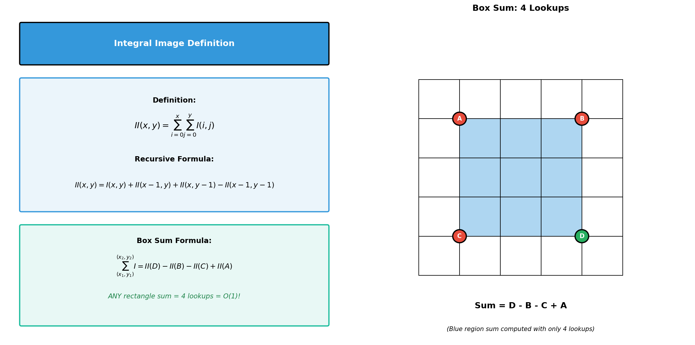

### Numerical Example

**Original Image (5×5):**

```
       x=0   x=1   x=2   x=3   x=4
      ┌─────┬─────┬─────┬─────┬─────┐
y=0   │  1  │  2  │  3  │  4  │  5  │
      ├─────┼─────┼─────┼─────┼─────┤
y=1   │  6  │  7  │  8  │  9  │ 10  │
      ├─────┼─────┼─────┼─────┼─────┤
y=2   │ 11  │ 12  │ 13  │ 14  │ 15  │
      ├─────┼─────┼─────┼─────┼─────┤
y=3   │ 16  │ 17  │ 18  │ 19  │ 20  │
      ├─────┼─────┼─────┼─────┼─────┤
y=4   │ 21  │ 22  │ 23  │ 24  │ 25  │
      └─────┴─────┴─────┴─────┴─────┘
```

**Computing row by row:**

```
II(x,y) = I(x,y) + II(x-1,y) + II(x,y-1) - II(x-1,y-1)

Row y=0:
  II(0,0) = I(0,0) = 1
  II(1,0) = I(1,0) + II(0,0) = 2 + 1 = 3
  II(2,0) = I(2,0) + II(1,0) = 3 + 3 = 6
  ...

Row y=1:
  II(0,1) = I(0,1) + II(0,0) = 6 + 1 = 7
  II(1,1) = I(1,1) + II(0,1) + II(1,0) - II(0,0) = 7 + 7 + 3 - 1 = 16
  ...
```

**Resulting Integral Image:**

```
       x=0   x=1   x=2   x=3   x=4
      ┌─────┬─────┬─────┬─────┬─────┐
y=0   │  1  │  3  │  6  │ 10  │ 15  │
      ├─────┼─────┼─────┼─────┼─────┤
y=1   │  7  │ 16  │ 27  │ 40  │ 55  │
      ├─────┼─────┼─────┼─────┼─────┤
y=2   │ 18  │ 39  │ 63  │ 90  │ 120 │
      ├─────┼─────┼─────┼─────┼─────┤
y=3   │ 34  │ 72  │114  │160  │ 210 │
      ├─────┼─────┼─────┼─────┼─────┤
y=4   │ 55  │115  │180  │250  │ 325 │
      └─────┴─────┴─────┴─────┴─────┘
```

### Box Sum Example (O(1) Computation)

```
Calculate sum of 3×3 box from (1,1) to (3,3):

A = II(0,0) = 1
B = II(3,0) = 10
C = II(0,3) = 34
D = II(3,3) = 160

Box Sum = D - B - C + A = 160 - 10 - 34 + 1 = 117

Verification: 7+8+9+12+13+14+17+18+19 = 117 ✓
```

**Key insight: ANY box size computed with just 4 lookups!**

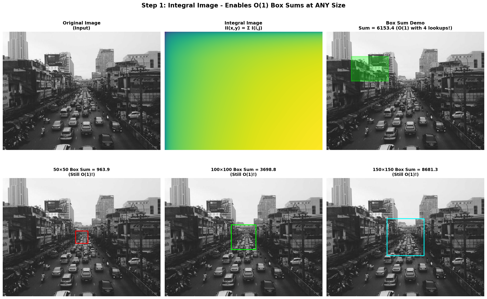

### Real Image Results

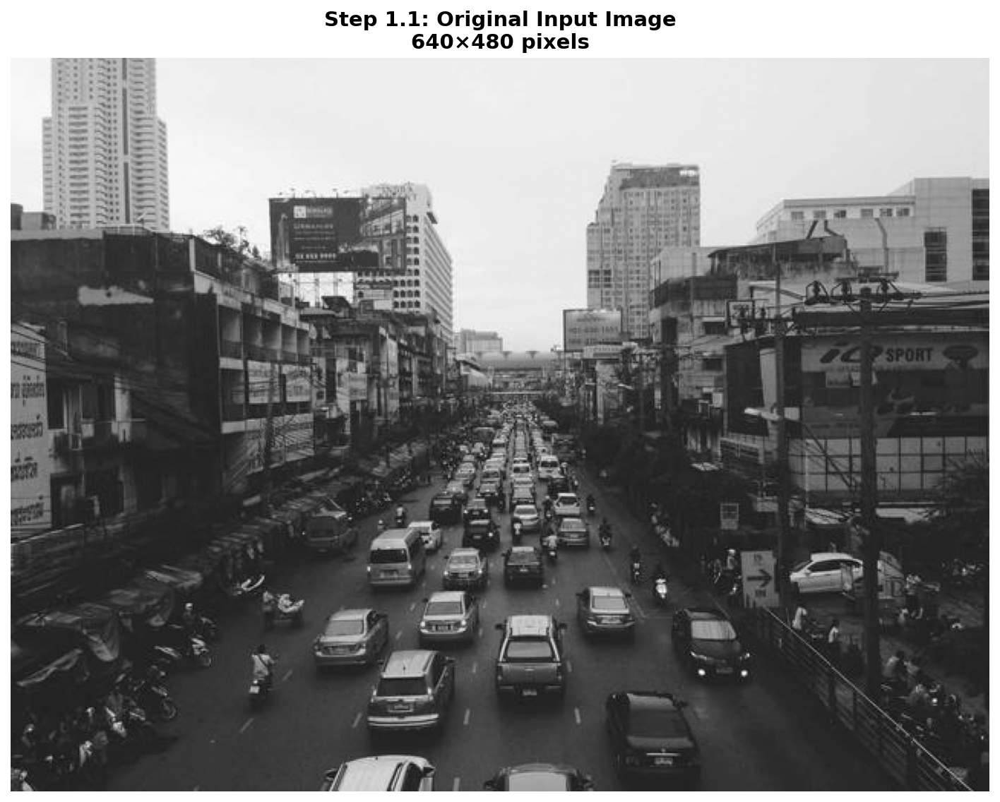
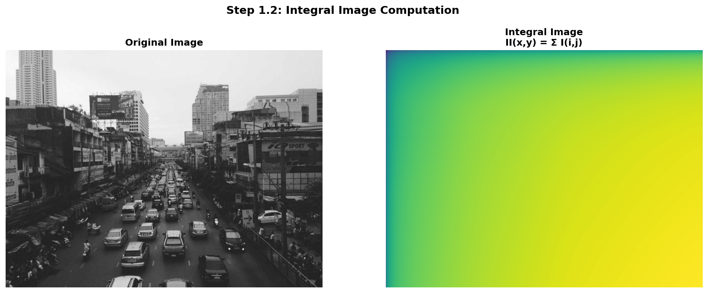
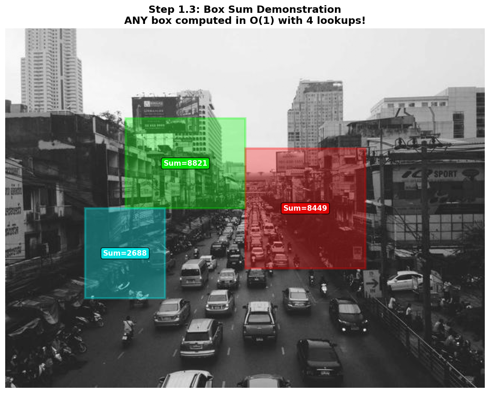

---

## Step 2: Hessian Determinant

**Why?** The Hessian determinant detects blob-like structures at any scale, similar to SIFT's DoG but using efficient box filters.

### Mathematical Definition

```
Hessian Matrix:
  H(x,σ) = | Lxx(x,σ)  Lxy(x,σ) |
           | Lxy(x,σ)  Lyy(x,σ) |

Determinant (blob response):
  det(H) = Lxx × Lyy - (w × Lxy)²

  where w = 0.9 (corrects for box filter approximation)
```

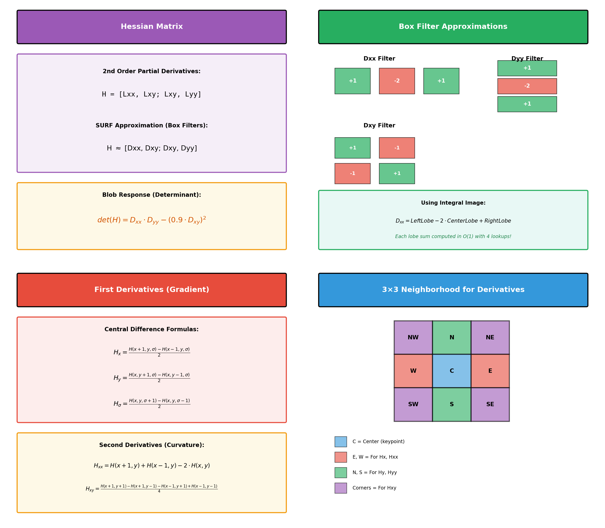

### Box Filter Patterns

SURF approximates Gaussian second derivatives using box filters:

```
Dxx Filter (9×9):            Dyy Filter (9×9):            Dxy Filter (9×9):
┌───┬───────────┬───┐        ┌─────────────────────┐        ┌────┬─────┬────┐
│+1 │    -2     │+1 │        │         +1          │        │ +1 │  0  │ -1 │
│   │           │   │        ├─────────────────────┤        ├────┼─────┼────┤
│   │           │   │        │         -2          │        │  0 │  0  │  0 │
│   │           │   │        ├─────────────────────┤        ├────┼─────┼────┤
│   │           │   │        │         +1          │        │ -1 │  0  │ +1 │
└───┴───────────┴───┘        └─────────────────────┘        └────┴─────┴────┘

Green = +1 weight            Red = -2 weight              Green = +1, Red = -1
```

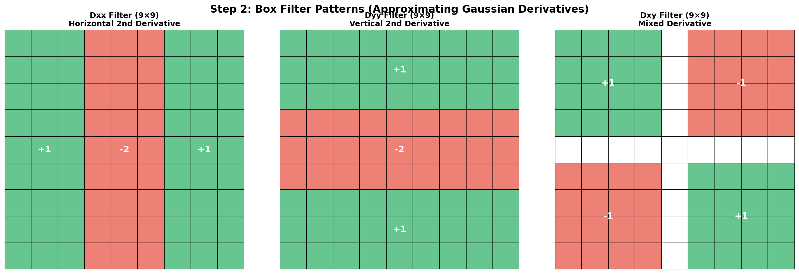

### Numerical Example

**Given:** Integral image, keypoint at (x=50, y=80), filter size = 9×9

```
For 9×9 filter, lobe size = 9/3 = 3

Dxx regions around (50, 80):
  Left lobe:   x ∈ [46, 48], y ∈ [76, 84]  → weight +1
  Center lobe: x ∈ [49, 51], y ∈ [76, 84]  → weight -2
  Right lobe:  x ∈ [52, 54], y ∈ [76, 84]  → weight +1

Computing box sums (example values):
  Dxx = 450 + 420 - 2×480 = -90
  Dyy = 400 + 380 - 2×520 = -260
  Dxy = 200 - 180 - 190 + 210 = 40

Normalized (area = 81):
  Dxx_n = -1.11, Dyy_n = -3.21, Dxy_n = 0.49

det(H) = (-1.11) × (-3.21) - (0.9 × 0.49)²
       = 3.56 - 0.19 = 3.37  (positive = blob detected)
```

### Multi-Scale Hessian Response

Filter sizes for multi-scale detection: 9×9, 15×15, 21×21, 27×27

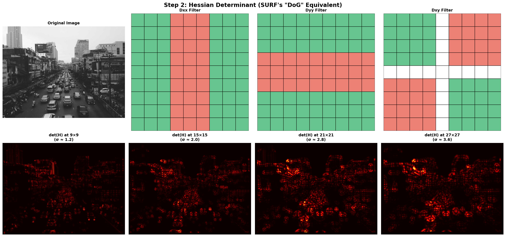
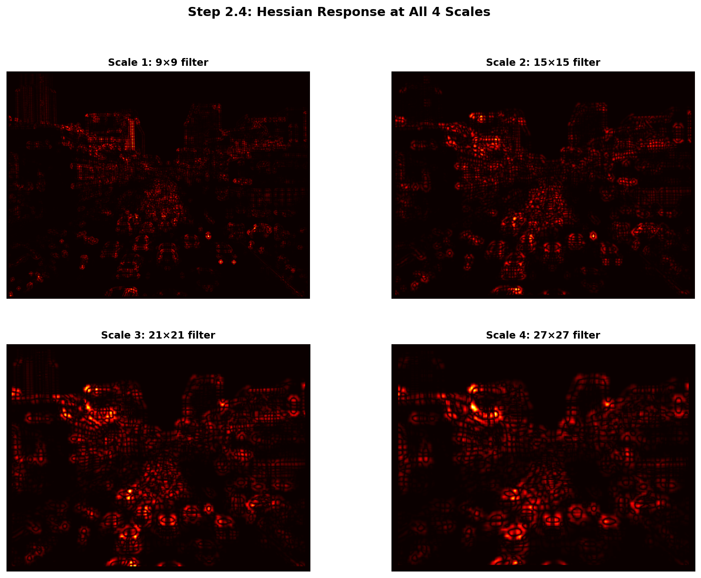

---

## Step 3: Keypoint Detection

### Scale-Space Structure

```
SURF Filter Pyramid (vs SIFT Image Pyramid):

SIFT (Image Pyramid - SLOW):          SURF (Filter Pyramid - FAST):
─────────────────────────────          ──────────────────────────────

  Octave 0:  640×480 image              Scale 1:  Same 640×480 image
       ↓ downsample                               + 9×9 box filter

  Octave 1:  320×240 image              Scale 2:  Same 640×480 image
       ↓ downsample                               + 15×15 box filter

  Octave 2:  160×120 image              Scale 3:  Same 640×480 image
                                                  + 21×21 box filter

  Problem: Multiple image copies        Advantage: ONE image, O(1) filters!
```

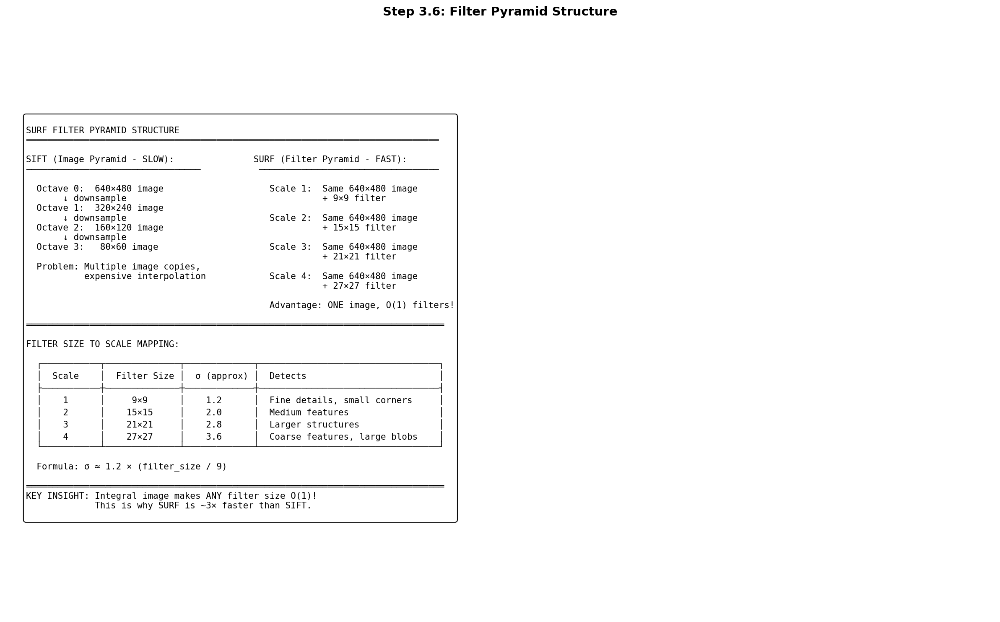

### 26-Neighbor Comparison

Same as SIFT, compare to **26 neighbors** across three consecutive scales:

```
    SCALE σ-1 (smaller)      SCALE σ (current)       SCALE σ+1 (larger)
    ┌───┬───┬───┐            ┌───┬───┬───┐            ┌───┬───┬───┐
    │ 1 │ 2 │ 3 │            │10 │11 │12 │            │19 │20 │21 │
    ├───┼───┼───┤            ├───┼───┼───┤            ├───┼───┼───┤
    │ 4 │ 5 │ 6 │            │13 │ ★ │14 │            │22 │23 │24 │
    ├───┼───┼───┤            ├───┼───┼───┤            ├───┼───┼───┤
    │ 7 │ 8 │ 9 │            │15 │16 │17 │            │25 │26 │27 │
    └───┴───┴───┘            └───┴───┴───┘            └───┴───┴───┘
      9 neighbors            8 neighbors + ★           9 neighbors

    Total: 9 + 8 + 9 = 26 neighbors
```

```
Keypoint if:
  value > ALL 26 neighbors → Maximum
  value < ALL 26 neighbors → Minimum
```

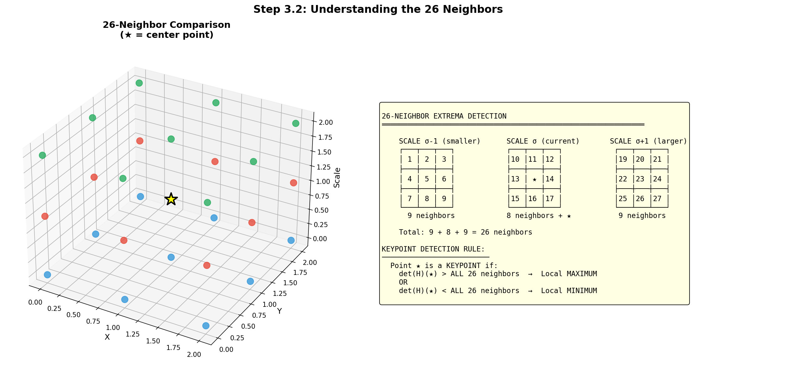

### All Scales Combined

Circle size and color indicate detection scale:
- **Red small circles**: Scale 1 (9×9) - Fine features
- **Green medium circles**: Scale 2 (15×15) - Medium features
- **Cyan large circles**: Scale 3 (21×21) - Coarse features
- **Magenta XL circles**: Scale 4 (27×27) - Very coarse features

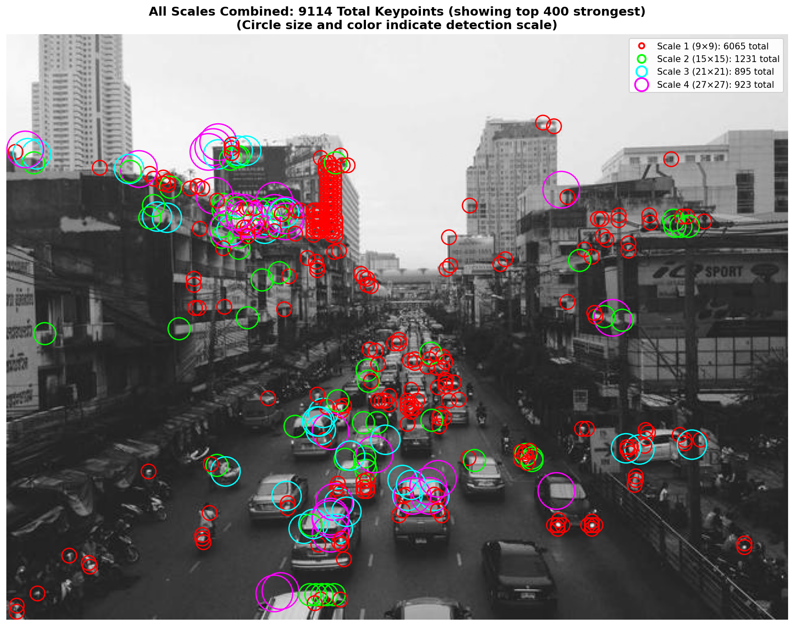

---

## Step 4: Keypoint Filtering & Refinement

### 3×3×3 Window for Derivatives

We need derivatives in the 3D scale-space (x, y, σ):

```
First Derivatives (Gradient):
  Dx = [H(x+1,y,σ) - H(x-1,y,σ)] / 2
  Dy = [H(x,y+1,σ) - H(x,y-1,σ)] / 2
  Dσ = [H(x,y,σ+1) - H(x,y,σ-1)] / 2

Second Derivatives (Curvature):
  Dxx = H(x+1,y,σ) + H(x-1,y,σ) - 2×H(x,y,σ)
  Dyy = H(x,y+1,σ) + H(x,y-1,σ) - 2×H(x,y,σ)
  Dσσ = H(x,y,σ+1) + H(x,y,σ-1) - 2×H(x,y,σ)
```

### Stage 1: Response Threshold

```
REJECT if: |det(H)| < 0.002

Example - KEEP:
  Keypoint at (150, 200): det(H) = 0.0025 > 0.002 ✓

Example - REJECT:
  Keypoint at (30, 220): det(H) = 0.0001 < 0.002 ✗
```

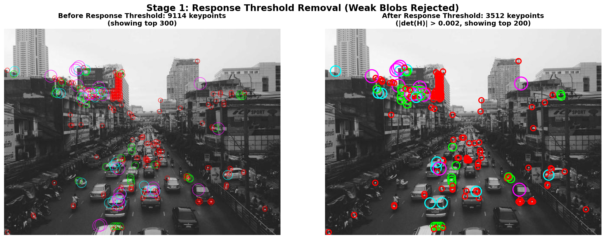

### Stage 2: Sub-pixel Refinement

```
offset = -H⁻¹ × ∇H

REJECT if: |offset_x| > 0.5 OR |offset_y| > 0.5 OR |offset_σ| > 0.5

Example - KEEP:
  offsets = (0.08, 0.05, 0.12) → All < 0.5 ✓

Example - REJECT:
  offsets = (-0.15, 0.22, 0.73) → offset_σ > 0.5 ✗
```

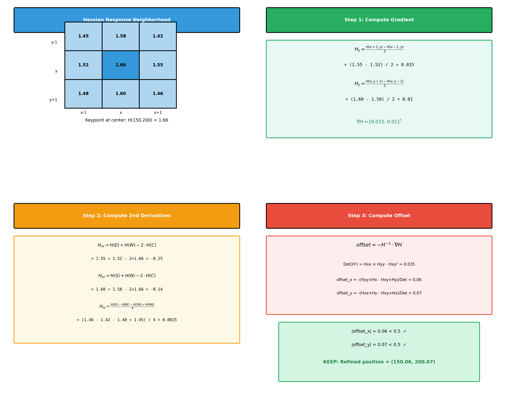

### Filtering Summary

```
Step 3 Complete: ~9000 keypoints detected
        ↓
Stage 1: Response Threshold  → ~5500 removed (61%)
        ↓
Stage 2: Sub-pixel Refinement → ~300 removed (3%)
        ↓
FINAL: ~3200 stable keypoints
```

---

## Description Phase

**Goal**: Create unique, rotation-invariant fingerprints (descriptors) for matching.

```
INPUT: Stable keypoints with (x, y, scale)
        ↓
Step 5: Orientation Assignment (Haar wavelets)
        ↓
Step 6: Descriptor Extraction (64-D)
        ↓
OUTPUT: Keypoints with (x, y, scale, orientation, 64-D descriptor)
```

---

## Step 5: Orientation Assignment

### Haar Wavelet Filters

```
Haar X (dx):                    Haar Y (dy):
┌───────┬───────┐               ┌───────────────┐
│  -1   │  +1   │               │      +1       │
│       │       │               ├───────────────┤
│       │       │               │      -1       │
└───────┴───────┘               └───────────────┘

dx = sum(right half) - sum(left half)
dy = sum(top half) - sum(bottom half)
```

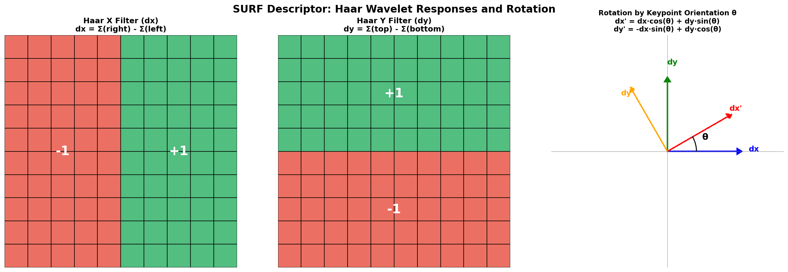

### 60° Sliding Window

```
For each sample point in circular region (radius 6s):
  1. Compute Haar responses: dx, dy
  2. Apply Gaussian weighting
  3. Weighted responses: dx_w, dy_w

Sliding window:
  For each angle θ from 0° to 360°:
    sum_x = Σ dx_w for points in [θ-30°, θ+30°]
    sum_y = Σ dy_w for points in [θ-30°, θ+30°]
    magnitude = √(sum_x² + sum_y²)

  Dominant orientation = θ with maximum magnitude
```

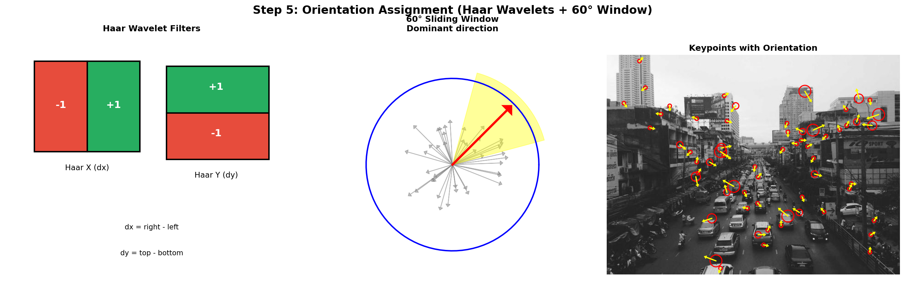
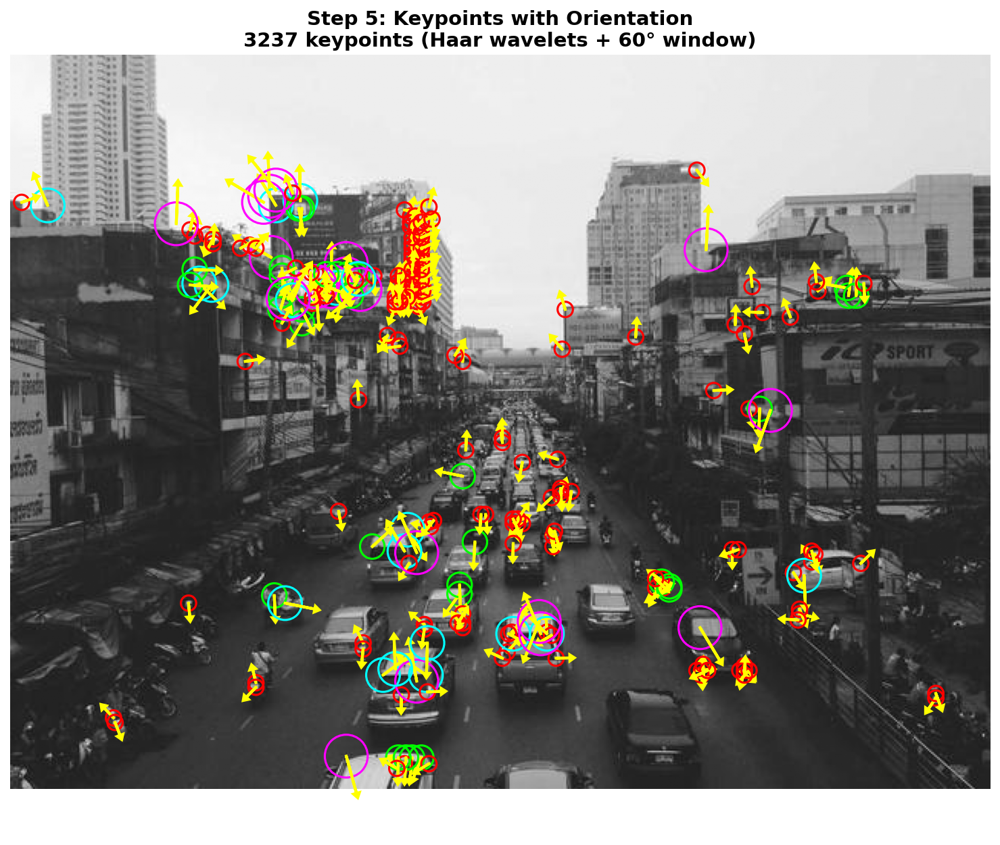

---

## Step 6: Descriptor Extraction (64-D)

### Extract 20s × 20s Region

```
Region size:
  - 9×9 filter: s = 1.2, region = 24 × 24 pixels
  - 15×15 filter: s = 2.0, region = 40 × 40 pixels
  - 21×21 filter: s = 2.8, region = 56 × 56 pixels

Coordinate transformation (rotation):
  x' = x + s × (u × cos(θ) - v × sin(θ))
  y' = y + s × (u × sin(θ) + v × cos(θ))
```

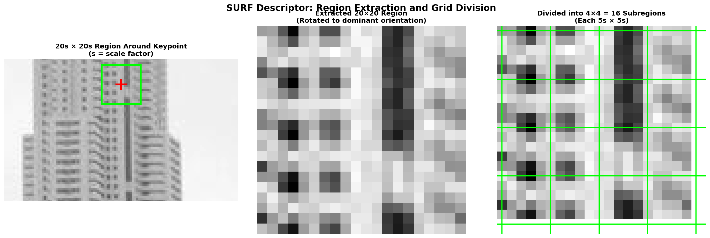

### Divide into 4×4 = 16 Subregions

```
┌──────┬──────┬──────┬──────┐
│  S0  │  S1  │  S2  │  S3  │   Each subregion = 5s × 5s pixels
├──────┼──────┼──────┼──────┤
│  S4  │  S5  │  S6  │  S7  │   Total subregions = 16
├──────┼──────┼──────┼──────┤
│  S8  │  S9  │ S10  │ S11  │   Each subregion → 4-value vector
├──────┼──────┼──────┼──────┤
│ S12  │ S13  │ S14  │ S15  │
└──────┴──────┴──────┴──────┘
```

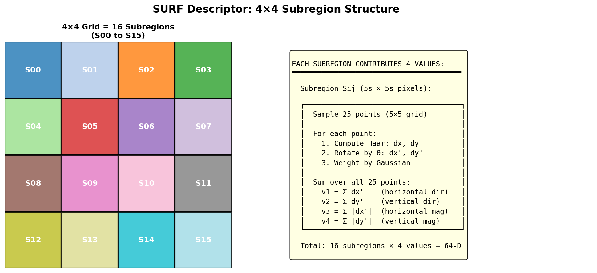

### Build 4-Value Vector per Subregion

```
v = [Σdx', Σdy', Σ|dx'|, Σ|dy'|]
```

| Component | Meaning | High Value Indicates |
|-----------|---------|---------------------|
| Σdx' | Horizontal direction | Consistent right-pointing gradients |
| Σdy' | Vertical direction | Consistent upward-pointing gradients |
| Σ\|dx'\| | Horizontal magnitude | Strong horizontal edges |
| Σ\|dy'\| | Vertical magnitude | Strong vertical edges |

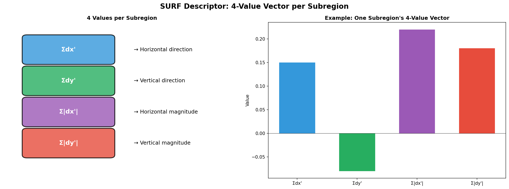

### Final 64-D Descriptor

```
Descriptor Structure:
  [S0: v0-v3][S1: v0-v3]...[S15: v0-v3]
  ───────────────────────────────────────
       Total = 16 × 4 = 64 dimensions

Normalize to unit length:
  descriptor = raw_descriptor / ||raw_descriptor||
```

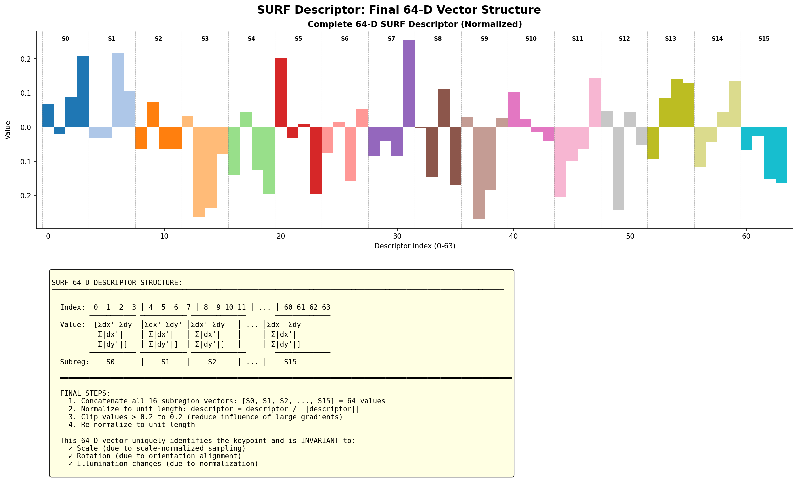
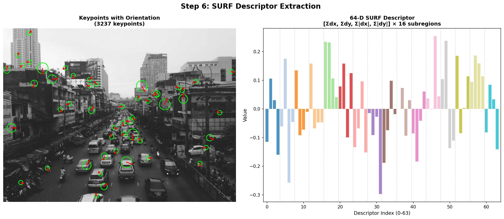

---

## Complete Pipeline Summary

```
INPUT: 640 × 480 grayscale image
        ↓
STEP 1: Integral Image → O(1) box sums
        ↓
STEP 2: Hessian Determinant → det(H) at 4 scales
        ↓
STEP 3: Keypoint Detection → ~9000 keypoints
        ↓
STEP 4: Filtering & Refinement → ~3200 keypoints
        ↓
STEP 5: Orientation Assignment → Haar wavelets + 60° window
        ↓
STEP 6: Descriptor Extraction → 64-D vector per keypoint
        ↓
OUTPUT: 3200 keypoints with (x, y, scale, θ, 64-D descriptor)
```

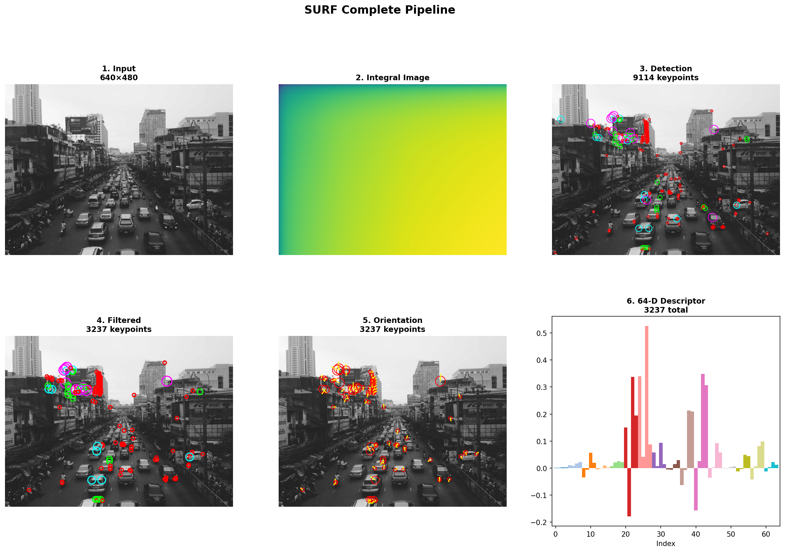

---

## SURF vs SIFT Comparison

| Feature | SIFT | SURF |
|---------|------|------|
| **Scale-space** | Gaussian pyramid (image resampling) | Filter pyramid (same image) |
| **Detector** | Difference of Gaussians | Hessian determinant |
| **Filter type** | Gaussian convolution | Box filters via integral image |
| **Complexity** | O(n) per filter | O(1) per filter |
| **Orientation** | 36-bin gradient histogram | Haar wavelets + 60° window |
| **Descriptor** | 128-D (4×4×8 bins) | 64-D (4×4×4 values) |
| **Speed** | Slower (~1×) | Faster (~3× faster) |

---

## Quick Reference: All Formulas

### Detection Phase

```
Integral Image:
  II(x,y) = Σ(i≤x, j≤y) I(i,j)
  Box Sum = II(D) - II(B) - II(C) + II(A)

Hessian:
  det(H) = Dxx × Dyy - (0.9 × Dxy)²

Keypoint:
  Local maximum: det(H) > ALL 26 neighbors
  Local minimum: det(H) < ALL 26 neighbors

Filtering:
  Stage 1: |det(H)| > threshold
  Stage 2: |offset| < 0.5
```

### Description Phase

```
Haar Wavelets:
  dx = I(x+1, y) - I(x-1, y)
  dy = I(x, y+1) - I(x, y-1)

Orientation:
  θ = argmax { √((Σdx)² + (Σdy)²) } over 60° window

Descriptor (per subregion):
  v = [Σdx', Σdy', Σ|dx'|, Σ|dy'|]

Final:
  64-D = concat(v0, v1, ..., v15)
  descriptor = 64-D / ||64-D||
```

---

## References

1. Bay, H., Tuytelaars, T., & Van Gool, L. (2006). "SURF: Speeded Up Robust Features." ECCV 2006.
2. Bay, H., Ess, A., Tuytelaars, T., & Van Gool, L. (2008). "Speeded-Up Robust Features (SURF)." Computer Vision and Image Understanding, 110(3), 346-359.
