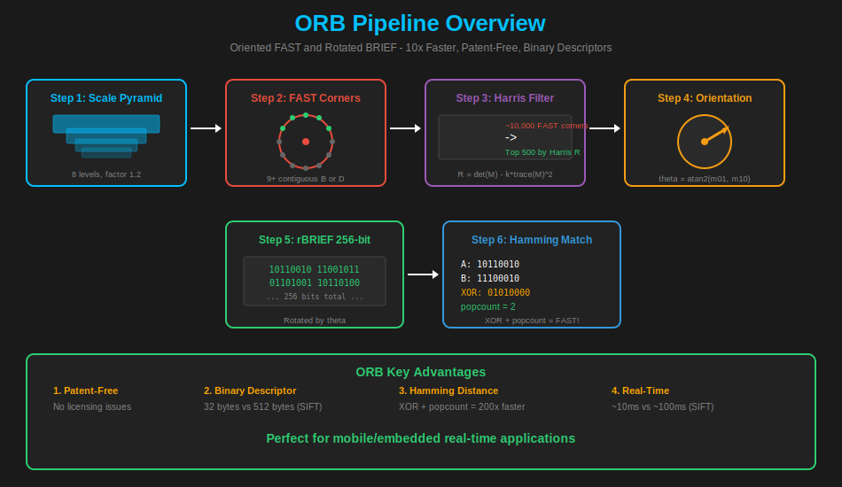
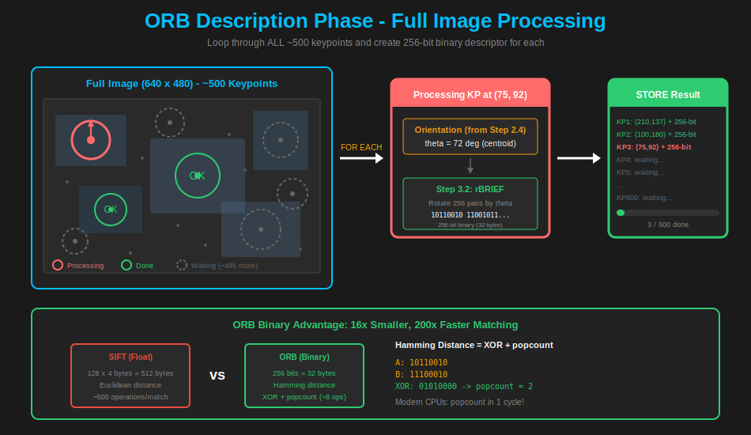

# Understanding ORB: Oriented FAST and Rotated BRIEF

*A comprehensive guide to implementing ORB from scratch*

---

The **ORB (Oriented FAST and Rotated BRIEF)** algorithm is a fast, robust, and **patent-free** alternative to SIFT and SURF. Introduced by Rublee et al. in 2011, ORB combines the speed of FAST corner detection with the compact binary descriptors of BRIEF, achieving approximately 10× faster performance than SIFT while remaining freely available for commercial use.

This article walks through the complete ORB pipeline, from mathematical foundations to practical implementation.

---

## Table of Contents

1. [Overview](#1-overview)
   - [1.1 What is ORB?](#11-what-is-orb)
   - [1.2 What is a Keypoint?](#12-what-is-a-keypoint)
   - [1.3 Why ORB?](#13-why-orb)
   - [1.4 Input Image](#14-input-image-used-in-this-tutorial)
   - [1.5 Pipeline Summary](#15-orb-pipeline-summary)
2. [Detection Phase](#2-detection-phase)
   - [2.1 Scale-Space Pyramid](#21-scale-space-pyramid)
   - [2.2 FAST Corner Detection](#22-fast-corner-detection)
   - [2.3 Harris Corner Response](#23-harris-corner-response)
   - [2.4 Orientation Assignment](#24-orientation-assignment)
3. [Description Phase](#3-description-phase)
   - [3.1 Description Phase Overview](#31-description-phase-overview)
   - [3.2 rBRIEF Descriptor](#32-rbrief-descriptor)
   - [3.3 Hamming Distance Matching](#33-hamming-distance-matching)
4. [Summary](#4-summary)
   - [4.1 Complete Pipeline](#41-complete-pipeline)
   - [4.2 Quick Reference: All Formulas](#42-quick-reference-all-formulas)
   - [4.3 Key Properties](#43-key-properties)
   - [4.4 What's Next? Matching](#44-whats-next-matching-descriptors)
5. [Common Mistakes & FAQ](#5-common-mistakes--faq)
6. [Complete Python Implementation](#6-complete-python-implementation)
7. [References](#7-references)

---

## 1. Overview

### 1.1 What is ORB?

**ORB (Oriented FAST and Rotated BRIEF)** is a high-performance feature detection and description algorithm designed for real-time applications. It combines:
- **FAST** corner detection (extremely fast)
- **BRIEF** binary descriptors (compact and fast to match)
- **Orientation** for rotation invariance

> **Real-World Analogy**: Imagine you're playing a game of "spot the difference" between two photos. SIFT is like carefully measuring every detail with a ruler—accurate but slow. ORB is like quickly scanning for obvious patterns—less precise but 10× faster, perfect for real-time applications like AR and robotics!

```
┌─────────────────────────────────────────────────────────────────────┐
│                    THE ORB PHILOSOPHY                                │
├─────────────────────────────────────────────────────────────────────┤
│                                                                     │
│   SIFT/SURF:                   ORB:                                 │
│   ──────────                   ────                                 │
│   Float descriptors            Binary descriptors                   │
│   512/256 bytes each           32 bytes each (16× smaller!)         │
│   Euclidean distance           Hamming distance (XOR + popcount)    │
│   ~100ms per image             ~10ms per image                      │
│                                                                     │
│   Patented (was)               Patent-FREE!                         │
│   Academic/research            Commercial-friendly                  │
│                                                                     │
└─────────────────────────────────────────────────────────────────────┘
```

### 1.2 What is a Keypoint?

A **keypoint** is a distinctive location in an image—typically corners that are easy to find again in other images.

```
Example: Keypoint locations in an image
┌────────────────────────────────┐
│       ●                        │   ● = keypoint (corner)
│           ●                    │   
│                    ●           │   Each keypoint has:
│   ●                            │     - Position (x, y)
│              ●         ●       │     - Scale (pyramid level)
└────────────────────────────────┘     - Orientation (θ)
                                       - Descriptor (256 bits)
```

### 1.3 Why ORB?

| Problem | How ORB Solves It |
|---------|-------------------|
| SIFT/SURF are slow | FAST corners + BRIEF = 10× faster |
| Float descriptors are large | Binary 256-bit = 32 bytes (vs 512 bytes) |
| Euclidean distance is slow | Hamming distance: just XOR + popcount |
| Patent restrictions | ORB is completely patent-free |
| Need real-time performance | Designed for mobile/embedded devices |

> **Key Insight**: The magic of ORB is using **binary** descriptors. Instead of comparing 128 floating-point numbers, you just XOR two 256-bit strings and count the 1s!

### 1.4 Input Image Used in This Tutorial


### 1.5 ORB Pipeline Summary



ORB operates in two main phases:

| Phase | Step | Description | Math |
|-------|------|-------------|------|
| Detection | 2.1 | Scale-Space Pyramid | `scale_n = 1/1.2^n` |
| Detection | 2.2 | FAST Corner Detection | 16-pixel Bresenham circle |
| Detection | 2.2a | High-Speed Test | Test 4 cardinal pixels first |
| Detection | 2.2b | Full Contiguous Test | 9+ contiguous B or D |
| Detection | 2.3 | Harris Corner Response | `R = det(M) - k×trace(M)²` |
| Detection | 2.4 | Orientation Assignment | `θ = atan2(m₀₁, m₁₀)` |
| Description | 3.2 | rBRIEF Descriptor | 256-bit rotated binary pattern |
| Matching | 3.3 | Hamming Distance | XOR + popcount |

---

<div align="center">


### **Find WHERE the keypoints are in the image**

`Pyramid` | `FAST` | `Harris Filtering` | `Orientation`

</div>

---

## 2. Detection Phase

**Goal**: Find stable corner points that can be detected regardless of scale and rotation.

```
INPUT: Image (H × W)
        ↓
Step 2.1: Build Scale-Space Pyramid (8 levels, factor 1.2)
        ↓
Step 2.2: FAST Corner Detection (16-pixel circle test)
        - Step 2.2a: High-Speed Test (4 pixels)
        - Step 2.2b: Full Contiguous Test (16 pixels)
        ↓
Step 2.3: Harris Corner Response (filter top N keypoints)
        - Compute Gradients Ix, Iy
        - Build Structure Tensor M
        - Compute Corner Response R
        ↓
Step 2.4: Orientation Assignment (intensity centroid)
        - Compute Image Moments
        - Compute Angle θ
        ↓
OUTPUT: ~500 keypoints with (x, y, scale, orientation)
```

*Example: For a 640×480 image, FAST might find ~10,000 corners, Harris filtering keeps top ~500.*

---

## 2.1 Scale-Space Pyramid

**Why do we need this?** To detect features at multiple scales for scale invariance.

> **Intuition**: Objects appear at different sizes depending on distance. A pyramid lets us find the same corner whether the object is close (large) or far (small).

```
┌─────────────────────────────────────────────────────────────┐
│  INTUITION: Why Multiple Scales?                            │
├─────────────────────────────────────────────────────────────┤
│                                                             │
│  Far away object:         Close object:                     │
│  ┌───────────┐            ┌─────────────────────┐          │
│  │    ■      │            │                     │          │
│  │   ■ ■     │    vs      │         ■■■         │          │
│  │    ■      │            │        ■■■■■        │          │
│  └───────────┘            │         ■■■         │          │
│   Small feature           └─────────────────────┘          │
│   Detected at             Large feature                     │
│   pyramid level 0         Detected at pyramid level 4       │
└─────────────────────────────────────────────────────────────┘
```

### 2.1.1 The Mathematics

**Scale at level n:**
```
scale_n = 1 / f^n

where:
  f = 1.2 (scale factor, default)
  n = pyramid level (0, 1, 2, ..., 7)
```

**Image size at level n:**
```
W_n = W_0 × scale_n = W_0 / f^n
H_n = H_0 × scale_n = H_0 / f^n
```

### 2.1.2 Example Calculation

```
For original image 640 × 480:

Level   Scale Formula        Scale Value    Image Size
─────────────────────────────────────────────────────────
  0     1/1.2⁰ = 1/1        1.000          640 × 480
  1     1/1.2¹ = 1/1.2      0.833          533 × 400
  2     1/1.2² = 1/1.44     0.694          444 × 333
  3     1/1.2³ = 1/1.728    0.579          370 × 278
  4     1/1.2⁴ = 1/2.074    0.482          309 × 231
  5     1/1.2⁵ = 1/2.488    0.402          257 × 193
  6     1/1.2⁶ = 1/2.986    0.335          214 × 161
  7     1/1.2⁷ = 1/3.583    0.279          179 × 134
```

### 2.1.3 Step-by-Step Calculation for Level 3

```
Given:
  Original size: W₀ = 640, H₀ = 480
  Scale factor: f = 1.2
  Level: n = 3

Step 1: Compute scale_3
  scale_3 = 1 / f³ = 1 / 1.728 = 0.5787

Step 2: Compute new dimensions
  W_3 = 640 × 0.5787 = 370
  H_3 = 480 × 0.5787 = 278

Result: Level 3 image is 370 × 278 pixels
```


*ORB 8-level scale pyramid. Each level is 1/1.2× smaller than the previous.*

### 2.1.4 Key Difference from SIFT

| Property | SIFT | ORB |
|----------|------|-----|
| Scale factor | 2.0 (per octave) | 1.2 (per level) |
| Method | Gaussian blur + downsample | Direct downsample |
| Levels | 4 octaves × 5 scales | 8 levels |
| Total images | 20 Gaussian + 16 DoG | 8 pyramid levels |

### 2.1.5 Pyramid Structure

```
Level 0 (1.000): ┌──────────────────────┐
                 │     640 × 480        │
                 └──────────────────────┘
                           ↓ resize by 1/1.2
Level 1 (0.833): ┌─────────────────────┐
                 │    533 × 400        │
                 └─────────────────────┘
                           ↓ resize by 1/1.2
Level 2 (0.694): ┌───────────────────┐
                 │   444 × 333       │
                 └───────────────────┘
                           ⋮
Level 7 (0.279): ┌───────────┐
                 │ 179 × 134 │
                 └───────────┘
```

### 2.1.6 Pseudocode

```python
def build_pyramid(image, n_levels=8, scale_factor=1.2):
    """
    Build image pyramid with n_levels levels.
    Each level is 1/scale_factor smaller than the previous.
    """
    pyramid = [image]  # Level 0 = original
    
    for level in range(1, n_levels):
        scale = 1.0 / (scale_factor ** level)
        new_width = int(image.shape[1] * scale)
        new_height = int(image.shape[0] * scale)
        
        resized = cv2.resize(image, (new_width, new_height))
        pyramid.append(resized)
    
    return pyramid
```


> **Key Takeaway**: ORB uses a simpler pyramid than SIFT (just resize, no Gaussian blur), making it faster to construct while still providing scale invariance.

---

## 2.2 FAST Corner Detection

**Why FAST?** FAST (Features from Accelerated Segment Test) is extremely fast for real-time applications.

> **Intuition**: FAST looks at a circle of 16 pixels around each candidate point. If at least 9 consecutive pixels are all brighter (or all darker) than the center, it's a corner!

```
┌─────────────────────────────────────────────────────────────┐
│  INTUITION: What Makes a Corner?                             │
├─────────────────────────────────────────────────────────────┤
│                                                             │
│   Edge (NOT corner):      Corner:          Flat (NOT):      │
│   ─────────────────       ─────────        ──────────       │
│        ●●●●●●                ●●●●●               ○○○○○      │
│       ○      ○              ●    ○              ○    ○      │
│      ○   p   ○             ●  p  ○             ○  p  ○      │
│       ○      ○              ●    ○              ○    ○      │
│        ○○○○○○                ●●●●○               ○○○○○      │
│                                                             │
│   Only ~4 bright         9+ consecutive      No bright/dark │
│   NOT a corner!          IS a corner!        NOT a corner!  │
│                                                             │
└─────────────────────────────────────────────────────────────┘
```

### 2.2.1 The Bresenham Circle (16 pixels)

The FAST detector uses a circle of 16 pixels around each candidate point:

```
         16  1   2
      15          3
    14              4
    13       p      5
    12              6
      11          7
         10  9   8

The 16 pixels form a Bresenham circle of radius 3
```

### 2.2.2 Circle Pixel Offsets

```
Position  Offset (dx, dy)    Position  Offset (dx, dy)
────────────────────────────────────────────────────────
   1      ( 0, -3)              9      ( 0, +3)
   2      (+1, -3)             10      (-1, +3)
   3      (+2, -2)             11      (-2, +2)
   4      (+3, -1)             12      (-3, +1)
   5      (+3,  0)             13      (-3,  0)
   6      (+3, +1)             14      (-3, -1)
   7      (+2, +2)             15      (-2, -2)
   8      (+1, +3)             16      (-1, -3)
```

### 2.2.3 FAST-9 Algorithm

**Step 1: Define threshold:**
```
Let I_p = intensity of center pixel p
Let t = threshold (default: 20 for 0-255 images, or 0.08 for normalized)

Upper bound: I_p + t
Lower bound: I_p - t
```

**Step 2: High-Speed Test (Cardinal Points):**

Before checking all 16 pixels, test positions 1, 5, 9, 13 (N, E, S, W):

```
         1 (North)
         ↓
    13 ← p → 5
  (West)     (East)
         ↓
         9 (South)

Rule:
  If at least 3 of {1, 5, 9, 13} are 'B' (Brighter) → Continue
  If at least 3 of {1, 5, 9, 13} are 'D' (Darker)   → Continue
  Otherwise → REJECT (cannot have 9 contiguous)
```

**Why this works:** For 9 contiguous pixels to be brighter (or darker), at least 3 of the 4 cardinal points MUST be included.

**Step 3: Classify Each Circle Pixel:**
```
For each of the 16 circle pixels with intensity I_c:

  If I_c > I_p + t  →  Label = 'B' (Brighter)
  If I_c < I_p - t  →  Label = 'D' (Darker)
  Otherwise         →  Label = 'S' (Similar)
```

**Step 4: Check Contiguous Condition:**
```
CORNER if: 9+ contiguous pixels are ALL 'B'
       OR: 9+ contiguous pixels are ALL 'D'

Note: "Contiguous" wraps around (pixel 16 is adjacent to pixel 1)
```

### 2.2.4 Worked Example: Corner Detection

```
Given:
  Center pixel p at location (100, 50)
  I_p = 150 (center intensity, 0-255 range)
  t = 20 (threshold)

  Upper bound = 170
  Lower bound = 130

Circle pixel intensities (16 values):
Position:  1     2     3     4     5     6     7     8
Intensity: 185   195   180   175   178   173   183   190
Label:     B     B     B     B     B     B     B     B

Position:  9     10    11    12    13    14    15    16
Intensity: 200   145   140   148   147   152   142   180
Label:     B     S     S     S     S     S     S     B

High-Speed Test:
  Position 1: 185 > 170? YES → B
  Position 5: 178 > 170? YES → B
  Position 9: 200 > 170? YES → B
  Position 13: 147 > 170? NO, 147 < 130? NO → S
  
  Count of B: 3 ✓ (continue)

Labels: B B B B B B B B B S S S S S S B

Check contiguous:
  Starting at position 16: B B B B B B B B B B = 10 consecutive B's!

10 ≥ 9 → ✓ CORNER DETECTED!
```

### 2.2.5 Example: Non-Corner Point

```
Labels: S B S S S S B S S S D S S B S S

High-Speed Test:
  Positions 1, 5, 9, 13: All S (similar)
  Count of B: 0, Count of D: 0
  
Neither has 3+ → REJECT immediately (no need to check all 16!)
```


*The Bresenham circle of 16 pixels used by FAST. Green pixels show the brighter/darker pattern that defines a corner.*

### 2.2.6 Pseudocode

```python
def fast_corner_detect(image, threshold=20):
    """
    FAST-9 corner detection with high-speed test.
    """
    H, W = image.shape
    corners = []
    
    # Circle offsets (16 pixels)
    circle = [(0,-3), (1,-3), (2,-2), (3,-1), (3,0), (3,1), (2,2), (1,3),
              (0,3), (-1,3), (-2,2), (-3,1), (-3,0), (-3,-1), (-2,-2), (-1,-3)]
    
    for y in range(3, H-3):
        for x in range(3, W-3):
            Ip = image[y, x]
            upper = Ip + threshold
            lower = Ip - threshold
            
            # High-speed test: check positions 1, 5, 9, 13
            cardinal_idx = [0, 4, 8, 12]  # positions 1, 5, 9, 13
            bright_count = 0
            dark_count = 0
            
            for idx in cardinal_idx:
                dx, dy = circle[idx]
                Ic = image[y + dy, x + dx]
                if Ic > upper:
                    bright_count += 1
                elif Ic < lower:
                    dark_count += 1
            
            # Must have at least 3 bright OR 3 dark
            if bright_count < 3 and dark_count < 3:
                continue  # REJECT
            
            # Full test: classify all 16 pixels
            labels = []
            for dx, dy in circle:
                Ic = image[y + dy, x + dx]
                if Ic > upper:
                    labels.append('B')
                elif Ic < lower:
                    labels.append('D')
                else:
                    labels.append('S')
            
            # Check for 9+ contiguous B or D
            is_corner = check_contiguous(labels, 'B', 9) or \
                        check_contiguous(labels, 'D', 9)
            
            if is_corner:
                corners.append((x, y))
    
    return corners  # ~10,000 corners

def check_contiguous(labels, target, min_count):
    """Check if min_count consecutive labels match target (with wraparound)."""
    extended = labels + labels  # Handle wraparound
    count = 0
    max_count = 0
    
    for label in extended:
        if label == target:
            count += 1
            max_count = max(max_count, count)
        else:
            count = 0
    
    return max_count >= min_count
```


> **Key Takeaway**: FAST is extremely efficient—the high-speed test rejects most non-corners with just 4 pixel comparisons. Only potential corners need the full 16-pixel test.

---

## 2.3 Harris Corner Response

**Why Harris?** FAST finds many corners, but Harris filters keeps only the strongest and most stable ones.

> **Intuition**: FAST detects corners but doesn't rank them. Harris assigns a quality score based on how "cornery" each point is, letting us keep only the best ones.

```
┌─────────────────────────────────────────────────────────────┐
│  INTUITION: Harris Corner Response                           │
├─────────────────────────────────────────────────────────────┤
│                                                             │
│  Eigenvalue Analysis of Structure Tensor M:                 │
│                                                             │
│  λ₁ >> λ₂ ≈ 0  →  Edge (strong gradient one direction)      │
│  λ₁ ≈ λ₂ ≈ 0   →  Flat (no gradient)                        │
│  λ₁ ≈ λ₂ >> 0  →  Corner (strong gradient both directions) │
│                                                             │
│  Harris R approximates this without computing eigenvalues!  │
│                                                             │
└─────────────────────────────────────────────────────────────┘
```

### 2.3.1 How Harris Filtering Works

The Harris response is computed **at each FAST corner location**, NOT sliding across all pixels:

```
Full Image (640 × 480):
┌─────────────────────────────────────────────────────────────┐
│                                                             │
│     ┌───┐ FAST Corner 1 at (100, 50)                       │
│     │3×3│ Compute Harris R → R = 0.0014 → KEEP (top 500)    │
│     └───┘                                                   │
│                                                             │
│              ┌───┐ FAST Corner 2 at (300, 250)             │
│              │3×3│ Compute Harris R → R = 0.0009 → KEEP     │
│              └───┘                                          │
│                                                             │
│                           ┌───┐ FAST Corner 3 at (450, 180)│
│                           │3×3│ R = 0.0001 → REJECT (weak)  │
│                           └───┘                             │
│                                    ... 9,997 more corners   │
└─────────────────────────────────────────────────────────────┘
```

### 2.3.2 The Mathematics

**Compute Image Gradients (Sobel operators):**
```
       ┌─────┬─────┬─────┐         ┌─────┬─────┬─────┐
       │ -1  │  0  │ +1  │         │ -1  │ -2  │ -1  │
       ├─────┼─────┼─────┤         ├─────┼─────┼─────┤
Sx =   │ -2  │  0  │ +2  │   Sy =  │  0  │  0  │  0  │
       ├─────┼─────┼─────┤         ├─────┼─────┼─────┤
       │ -1  │  0  │ +1  │         │ +1  │ +2  │ +1  │
       └─────┴─────┴─────┘         └─────┴─────┴─────┘

Ix = Sx * I    (horizontal gradient)
Iy = Sy * I    (vertical gradient)
```

**Build Structure Tensor:**
```
Ixx = Gaussian_blur(Ix × Ix)
Iyy = Gaussian_blur(Iy × Iy)
Ixy = Gaussian_blur(Ix × Iy)

Structure Tensor:
      ┌          ┐
M =   │ Ixx  Ixy │
      │ Ixy  Iyy │
      └          ┘
```

**Compute Corner Response:**
```
R = det(M) - k × trace(M)²

where:
  det(M) = Ixx × Iyy - Ixy²
  trace(M) = Ixx + Iyy
  k = 0.04 (Harris constant)
```

### 2.3.3 Interpretation of Harris Response

| Response R | Meaning | Action |
|------------|---------|--------|
| R >> 0 | Strong corner | KEEP |
| R ≈ 0 | Flat region | REJECT |
| R << 0 | Edge | REJECT |


*Harris response map showing corner quality scores. Brighter regions indicate stronger corner responses.*

### 2.3.4 Worked Example

```
Given a FAST corner at (300, 250):

Gradients after Sobel:
  Ix(300, 250) = 0.20
  Iy(300, 250) = 0.22

Structure tensor (after Gaussian smoothing):
  Ixx = 0.040
  Iyy = 0.048
  Ixy = 0.015

Compute response:
  det(M) = 0.040 × 0.048 - 0.015² = 0.001695
  trace(M) = 0.040 + 0.048 = 0.088
  R = 0.001695 - 0.04 × 0.088² = 0.001385

Since R > 0, this is a CORNER → keep it!
```

### 2.3.5 Pseudocode

```python
def harris_filter(image, fast_corners, top_n=500, k=0.04):
    """
    Compute Harris response at each FAST corner, keep top N.
    """
    # Compute gradients
    Ix = cv2.Sobel(image, cv2.CV_64F, 1, 0, ksize=3)
    Iy = cv2.Sobel(image, cv2.CV_64F, 0, 1, ksize=3)
    
    # Structure tensor components
    Ixx = cv2.GaussianBlur(Ix * Ix, (3, 3), 0)
    Iyy = cv2.GaussianBlur(Iy * Iy, (3, 3), 0)
    Ixy = cv2.GaussianBlur(Ix * Iy, (3, 3), 0)
    
    # Compute Harris response at each FAST corner
    harris_responses = []
    for x, y in fast_corners:
        det_M = Ixx[y, x] * Iyy[y, x] - Ixy[y, x]**2
        trace_M = Ixx[y, x] + Iyy[y, x]
        R = det_M - k * trace_M**2
        harris_responses.append((x, y, R))
    
    # Sort by response and keep top N
    harris_responses.sort(key=lambda p: p[2], reverse=True)
    top_keypoints = [(x, y) for x, y, R in harris_responses[:top_n]]
    
    return top_keypoints  # ~500 keypoints
```


> **Key Takeaway**: Harris filtering ensures we keep only high-quality corners. This is crucial because matching works better with fewer, stronger keypoints than many weak ones.

---

## 2.4 Orientation Assignment

**Why?** Assign a consistent orientation to each keypoint for rotation invariance using the intensity centroid method.

> **Intuition**: The intensity centroid method finds the "center of mass" of brightness around a keypoint. The direction from the keypoint to this centroid defines the orientation—and this direction rotates WITH the image!

```
┌─────────────────────────────────────────────────────────────┐
│  INTUITION: Why Intensity Centroid Works                     │
├─────────────────────────────────────────────────────────────┤
│                                                             │
│   Keypoint at center, bright region on one side:            │
│                                                             │
│   Original:           Rotated 45°:        Rotated 90°:      │
│   ┌─────────┐         ╲─────────╲         ┌─────────┐      │
│   │ BRIGHT  │          ╲BRIGHT ╲          │    │    │      │
│   │    ↗    │           ╲  ↗   ╲          │  B │    │      │
│   │  ○      │            ╲○     ╲          │←─○    │      │
│   │ dark    │             ╲dark  ╲         │  R │    │      │
│   └─────────┘              ╲──────╲        └────┴────┘      │
│   θ = 45°              θ = 90°            θ = 135°          │
│                                                             │
│   The centroid direction ROTATES WITH THE IMAGE!            │
│                                                             │
└─────────────────────────────────────────────────────────────┘
```

### 2.4.1 The Mathematics

**Image Moments:**

For a circular patch of radius r around keypoint:

```
m₁₀ = Σ x × I(x, y)    (x-weighted intensity sum)
m₀₁ = Σ y × I(x, y)    (y-weighted intensity sum)
m₀₀ = Σ I(x, y)        (total intensity)

where (x, y) are relative to keypoint center
```

**Intensity Centroid:**
```
Centroid C = (m₁₀/m₀₀, m₀₁/m₀₀)

This is the "center of mass" of the intensity distribution
```

**Orientation Angle:**
```
θ = atan2(m₀₁, m₁₀)

This angle points from keypoint center toward the intensity centroid
```


*Visualization of the intensity centroid method. The arrow points from keypoint center to the computed centroid, defining the orientation.*

### 2.4.2 Worked Example

```
Keypoint at (200, 150), patch radius r = 15 pixels

After summing over ~707 pixels in circular patch:
  m₁₀ = 125.3  (centroid is RIGHT of center)
  m₀₁ = -89.7  (centroid is ABOVE center)
  m₀₀ = 423.1  (total intensity)

Centroid:
  C_x = 125.3 / 423.1 = 0.296 pixels right
  C_y = -89.7 / 423.1 = -0.212 pixels up

Orientation:
  θ = atan2(-89.7, 125.3) = -35.6° (or 324.4°)
```

### 2.4.3 Pseudocode

```python
def compute_orientation(image, x, y, radius=15):
    """
    Compute keypoint orientation using intensity centroid.
    """
    m10 = 0  # x-weighted sum
    m01 = 0  # y-weighted sum
    m00 = 0  # total intensity
    
    for dy in range(-radius, radius + 1):
        for dx in range(-radius, radius + 1):
            # Check if inside circular patch
            if dx*dx + dy*dy <= radius*radius:
                px, py = x + dx, y + dy
                intensity = image[py, px]
                
                m10 += dx * intensity
                m01 += dy * intensity
                m00 += intensity
    
    # Compute orientation
    theta = np.arctan2(m01, m10)
    
    return theta  # radians
```


> **Key Takeaway**: Intensity centroid is faster than SIFT's gradient histogram method while still providing reliable rotation invariance. It's perfect for real-time applications.

---

<div align="center">


### **Create unique binary fingerprints for each keypoint**

`rBRIEF Descriptor` | `256-bit Binary` | `Hamming Distance`

</div>

---

## 3. Description Phase

**Goal**: Create a compact binary descriptor that is invariant to rotation.

> **Intuition**: Instead of storing 128 floating-point numbers like SIFT, ORB stores 256 binary comparisons: "Is pixel A brighter than pixel B?" This creates a compact 32-byte descriptor that can be matched incredibly fast.

```
INPUT: ~500 keypoints with (x, y, scale, orientation θ)
        ↓
Step 3.2: Compute rBRIEF Descriptors
        - Generate sampling pattern (256 pairs)
        - Rotate pattern by θ
        - Binary intensity comparisons
        ↓
OUTPUT: ~500 × 256-bit descriptors
```

---

## 3.1 Description Phase Overview



The Description Phase transforms keypoints into unique, matchable binary fingerprints:

| Step | Process | Output |
|------|---------|--------|
| **Step 3.2** | rBRIEF Descriptor | 256-bit binary vector per keypoint |
| **Step 3.3** | Hamming Matching | Matched keypoint pairs |

**Final Output:** ~500 keypoints with `(x, y, scale, orientation, 256-bit descriptor)`

### 3.1.1 How Description Phase Works

The Description Phase **loops through each keypoint individually**:

```
Full Image (640 × 480):
┌─────────────────────────────────────────────────────────────┐
│                                                             │
│     ┌───┐ Keypoint 1 at (55, 55) with θ=72°                │
│     │31×31 Rotate pattern → 256 comparisons → STORE         │
│     └───┘                                                   │
│                                                             │
│              ┌───┐ Keypoint 2 at (165, 95) with θ=135°     │
│              │31×31 Rotate pattern → 256 comparisons        │
│              └───┘                                          │
│                                    ... 498 more keypoints   │
└─────────────────────────────────────────────────────────────┘
```

---

## 3.2 rBRIEF Descriptor

**Why rBRIEF?** BRIEF is fast (binary), but not rotation-invariant. rBRIEF (Rotated BRIEF) rotates the sampling pattern by the keypoint orientation θ.

```
┌─────────────────────────────────────────────────────────────┐
│  BRIEF vs rBRIEF                                             │
├─────────────────────────────────────────────────────────────┤
│                                                             │
│   BRIEF (not rotation-invariant):                           │
│   ──────────────────────────────                            │
│   Same sampling pattern for all keypoints                   │
│   If image rotates → descriptor changes → matching fails    │
│                                                             │
│   rBRIEF (rotation-invariant):                              │
│   ────────────────────────────                              │
│   Rotate sampling pattern by keypoint orientation θ         │
│   If image rotates → θ changes → pattern rotates            │
│   → same descriptor!                                        │
│                                                             │
└─────────────────────────────────────────────────────────────┘
```

### 3.2.1 Generate Sampling Pattern

256 pairs of points (p, q) within a 31×31 patch:

```
For each of 256 pairs:
  p_x, p_y ~ N(0, (31/2)²/25)  → Gaussian distribution
  q_x, q_y ~ N(0, (31/2)²/25)
  Clamp to [-15, 15]
```

### 3.2.2 Rotate Pattern by Orientation θ

```
Rotation matrix:
R(θ) = ┌              ┐
       │ cos θ  -sin θ│
       │ sin θ   cos θ│
       └              ┘

For each point pair (p, q):
  p' = R(θ) × p
  q' = R(θ) × q
```

### 3.2.3 Worked Example: Pattern Rotation

```
Keypoint orientation θ = 30°
Original pair: p = (-5, 3), q = (2, -7)

Rotation matrix:
  cos(30°) = 0.866
  sin(30°) = 0.500

Rotate point p:
  p'_x = 0.866 × (-5) + (-0.5) × 3 = -5.83 → round to -6
  p'_y = 0.5 × (-5) + 0.866 × 3 = 0.098 → round to 0
  p' = (-6, 0)

Rotate point q:
  q'_x = 0.866 × 2 + (-0.5) × (-7) = 5.23 → round to 5
  q'_y = 0.5 × 2 + 0.866 × (-7) = -5.06 → round to -5
  q' = (5, -5)

Result: Original (-5,3),(2,-7) → Rotated (-6,0),(5,-5)
```

### 3.2.4 Binary Intensity Comparisons

```
For each of 256 rotated pairs (p'_i, q'_i):

  bit_i = 1  if I(p'_i) < I(q'_i)
          0  otherwise

Result: 256-bit binary string
```

### 3.2.5 Computing Descriptor Example

```
Keypoint at (200, 150) with θ = 30°

Pair   p' offset   q' offset   I(p')   I(q')   bit
─────────────────────────────────────────────────────
0      (-6, 0)     (5, -5)     0.42    0.68    1
1      (6, 3)      (-1, 7)     0.55    0.51    0
2      (4, 8)      (3, -6)     0.38    0.62    1
3      (6, 2)      (-9, 3)     0.71    0.45    0
4      (-2, -7)    (5, 6)      0.59    0.59    0
...
255    (2, -4)     (-8, 1)     0.33    0.67    1

Final 256-bit descriptor:
bits: 1 0 1 0 0 1 1 0 | 1 1 0 1 0 0 1 1 | ... (256 bits total)
As bytes: 0x56 0xCB ... (32 bytes total)
```

### 3.2.6 Why Binary Descriptors?

| Property | SIFT | ORB |
|----------|------|-----|
| Size | 512 bytes (128 × 4) | 32 bytes (256 / 8) |
| Size ratio | 16× larger | 1× (baseline) |
| Matching | Euclidean distance | Hamming distance |
| Match speed | ~100 μs/match | ~0.5 μs/match |


*The 256 point pairs used for BRIEF descriptor extraction. Each line connects a pair of points that are compared.*


*Visualization of a 256-bit binary descriptor as a grid. Black=0, White=1.*

### 3.2.7 Pseudocode

```python
def compute_rbrief(image, x, y, theta, pattern):
    """
    Compute 256-bit rBRIEF descriptor.
    
    pattern: list of 256 (p, q) point pairs
    """
    cos_t = np.cos(theta)
    sin_t = np.sin(theta)
    
    descriptor = np.zeros(256, dtype=np.uint8)
    
    for i, (p, q) in enumerate(pattern):
        # Rotate p
        p_rot_x = int(round(p[0] * cos_t - p[1] * sin_t))
        p_rot_y = int(round(p[0] * sin_t + p[1] * cos_t))
        
        # Rotate q
        q_rot_x = int(round(q[0] * cos_t - q[1] * sin_t))
        q_rot_y = int(round(q[0] * sin_t + q[1] * cos_t))
        
        # Get intensity values
        I_p = image[y + p_rot_y, x + p_rot_x]
        I_q = image[y + q_rot_y, x + q_rot_x]
        
        # Binary test
        descriptor[i] = 1 if I_p < I_q else 0
    
    # Pack into 32 bytes
    descriptor_bytes = np.packbits(descriptor)
    
    return descriptor_bytes
```


> **Key Takeaway**: rBRIEF creates a 32-byte binary descriptor that is 16× smaller than SIFT and 200× faster to match, while maintaining rotation invariance.

---

## 3.3 Hamming Distance Matching

**Why Hamming?** For binary descriptors, Hamming distance (number of differing bits) can be computed extremely fast using XOR and population count.

> **Intuition**: Matching two binary strings is as simple as XOR (which finds differences) and counting the 1s. Modern CPUs have a special instruction (popcount) that counts 1s in a single cycle!

```
┌─────────────────────────────────────────────────────────────┐
│  EUCLIDEAN vs HAMMING DISTANCE                               │
├─────────────────────────────────────────────────────────────┤
│                                                             │
│   Euclidean (SIFT):                                         │
│   ─────────────────                                         │
│   d = √((a₁-b₁)² + (a₂-b₂)² + ... + (a₁₂₈-b₁₂₈)²)          │
│   → 128 subtractions, 128 squares, 127 additions, 1 sqrt   │
│   → ~500 operations                                         │
│                                                             │
│   Hamming (ORB):                                            │
│   ──────────────                                            │
│   d = popcount(A XOR B)                                     │
│   → 4 XOR operations (for 256 bits), 4 popcounts           │
│   → ~8 operations + CPU popcount instruction!               │
│                                                             │
└─────────────────────────────────────────────────────────────┘
```

### 3.3.1 The Mathematics

```
Hamming(A, B) = popcount(A XOR B)

where:
  XOR: bitwise exclusive-or (1 if bits differ, 0 if same)
  popcount: count of 1-bits (number of differences)
```

### 3.3.2 Worked Example

```
Descriptor A: 1 0 1 0 0 1 1 0 | 1 1 0 1 ...
Descriptor B: 1 1 1 0 0 0 1 0 | 1 0 0 1 ...

XOR result:   0 1 0 0 0 1 0 0 | 0 1 0 0 ...
              ↑ different     ↑       ↑

Hamming distance = popcount(XOR) = number of 1s = 3 (in first 12 bits)
```

### 3.3.3 Step-by-Step (First Byte)

```
Byte 1 of A: 10100110 = 0xA6
Byte 1 of B: 11100010 = 0xE2

XOR:
  10100110
⊕ 11100010
──────────
  01000100

popcount(01000100) = 2 (two 1-bits)
```

### 3.3.4 Matching Threshold

```
For 256-bit descriptors:
  Maximum distance = 256 (all bits different)
  Minimum distance = 0 (identical)

Typical threshold:
  distance < 50 → GOOD MATCH
  distance ≥ 50 → NOT A MATCH

Interpretation: ~19.5% of bits can differ and still match
```


*Distribution of Hamming distances for matched (green) and non-matched (red) keypoint pairs.*

### 3.3.5 Pseudocode

```python
def hamming_distance(desc1, desc2):
    """
    Compute Hamming distance between two binary descriptors.
    """
    # XOR to find differences
    xor_result = np.bitwise_xor(desc1, desc2)
    
    # Count 1-bits (popcount)
    distance = np.sum(np.unpackbits(xor_result))
    
    return distance

def match_descriptors(descs1, descs2, threshold=50):
    """
    Match descriptors from two images using Hamming distance.
    """
    matches = []
    
    for i, d1 in enumerate(descs1):
        best_dist = float('inf')
        best_j = -1
        second_best = float('inf')
        
        for j, d2 in enumerate(descs2):
            dist = hamming_distance(d1, d2)
            if dist < best_dist:
                second_best = best_dist
                best_dist = dist
                best_j = j
            elif dist < second_best:
                second_best = dist
        
        # Lowe's ratio test (adapted for binary)
        if best_dist < threshold and best_dist < 0.8 * second_best:
            matches.append((i, best_j, best_dist))
    
    return matches
```


> **Key Takeaway**: Hamming distance + XOR + popcount makes ORB matching approximately 200× faster than SIFT's Euclidean distance, enabling real-time applications.

---

<div align="center">


### **Complete ORB Pipeline Overview**

`Detection` | `Description` | `Output: ~500 keypoints with 256-bit descriptors`

</div>

---

## 4. Summary

### 4.1 Complete Pipeline


```
INPUT: Image (H × W)

═══════════════════════════════════════════════════════════════════
                        DETECTION PHASE
═══════════════════════════════════════════════════════════════════
        ↓
STEP 2.1: Scale-Space Pyramid (8 levels, factor 1.2)
        ↓
STEP 2.2: FAST Corner Detection (16-pixel circle) → ~10,000 corners
        ↓
STEP 2.3: Harris Corner Response → top ~500 keypoints
        ↓
STEP 2.4: Orientation Assignment (intensity centroid) → θ per keypoint

═══════════════════════════════════════════════════════════════════
                        DESCRIPTION PHASE
═══════════════════════════════════════════════════════════════════
        ↓
STEP 3.2: rBRIEF Descriptor → 256-bit per keypoint
        ↓
STEP 3.3: Hamming Distance Matching → matched pairs
        ↓
OUTPUT: Keypoints with (x, y, scale, orientation, 256-bit descriptor)
```

### 4.2 Quick Reference: All Formulas

**Step 2.1: Scale Pyramid**
```
scale_n = 1 / 1.2^n
```

**Step 2.2: FAST Test**
```
Brighter: I_c > I_p + t
Darker:   I_c < I_p - t
Corner:   9+ contiguous B or D
```

**Step 2.3: Harris Response**
```
R = det(M) - k × trace(M)²
det(M) = Ixx × Iyy - Ixy²
trace(M) = Ixx + Iyy
k = 0.04
```

**Step 2.4: Orientation**
```
θ = atan2(m₀₁, m₁₀)
m₁₀ = Σ x × I(x,y)
m₀₁ = Σ y × I(x,y)
```

**Step 3.2: rBRIEF**
```
Pattern Rotation: p' = R(θ) × p
R(θ) = [[cos θ, -sin θ], [sin θ, cos θ]]
Binary Test: bit_i = 1 if I(p'_i) < I(q'_i), else 0
```

**Step 3.3: Hamming Distance**
```
d = popcount(A XOR B)
```

### 4.3 Key Properties

| Property | Value |
|----------|-------|
| Year | 2011 (Rublee et al.) |
| Speed | ~10× faster than SIFT |
| Descriptor size | 32 bytes (256 bits) |
| Matching | Hamming distance (XOR + popcount) |
| Patent | **FREE** (no restrictions) |
| Key Innovation | Binary descriptors + intensity centroid |

### 4.4 What's Next? Matching Descriptors

After extracting descriptors, you can **match keypoints between images**:

```
Image 1: ~500 keypoints, each with 256-bit descriptor
Image 2: ~480 keypoints, each with 256-bit descriptor

For each keypoint in Image 1:
  1. Compute Hamming distance to ALL keypoints in Image 2
  2. Find nearest neighbor (smallest distance)
  3. Apply ratio test: d1/d2 < 0.8
```

**Brute-Force Matching:**
```python
for each descriptor A in image1:
    for each descriptor B in image2:
        d = hamming(A, B)
        if d < best_distance:
            best_match = B
```

**Lowe's Ratio Test (adapted for binary):**
```
For query descriptor Q:
  1. Find nearest neighbor N1 with distance d1
  2. Find second nearest neighbor N2 with distance d2
  3. Accept match if: d1/d2 < 0.8

Why? Distinctive matches have d1 << d2
```

**Example Matching Result:**
```
Image 1 keypoint at (200, 150):
  Descriptor: 10110010 11001011 01101001... (256 bits)
  
  Hamming distance to Image 2 keypoint at (195, 148):  12 (best)
  Hamming distance to Image 2 keypoint at (350, 80):   89 (second-best)
  
  Ratio: 12 / 89 = 0.13 < 0.8 → GOOD MATCH!
```

---

## 5. Common Mistakes & FAQ

### 5.1 Frequently Asked Questions

| Question | Answer |
|----------|--------|
| **Why 256 bits?** | Good balance of distinctiveness and speed. 128 is too ambiguous, 512 is slower |
| **Why FAST + Harris?** | FAST is fast but returns many corners; Harris filters for quality |
| **Can ORB detect blobs?** | No, FAST detects corners only. Use SIFT/SURF for blob detection |
| **Is ORB truly patent-free?** | Yes, both FAST and BRIEF are patent-free |
| **Why k = 0.04 in Harris?** | Empirically chosen; smaller k = more corners, larger k = fewer, stronger corners |
| **Why 16 pixels in FAST circle?** | Radius 3 Bresenham circle; balances detection quality and speed |

### 5.2 Common Implementation Mistakes

```
❌ WRONG: Not rotating BRIEF pattern by keypoint orientation
✓ RIGHT: Always apply R(θ) to sampling pairs for rotation invariance

❌ WRONG: Using Euclidean distance for binary descriptors
✓ RIGHT: Use Hamming distance (XOR + popcount)

❌ WRONG: Forgetting high-speed test in FAST
✓ RIGHT: Always check 4 cardinals first for 4× speedup

❌ WRONG: Not building pyramid (no scale invariance)
✓ RIGHT: Build 8-level pyramid with factor 1.2

❌ WRONG: Keeping all FAST corners
✓ RIGHT: Filter using Harris response, keep top N
```

### 5.3 ORB vs SIFT

| Feature | SIFT | ORB |
|---------|------|-----|
| **Speed** | ~100 ms | ~10 ms |
| **Descriptor size** | 512 bytes | 32 bytes |
| **Matching speed** | Slow (Euclidean) | Fast (Hamming) |
| **Scale invariance** | Yes (DoG pyramid) | Yes (direct pyramid) |
| **Rotation invariance** | Yes (gradient histogram) | Yes (intensity centroid) |
| **Patent** | Was patented | Patent-free |
| **Best for** | Accuracy-critical | Real-time applications |

### 5.4 When NOT to Use ORB

| Situation | Better Alternative |
|-----------|-------------------|
| High accuracy required | SIFT (more precise descriptors) |
| Large viewpoint changes | ASIFT (affine-invariant) |
| Featureless images | Template matching |
| 3D reconstruction | SIFT + RANSAC |
| Need blob detection | SIFT, SURF, or blob detector |

---

## 6. Complete Python Implementation

```
┌─────────────────────────────────────────────────────────────────────────────┐
│                         ORB — FULL PIPELINE                                 │
├─────────────────────────────────────────────────────────────────────────────┤
│                                                                             │
│   INPUT IMAGE                                                               │
│         │                                                                   │
│         ▼                                                                   │
│   ┌─────────────────────────────────────────────────────────────────────┐   │
│   │ 1. FAST CORNERS: Check 16-pixel circle for N contiguous brighter   │   │
│   │    or darker pixels (N=9 for FAST-9)                               │   │
│   └─────────────────────────────────────────────────────────────────────┘   │
│         │                                                                   │
│         ▼                                                                   │
│   ┌─────────────────────────────────────────────────────────────────────┐   │
│   │ 2. HARRIS RANKING: Score corners by Harris response                │   │
│   │    R = det(M) - k·trace(M)²                                        │   │
│   └─────────────────────────────────────────────────────────────────────┘   │
│         │                                                                   │
│         ▼                                                                   │
│   ┌─────────────────────────────────────────────────────────────────────┐   │
│   │ 3. ORIENTATION: Intensity centroid → rotation angle                │   │
│   │    θ = atan2(m01, m10) using image moments                         │   │
│   └─────────────────────────────────────────────────────────────────────┘   │
│         │                                                                   │
│         ▼                                                                   │
│   ┌─────────────────────────────────────────────────────────────────────┐   │
│   │ 4. rBRIEF: Binary descriptor from rotated point pairs              │   │
│   │    256 bits, rotation-invariant                                    │   │
│   └─────────────────────────────────────────────────────────────────────┘   │
│         │                                                                   │
│         ▼                                                                   │
│   OUTPUT: Keypoints with 256-bit binary descriptors                         │
│   MATCHING: Hamming distance (XOR + popcount) — ~100× faster than SIFT     │
│                                                                             │
└─────────────────────────────────────────────────────────────────────────────┘
```

```python
import math
import random


class ORB:
    """
    Oriented FAST and Rotated BRIEF (ORB) implementation.
    
    Key innovations:
    - FAST corners with Harris ranking
    - Intensity centroid for rotation
    - Rotation-invariant BRIEF (rBRIEF)
    - ~100× faster matching than SIFT (Hamming vs L2)
    """
    
    def __init__(self, n_keypoints=500, fast_threshold=20, n_pairs=256):
        """
        Initialize ORB parameters.
        
        n_keypoints: maximum keypoints to detect
        fast_threshold: FAST intensity difference threshold
        n_pairs: number of BRIEF comparison pairs (256 standard)
        """
        self.n_keypoints = n_keypoints
        self.fast_threshold = fast_threshold
        self.n_pairs = n_pairs
        self.patch_size = 31
        self.brief_pairs = self._generate_brief_pairs()
        
        # FAST circle offsets (16 pixels at radius 3)
        self.fast_circle = [
            (0, -3), (1, -3), (2, -2), (3, -1),
            (3, 0), (3, 1), (2, 2), (1, 3),
            (0, 3), (-1, 3), (-2, 2), (-3, 1),
            (-3, 0), (-3, -1), (-2, -2), (-1, -3)
        ]
    
    def _generate_brief_pairs(self):
        """
        Generate random point pairs for BRIEF descriptor.
        
        Each pair (p1, p2) defines a binary test:
        bit = 1 if I(p1) < I(p2) else 0
        """
        random.seed(42)  # reproducible
        pairs = []
        half = self.patch_size // 2
        for _ in range(self.n_pairs):
            x1 = random.randint(-half, half)
            y1 = random.randint(-half, half)
            x2 = random.randint(-half, half)
            y2 = random.randint(-half, half)
            pairs.append(((x1, y1), (x2, y2)))
        return pairs
    
    # ═══════════════════════════════════════════════════════════════════════════
    # Step 1: FAST Corner Detection
    # ═══════════════════════════════════════════════════════════════════════════
    
    def detect_fast_corners(self, img):
        """
        Detect corners using FAST algorithm.
        
        A pixel is a corner if N contiguous pixels on a circle of 16
        are all brighter or all darker than center by threshold.
        
        Visual:
                  16 1 2
               15       3
              14    P    4    P = center pixel
              13         5    Numbers = circle positions
               12       6
                  11 10 9 8 7
        """
        h, w = len(img), len(img[0])
        corners = []
        
        for y in range(4, h - 4):
            for x in range(4, w - 4):
                center = img[y][x]
                threshold = self.fast_threshold
                
                # Quick test: check positions 1, 5, 9, 13 (cardinal directions)
                n_bright = 0
                n_dark = 0
                for idx in [0, 4, 8, 12]:
                    dy, dx = self.fast_circle[idx]
                    val = img[y + dy][x + dx]
                    if val > center + threshold:
                        n_bright += 1
                    elif val < center - threshold:
                        n_dark += 1
                
                # Need at least 3 of 4 to pass quick test
                if n_bright < 3 and n_dark < 3:
                    continue
                
                # Full segment test: check for 9 contiguous pixels
                circle_vals = []
                for dy, dx in self.fast_circle:
                    circle_vals.append(img[y + dy][x + dx])
                
                # Check for 9 contiguous brighter or darker
                extended = circle_vals + circle_vals[:8]  # wrap around
                
                is_corner = False
                for start in range(16):
                    bright_count = 0
                    dark_count = 0
                    for i in range(9):
                        val = extended[start + i]
                        if val > center + threshold:
                            bright_count += 1
                        elif val < center - threshold:
                            dark_count += 1
                        else:
                            break
                    
                    if bright_count >= 9 or dark_count >= 9:
                        is_corner = True
                        break
                
                if is_corner:
                    corners.append({'x': x, 'y': y})
        
        return corners
    
    # ═══════════════════════════════════════════════════════════════════════════
    # Step 2: Harris Score for Ranking
    # ═══════════════════════════════════════════════════════════════════════════
    
    def compute_harris_scores(self, img, corners):
        """
        Rank corners by Harris response.
        
        R = det(M) - k·trace(M)² where M is structure tensor.
        """
        h, w = len(img), len(img[0])
        k = 0.04
        
        for corner in corners:
            x, y = corner['x'], corner['y']
            
            # Compute structure tensor in 3×3 window
            Ixx = Ixy = Iyy = 0
            
            for di in range(-1, 2):
                for dj in range(-1, 2):
                    ny, nx = y + di, x + dj
                    if ny < 1 or ny >= h - 1 or nx < 1 or nx >= w - 1:
                        continue
                    
                    Ix = (img[ny][nx + 1] - img[ny][nx - 1]) / 2
                    Iy = (img[ny + 1][nx] - img[ny - 1][nx]) / 2
                    
                    Ixx += Ix * Ix
                    Ixy += Ix * Iy
                    Iyy += Iy * Iy
            
            det = Ixx * Iyy - Ixy * Ixy
            trace = Ixx + Iyy
            R = det - k * trace * trace
            
            corner['harris_score'] = R
        
        # Sort by Harris score and keep top N
        corners.sort(key=lambda c: c['harris_score'], reverse=True)
        return corners[:self.n_keypoints]
    
    # ═══════════════════════════════════════════════════════════════════════════
    # Step 3: Orientation via Intensity Centroid
    # ═══════════════════════════════════════════════════════════════════════════
    
    def compute_orientation(self, img, kp):
        """
        Compute keypoint orientation using intensity centroid.
        
        θ = atan2(m01, m10) where m10, m01 are image moments.
        
        Much faster than SIFT's gradient histogram method.
        """
        x, y = kp['x'], kp['y']
        h, w = len(img), len(img[0])
        radius = 15
        
        m10 = 0
        m01 = 0
        
        for dy in range(-radius, radius + 1):
            for dx in range(-radius, radius + 1):
                if dx * dx + dy * dy > radius * radius:
                    continue
                
                ny, nx = y + dy, x + dx
                if ny < 0 or ny >= h or nx < 0 or nx >= w:
                    continue
                
                intensity = img[ny][nx]
                m10 += dx * intensity
                m01 += dy * intensity
        
        orientation = math.degrees(math.atan2(m01, m10))
        return orientation
    
    # ═══════════════════════════════════════════════════════════════════════════
    # Step 4: Rotated BRIEF Descriptor
    # ═══════════════════════════════════════════════════════════════════════════
    
    def compute_rbrief_descriptor(self, img, kp):
        """
        Compute rotation-invariant BRIEF descriptor.
        
        Each bit = 1 if I(rotated_p1) < I(rotated_p2).
        Total: 256 bits packed into integers.
        
        Matching: Hamming distance = XOR + popcount (~8 ops).
        """
        x, y = kp['x'], kp['y']
        h, w = len(img), len(img[0])
        theta = math.radians(kp.get('orientation', 0))
        cos_t = math.cos(theta)
        sin_t = math.sin(theta)
        
        descriptor = 0
        
        for i, (p1, p2) in enumerate(self.brief_pairs):
            # Rotate point pairs by keypoint orientation
            x1 = int(p1[0] * cos_t - p1[1] * sin_t)
            y1 = int(p1[0] * sin_t + p1[1] * cos_t)
            x2 = int(p2[0] * cos_t - p2[1] * sin_t)
            y2 = int(p2[0] * sin_t + p2[1] * cos_t)
            
            nx1, ny1 = x + x1, y + y1
            nx2, ny2 = x + x2, y + y2
            
            # Boundary check
            if not (0 <= nx1 < w and 0 <= ny1 < h and 
                    0 <= nx2 < w and 0 <= ny2 < h):
                continue
            
            # Binary test
            if img[ny1][nx1] < img[ny2][nx2]:
                descriptor |= (1 << i)
        
        return descriptor
    
    # ═══════════════════════════════════════════════════════════════════════════
    # Matching: Hamming Distance
    # ═══════════════════════════════════════════════════════════════════════════
    
    @staticmethod
    def hamming_distance(d1, d2):
        """
        Compute Hamming distance between binary descriptors.
        
        Hamming = XOR + popcount
        ~8 integer operations vs ~385 floating-point for L2.
        """
        return bin(d1 ^ d2).count('1')
    
    # ═══════════════════════════════════════════════════════════════════════════
    # Main Pipeline
    # ═══════════════════════════════════════════════════════════════════════════
    
    def detect_and_compute(self, img):
        """
        Full ORB pipeline: detect keypoints and compute descriptors.
        """
        h, w = len(img), len(img[0])
        
        # Step 1: FAST corners
        corners = self.detect_fast_corners(img)
        
        if not corners:
            return []
        
        # Step 2: Harris ranking
        keypoints = self.compute_harris_scores(img, corners)
        
        # Step 3-4: Orientation and rBRIEF for each keypoint
        for kp in keypoints:
            kp['orientation'] = self.compute_orientation(img, kp)
            kp['descriptor'] = self.compute_rbrief_descriptor(img, kp)
        
        return keypoints


# ═══════════════════════════════════════════════════════════════════════════════
# USAGE EXAMPLE
# ═══════════════════════════════════════════════════════════════════════════════

# Create test image with corner
test_img = [[128] * 64 for _ in range(64)]
for i in range(20, 40):
    for j in range(20, 40):
        test_img[i][j] = 200

orb = ORB(n_keypoints=100, fast_threshold=15)
keypoints = orb.detect_and_compute(test_img)

print(f"Found {len(keypoints)} keypoints")
for kp in keypoints[:3]:
    print(f"  ({kp['x']}, {kp['y']}) ori={kp.get('orientation', 0):.0f}°")

# Matching example
if len(keypoints) >= 2:
    d1 = keypoints[0]['descriptor']
    d2 = keypoints[1]['descriptor']
    dist = ORB.hamming_distance(d1, d2)
    print(f"\nHamming distance between first two: {dist} bits")
```

---

## 7. References

1. Rublee, E., et al. (2011). "ORB: An efficient alternative to SIFT or SURF." ICCV 2011.
2. Rosten, E., & Drummond, T. (2006). "Machine learning for high-speed corner detection." ECCV 2006.
3. Calonder, M., et al. (2010). "BRIEF: Binary Robust Independent Elementary Features." ECCV 2010.
4. Harris, C., & Stephens, M. (1988). "A combined corner and edge detector." Alvey Vision Conference.
5. [OpenCV ORB Documentation](https://docs.opencv.org/4.x/d1/d89/tutorial_py_orb.html)
