# Understanding ORB: Oriented FAST and Rotated BRIEF

*A complete guide to real-time feature detection and matching*

---

**ORB (Oriented FAST and Rotated BRIEF)** is a fast, robust, and patent-free alternative to SIFT and SURF. Designed for real-time applications, ORB combines the speed of FAST corner detection with the efficiency of binary BRIEF descriptors, adding rotation invariance to both.

This article provides a detailed walkthrough of the ORB algorithm with mathematical explanations and visual examples.

## Table of Contents

1. [Overview](#overview)
2. [Detection Phase](#detection-phase)
   - [Step 1: Scale-Space Pyramid](#step-1-scale-space-pyramid)
   - [Step 2: FAST Corner Detection](#step-2-fast-corner-detection)
   - [Step 3: Harris Corner Response](#step-3-harris-corner-response)
   - [Step 4: Orientation Assignment](#step-4-orientation-assignment)
3. [Description Phase](#description-phase)
   - [Step 5: rBRIEF Descriptor](#step-5-rbrief-descriptor)
   - [Step 6: Hamming Distance Matching](#step-6-hamming-distance-matching)
4. [ORB vs SIFT Comparison](#orb-vs-sift-comparison)

---

## Overview

ORB operates in two main phases:

| Phase | Step | Description | Math |
|-------|------|-------------|------|
| Detection | 1 | Scale-Space Pyramid | `scale_n = 1/1.2^n` |
| Detection | 2 | FAST Corner Detection | 16-pixel Bresenham circle |
| Detection | 2.1 | High-Speed Test | Test 4 cardinal pixels |
| Detection | 2.2 | Full Contiguous Test | 9+ contiguous B or D |
| Detection | 3 | Harris Corner Response | `R = det(M) - k·trace(M)²` |
| Detection | 4 | Orientation Assignment | `θ = atan2(m₀₁, m₁₀)` |
| Description | 5 | rBRIEF Descriptor | 256-bit rotated binary pattern |
| Description | 6 | Hamming Distance Matching | XOR + popcount |

### Project Structure

```
orb/
├── README.md                    ← Documentation
├── ORB_Algorithm.ipynb          ← Jupyter notebook implementation
├── code/
│   ├── orb_pipeline.py          ← Main implementation
│   ├── orb_fast_detector.py     ← FAST corner detection details
│   ├── orb_brief_descriptor.py  ← BRIEF descriptor details
│   ├── orb_math_formulas.py     ← Math formula visualizations
│   └── ...                      ← Other scripts
└── images/
    ├── input_image.jpg
    └── orb_*.png                ← Visualization images
```

### Running the Code

```bash
# Main pipeline
python code/orb_pipeline.py

# FAST corner detection details
python code/orb_fast_detector.py

# Complete visualizations
python code/orb_complete_visualization.py
python code/orb_all_steps_real.py
```

---

## Detection Phase

**Goal**: Find corner points that are stable across scale and rotation.

```
INPUT: Image (H × W)
        ↓
Step 1: Build Scale-Space Pyramid (8 levels, factor 1.2)
        ↓
Step 2: FAST Corner Detection (16-pixel circle test)
        ├── Step 2.1: High-Speed Test (4 pixels)
        └── Step 2.2: Full Contiguous Test (16 pixels)
        ↓
Step 3: Harris Corner Response (filter top N keypoints)
        ├── Step 3.1: Compute Gradients Ix, Iy
        ├── Step 3.2: Build Structure Tensor M
        └── Step 3.3: Compute Corner Response R
        ↓
Step 4: Orientation Assignment (intensity centroid)
        ├── Step 4.1: Compute Image Moments
        ├── Step 4.2: Compute Centroid
        └── Step 4.3: Compute Angle θ
        ↓
OUTPUT: Keypoints with (x, y, scale, orientation)
```

---

## Step 1: Scale-Space Pyramid

**Why?** Detect features at multiple scales for scale invariance.

### The Mathematics

```
Scale at level n:
  scale_n = 1 / f^n

  where:
    f = 1.2 (scale factor, default)
    n = pyramid level (0, 1, 2, ..., 7)

Image size at level n:
  W_n = W_0 × scale_n = W_0 / f^n
  H_n = H_0 × scale_n = H_0 / f^n
```

### Detailed Calculation Example

```
For original image 640 × 480:

Level   Scale Formula        Scale Value    Image Size
─────────────────────────────────────────────────────────
  0     1/1.2⁰ = 1/1        1.000          640 × 480
  1     1/1.2¹ = 1/1.2      0.833          533 × 400
  2     1/1.2² = 1/1.44     0.694          444 × 333
  3     1/1.2³ = 1/1.728    0.579          370 × 278
  4     1/1.2⁴ = 1/2.074    0.482          309 × 231
  5     1/1.2⁵ = 1/2.488    0.402          257 × 193
  6     1/1.2⁶ = 1/2.986    0.335          214 × 161
  7     1/1.2⁷ = 1/3.583    0.279          179 × 134
```

### Step-by-Step Calculation for Level 3

```
Given:
  Original size: W₀ = 640, H₀ = 480
  Scale factor: f = 1.2
  Level: n = 3

Step 1: Compute scale_3
  scale_3 = 1 / f³ = 1 / 1.728 = 0.5787

Step 2: Compute new dimensions
  W_3 = 640 × 0.5787 = 370
  H_3 = 480 × 0.5787 = 278

Result: Level 3 image is 370 × 278 pixels
```

### Key Difference from SIFT

| Property | SIFT | ORB |
|----------|------|-----|
| Scale factor | 2.0 (per octave) | 1.2 (per level) |
| Method | Gaussian blur + downsample | Direct downsample |
| Levels | 4 octaves × 5 scales | 8 levels |
| Total images | 20 Gaussian + 16 DoG | 8 pyramid levels |

### Pyramid Structure

```
Level 0 (1.000): ┌──────────────────────┐
                 │     640 × 480        │
                 └──────────────────────┘
                           ↓ ÷1.2
Level 1 (0.833): ┌─────────────────────┐
                 │    533 × 400        │
                 └─────────────────────┘
                           ↓ ÷1.2
Level 2 (0.694): ┌───────────────────┐
                 │   444 × 333       │
                 └───────────────────┘
                           ⋮
```

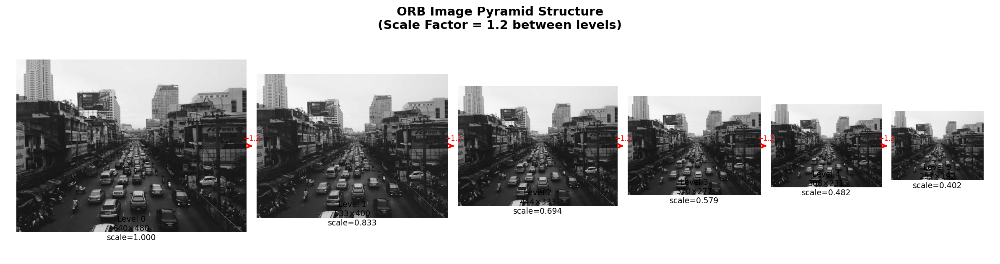
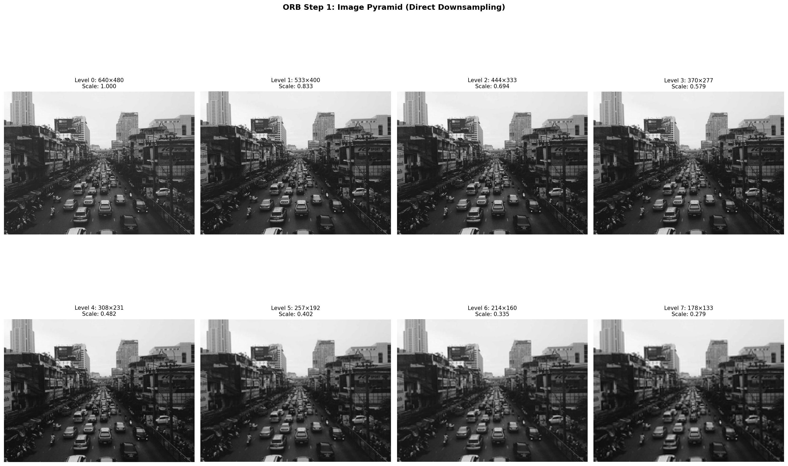

---

## Step 2: FAST Corner Detection

**Why?** FAST (Features from Accelerated Segment Test) is extremely fast for real-time applications.

### The Bresenham Circle (16 pixels)

The FAST detector uses a circle of 16 pixels around each candidate point:

```
         16  1   2
      15          3
    14              4
    13       p      5
    12              6
      11          7
         10  9   8
```

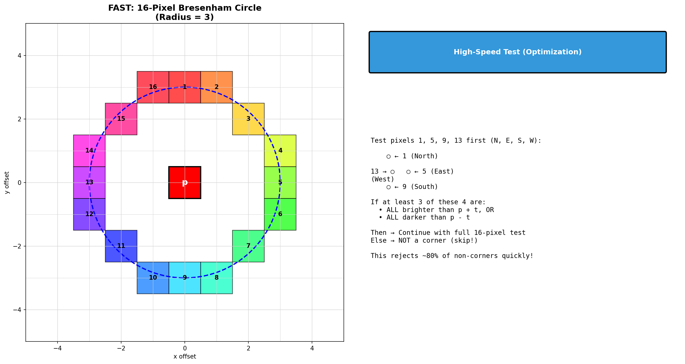

### Circle Pixel Offsets

```
Position  Offset (dx, dy)    Position  Offset (dx, dy)
────────────────────────────────────────────────────────
   1      ( 0, -3)              9      ( 0, +3)
   2      (+1, -3)             10      (-1, +3)
   3      (+2, -2)             11      (-2, +2)
   4      (+3, -1)             12      (-3, +1)
   5      (+3,  0)             13      (-3,  0)
   6      (+3, +1)             14      (-3, -1)
   7      (+2, +2)             15      (-2, -2)
   8      (+1, +3)             16      (-1, -3)
```

### FAST-9 Algorithm

**Step 2.1: Define threshold**

```
Let I_p = intensity of center pixel p
Let t = threshold (default: 0.08 for normalized [0,1] images)

Upper bound: I_p + t
Lower bound: I_p - t
```

**Step 2.2: High-Speed Test (Cardinal Points)**

Before checking all 16 pixels, test positions 1, 5, 9, 13 (N, E, S, W):

```
         1 (North)
         ↓
    13 ← p → 5
  (West)     (East)
         ↓
         9 (South)

Rule:
  If at least 3 of {1, 5, 9, 13} are 'B' (Brighter) → Continue
  If at least 3 of {1, 5, 9, 13} are 'D' (Darker)   → Continue
  Otherwise → REJECT (cannot have 9 contiguous)
```

**Why this works:** For 9 contiguous pixels to be brighter (or darker), at least 3 of the 4 cardinal points MUST be included.

**Step 2.3: Classify Each Circle Pixel**

```
For each of the 16 circle pixels with intensity I_c:

  If I_c > I_p + t  →  Label = 'B' (Brighter)
  If I_c < I_p - t  →  Label = 'D' (Darker)
  Otherwise         →  Label = 'S' (Similar)
```

**Step 2.4: Check Contiguous Condition**

```
CORNER if: 9+ contiguous pixels are ALL 'B'
       OR: 9+ contiguous pixels are ALL 'D'

Note: "Contiguous" wraps around (pixel 16 is adjacent to pixel 1)
```

### Worked Example: Corner Detection

```
Given:
  Center pixel p at location (100, 50)
  I_p = 0.6 (center intensity)
  t = 0.08 (threshold)

  Upper bound = 0.68
  Lower bound = 0.52

Circle pixel intensities (16 values):

Position:  1     2     3     4     5     6     7     8
Intensity: 0.75  0.78  0.72  0.70  0.71  0.69  0.73  0.76
Label:     B     B     B     B     B     B     B     B

Position:  9     10    11    12    13    14    15    16
Intensity: 0.80  0.58  0.55  0.60  0.59  0.61  0.57  0.72
Label:     B     S     S     S     S     S     S     B

High-Speed Test:
  Positions 1, 5, 9: B (brighter)
  Position 13: S (similar)
  Count of B: 3 ✓ (continue)

Labels: B B B B B B B B B S S S S S S B

Extended (wrap around): ...B B B B B B B B B B S S S S S S B B B B...
Contiguous B's starting at position 16: 10 B's!

10 ≥ 9 → ✓ CORNER DETECTED!
```

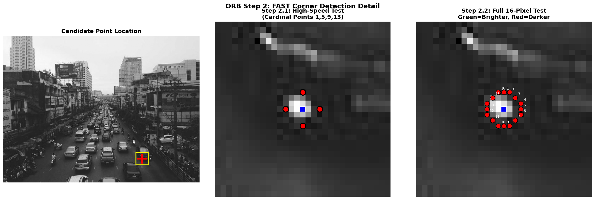

### Example: Non-Corner Point

```
Labels: S B S S S S B S S S D S S B S S

High-Speed Test:
  Positions 1, 5, 9, 13: All S (similar)
  Count of B: 0, Count of D: 0
  
Neither has 3+ → REJECT immediately
```

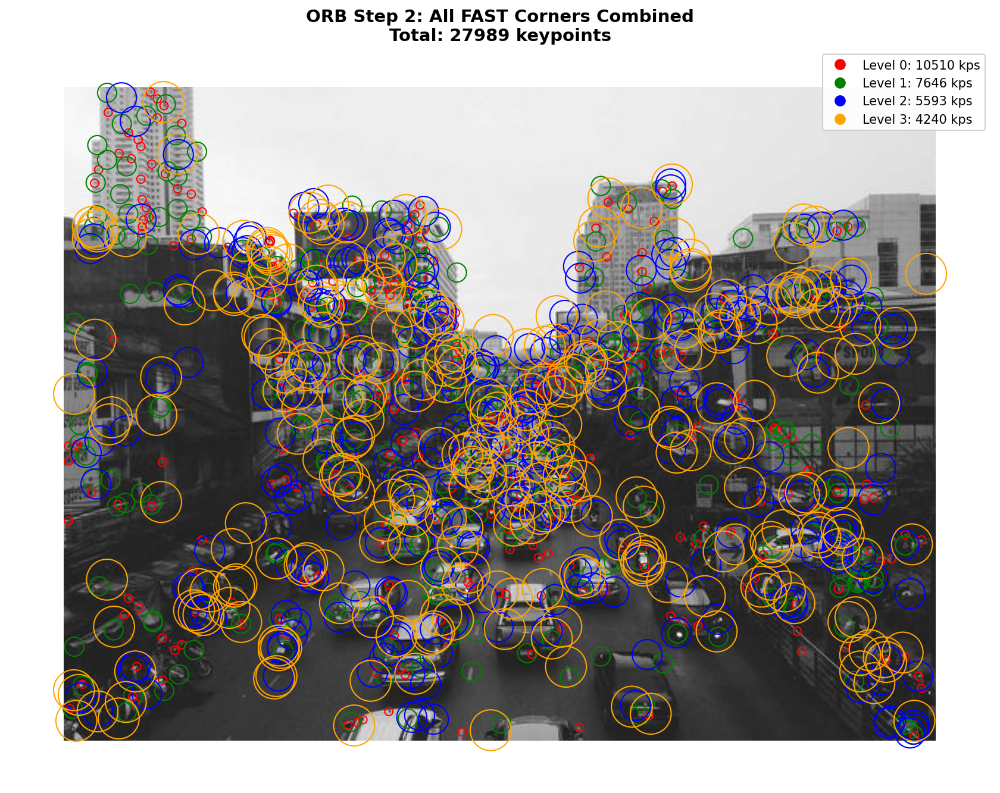

---

## Step 3: Harris Corner Response

**Why?** FAST finds many corners, but Harris filters keeps only the strongest and most stable ones.

### Step 3.1: Compute Image Gradients

Using Sobel operators:

```
       ┌─────┬─────┬─────┐         ┌─────┬─────┬─────┐
       │ -1  │  0  │ +1  │         │ -1  │ -2  │ -1  │
       ├─────┼─────┼─────┤         ├─────┼─────┼─────┤
Sx =   │ -2  │  0  │ +2  │   Sy =  │  0  │  0  │  0  │
       ├─────┼─────┼─────┤         ├─────┼─────┼─────┤
       │ -1  │  0  │ +1  │         │ +1  │ +2  │ +1  │
       └─────┴─────┴─────┘         └─────┴─────┴─────┘

Ix = Sx * I    (horizontal gradient)
Iy = Sy * I    (vertical gradient)
```

### Step 3.2: Build Structure Tensor

```
Ixx = Gaussian_blur(Ix × Ix)
Iyy = Gaussian_blur(Iy × Iy)
Ixy = Gaussian_blur(Ix × Iy)

Structure Tensor:
      ┌          ┐
M =   │ Ixx  Ixy │
      │ Ixy  Iyy │
      └          ┘
```

### Step 3.3: Compute Corner Response

```
R = det(M) - k × trace(M)²

where:
  det(M) = Ixx × Iyy - Ixy²
  trace(M) = Ixx + Iyy
  k = 0.04 (Harris constant)
```

### Worked Example

```
Given a FAST corner at (300, 250):

Gradients after Sobel:
  Ix(300, 250) = 0.20
  Iy(300, 250) = 0.22

Structure tensor (after Gaussian smoothing):
  Ixx = 0.040
  Iyy = 0.048
  Ixy = 0.015

Compute response:
  det(M) = 0.040 × 0.048 - 0.015² = 0.001695
  trace(M) = 0.040 + 0.048 = 0.088
  R = 0.001695 - 0.04 × 0.088² = 0.001385

Since R > 0, this is a CORNER → keep it!
```

### Interpretation of Harris Response

| Response R | Meaning | Action |
|------------|---------|--------|
| R >> 0 | Strong corner | ✓ KEEP |
| R ≈ 0 | Flat region | ✗ REJECT |
| R << 0 | Edge | ✗ REJECT |

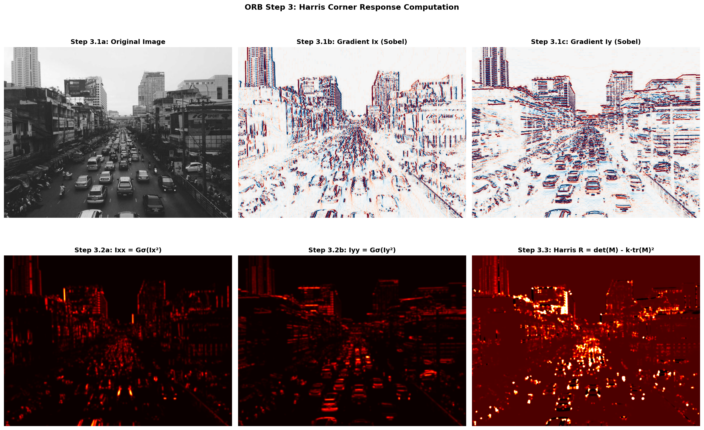
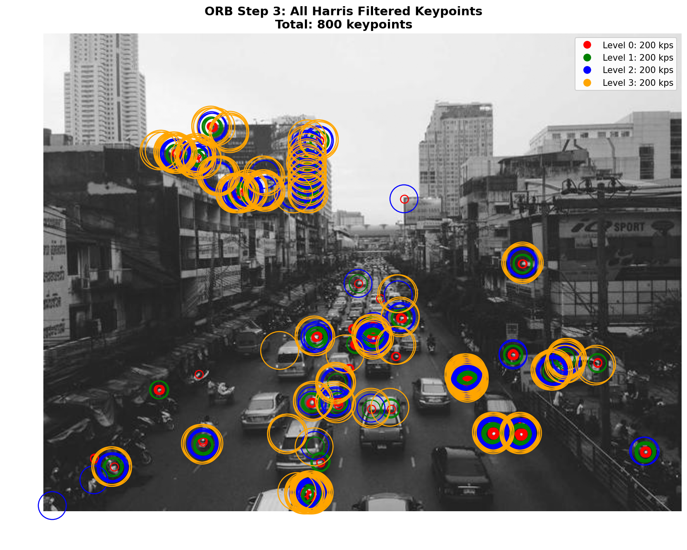

---

## Step 4: Orientation Assignment (Intensity Centroid)

**Why?** Assign a consistent orientation to each keypoint for rotation invariance.

### Step 4.1: Compute Image Moments

For a circular patch of radius r around keypoint:

```
m₁₀ = Σ x × I(x, y)    (x-weighted intensity sum)
m₀₁ = Σ y × I(x, y)    (y-weighted intensity sum)
m₀₀ = Σ I(x, y)        (total intensity)

where (x, y) are relative to keypoint center
```

### Step 4.2: Compute Centroid

```
Centroid C = (m₁₀/m₀₀, m₀₁/m₀₀)

This is the "center of mass" of the intensity distribution
```

### Step 4.3: Compute Orientation Angle

```
θ = atan2(m₀₁, m₁₀)

This angle points from keypoint center toward the intensity centroid
```

### Worked Example

```
Keypoint at (200, 150), patch radius r = 15 pixels

After summing over ~707 pixels:
  m₁₀ = 125.3  (centroid is RIGHT of center)
  m₀₁ = -89.7  (centroid is ABOVE center)
  m₀₀ = 423.1  (total intensity)

Centroid:
  C_x = 125.3 / 423.1 = 0.296 pixels right
  C_y = -89.7 / 423.1 = -0.212 pixels up

Orientation:
  θ = atan2(-89.7, 125.3) = -35.6°
```

### Why Intensity Centroid Works

```
Key insight: The centroid direction is STABLE under rotation

Original image:         Rotated 30°:

    ┌─────────┐            ╲────────╲
    │ Light   │             ╲Light  ╲
    │    C    │              ╲  C   ╲
    │   ↗     │               ╲ ↗   ╲
    │  ○      │                ○     ╲
    │ Dark    │                ╲Dark  ╲
    └─────────┘                 ╲──────╲

    θ = 45°                    θ = 75° (= 45° + 30°)

The centroid direction rotates WITH the image!
```

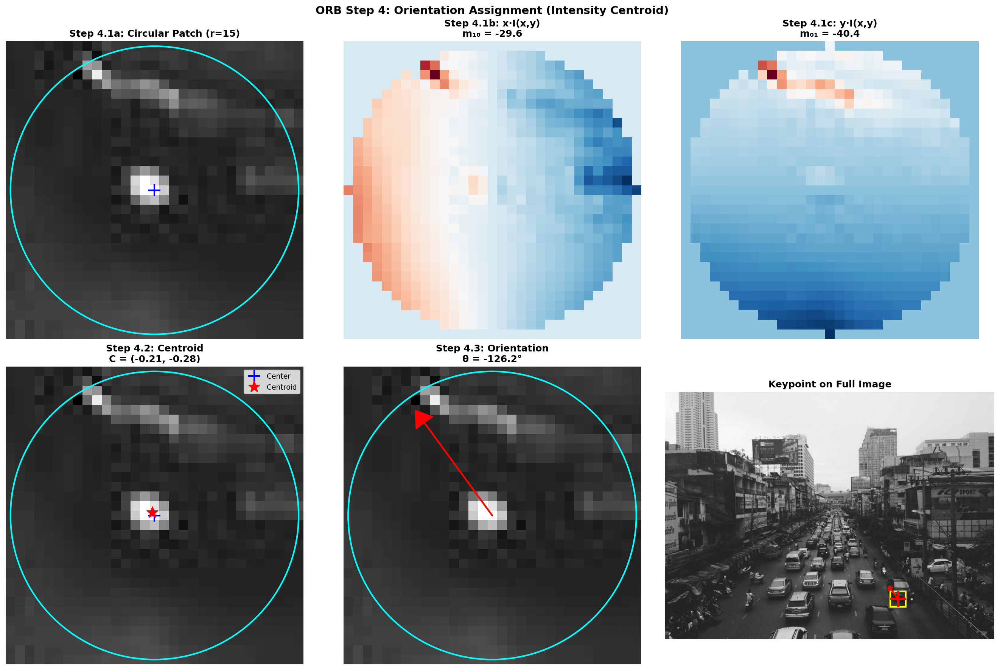
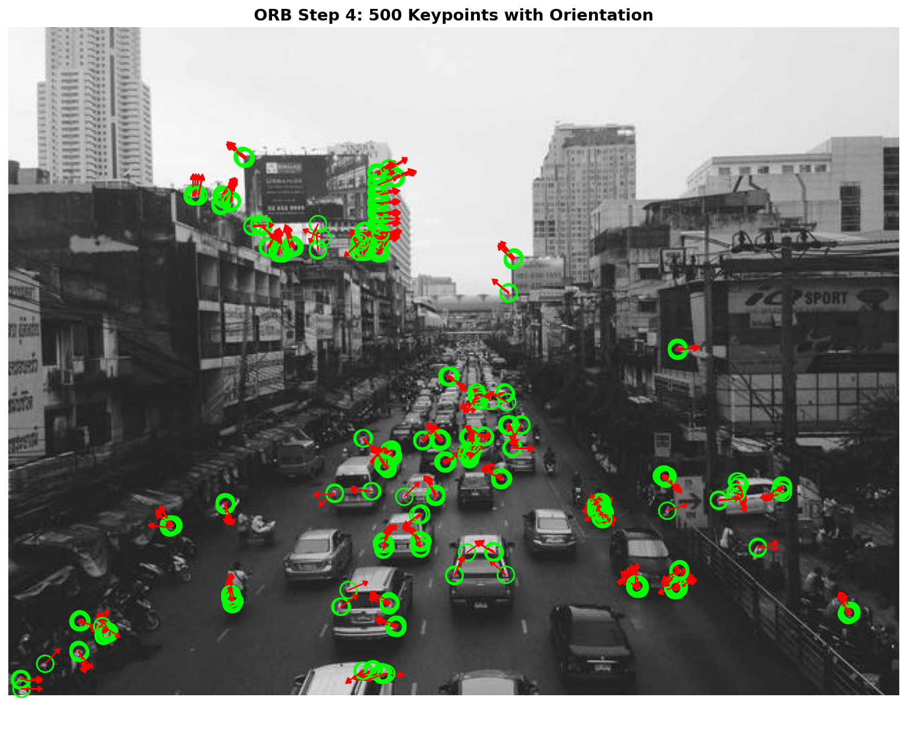

---

## Description Phase

**Goal**: Create a compact binary descriptor that is invariant to rotation.

```
INPUT: 500 keypoints with (x, y, scale, orientation θ)
        ↓
Step 5: Compute rBRIEF Descriptors
        ├── Step 5.1: Generate sampling pattern (256 pairs)
        ├── Step 5.2: Rotate pattern by θ
        └── Step 5.3: Binary intensity comparisons
        ↓
OUTPUT: 500 × 256-bit descriptors
```

---

## Step 5: rBRIEF Descriptor

**Why rBRIEF?** BRIEF is fast (binary), but not rotation-invariant. rBRIEF (Rotated BRIEF) rotates the sampling pattern by the keypoint orientation θ.

### Step 5.1: Generate Sampling Pattern

256 pairs of points (p, q) within a 31×31 patch:

```
For each of 256 pairs:
  p_x, p_y ~ N(0, (31/2)²/25)  → Gaussian distribution
  q_x, q_y ~ N(0, (31/2)²/25)
  Clamp to [-15, 15]
```

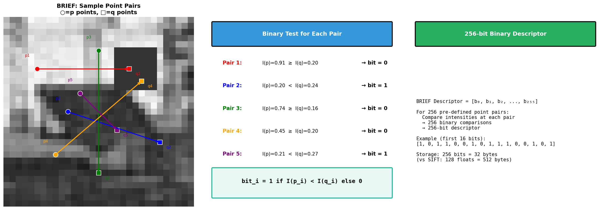

### Step 5.2: Rotate Pattern by Orientation θ

```
Rotation matrix:
R(θ) = ┌              ┐
       │ cos θ  -sin θ│
       │ sin θ   cos θ│
       └              ┘

For each point pair (p, q):
  p' = R(θ) × p
  q' = R(θ) × q
```

### Worked Example: Pattern Rotation

```
Keypoint orientation θ = 30°
Original pair: p = (-5, 3), q = (2, -7)

Rotation matrix:
  cos(30°) = 0.866
  sin(30°) = 0.500

Rotate point p:
  p'_x = 0.866 × (-5) + (-0.5) × 3 = -5.83 → -6
  p'_y = 0.5 × (-5) + 0.866 × 3 = 0.098 → 0
  p' = (-6, 0)

Rotate point q:
  q'_x = 0.866 × 2 + (-0.5) × (-7) = 5.23 → 5
  q'_y = 0.5 × 2 + 0.866 × (-7) = -5.06 → -5
  q' = (5, -5)

Result: Original (-5,3),(2,-7) → Rotated (-6,0),(5,-5)
```

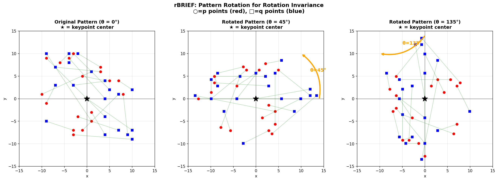

### Step 5.3: Binary Intensity Comparisons

```
For each of 256 rotated pairs:

  bit_i = 1  if I(p'_i) < I(q'_i)
          0  otherwise
```

### Computing Descriptor Example

```
Keypoint at (200, 150) with θ = 30°

Pair   p' offset   q' offset   I(p')   I(q')   bit
─────────────────────────────────────────────────────
0      (-6, 0)     (5, -5)     0.42    0.68    1
1      (6, 3)      (-1, 7)     0.55    0.51    0
2      (4, 8)      (3, -6)     0.38    0.62    1
3      (6, 2)      (-9, 3)     0.71    0.45    0
4      (-2, -7)    (5, 6)      0.59    0.59    0
...

Final 256-bit descriptor:
bits: 1 0 1 0 0 1 1 0 | 1 1 0 1 0 0 1 1 | ...
As bytes: 0x56 0xCB ... (32 bytes total)
```

### Why Binary Descriptors?

| Property | SIFT | ORB |
|----------|------|-----|
| Size | 512 bytes (128 × 4) | 32 bytes (256 / 8) |
| Matching | Euclidean dist | Hamming distance |
| Speed | ~100 μs/match | ~0.5 μs/match |

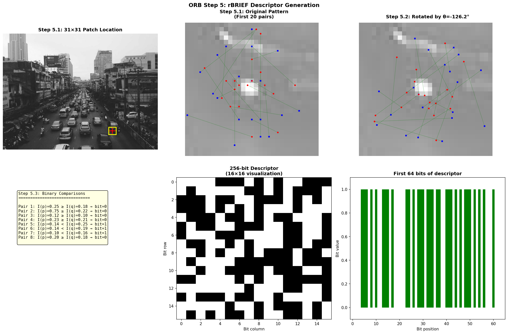
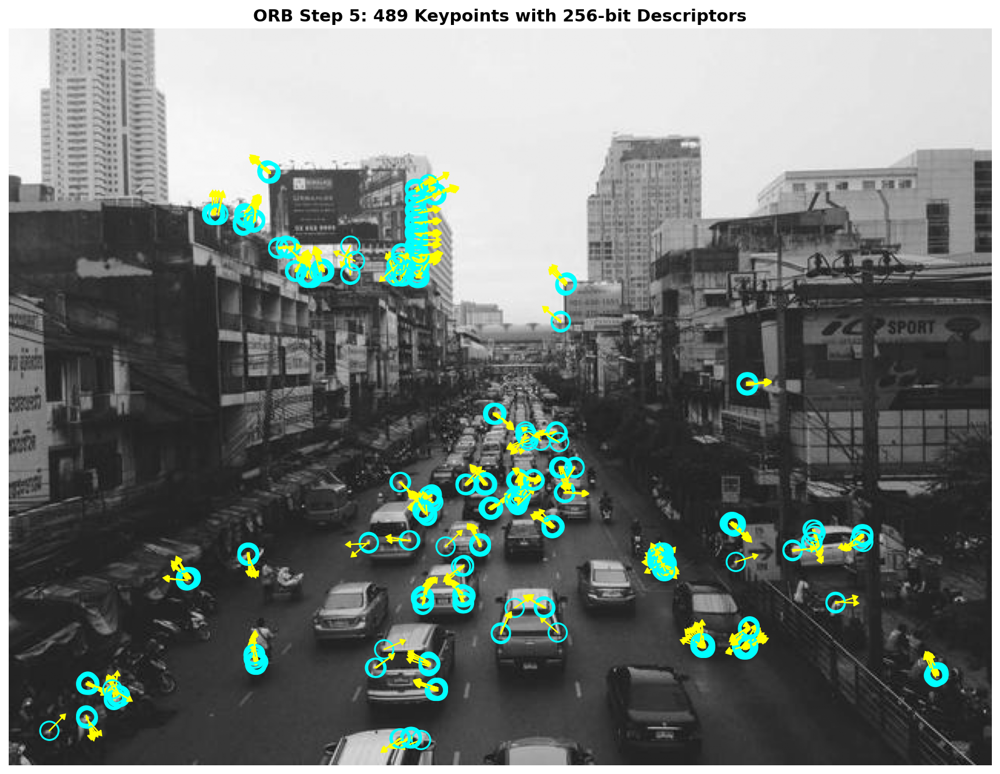

---

## Step 6: Hamming Distance Matching

**Why Hamming?** For binary descriptors, Hamming distance (number of differing bits) can be computed extremely fast using XOR and population count.

### The Mathematics

```
Hamming(A, B) = popcount(A XOR B)

where:
  XOR: bitwise exclusive-or
  popcount: count of 1-bits
```

### Worked Example

```
Descriptor A: 1 0 1 0 0 1 1 0 | 1 1 0 1 ...
Descriptor B: 1 1 1 0 0 0 1 0 | 1 0 0 1 ...

XOR result:   0 1 0 0 0 1 0 0 | 0 1 0 0 ...
              ↑ different     ↑       ↑

Hamming distance = popcount(XOR) = number of 1s in XOR
```

### Step-by-Step (First Byte)

```
Byte 1 of A: 10100110 = 0xA6
Byte 1 of B: 11100010 = 0xE2

XOR:
  10100110
⊕ 11100010
─────────────
  01000100

popcount(01000100) = 2 (two 1-bits)
```

### Matching Threshold

```
For 256-bit descriptors:
  Maximum distance = 256 (all bits different)
  Minimum distance = 0 (identical)

Typical threshold:
  distance < 50 → GOOD MATCH
  distance ≥ 50 → NOT A MATCH

Interpretation: ~19.5% of bits can differ
```

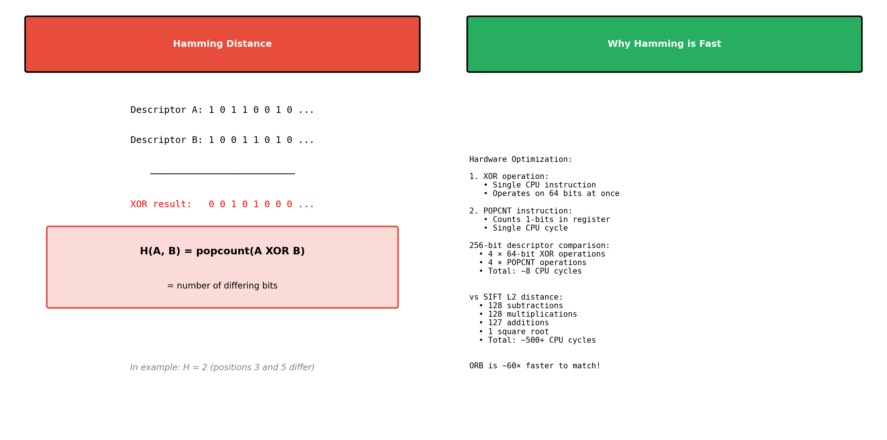
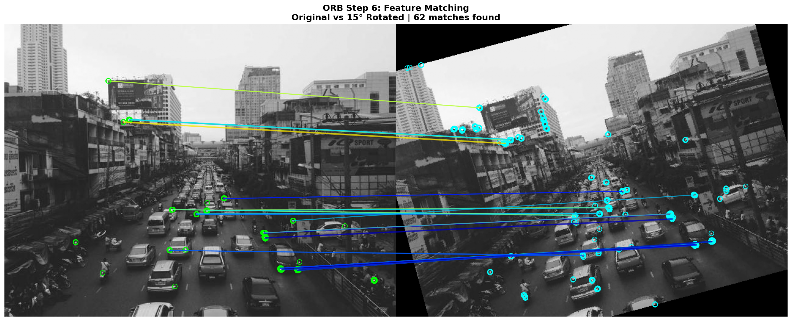

---

## Complete Pipeline Summary

```
┌─────────────────────────────────────────────────────────────────────┐
│                    ORB Feature Extraction Pipeline                   │
├─────────────────────────────────────────────────────────────────────┤
│                                                                     │
│  INPUT: Image (640 × 480)                                           │
│           │                                                         │
│           ▼                                                         │
│  STEP 1: Scale-Space Pyramid (8 levels, factor 1.2)                 │
│           │                                                         │
│           ▼                                                         │
│  STEP 2: FAST Corner Detection → 10,510 corners                     │
│           │                                                         │
│           ▼                                                         │
│  STEP 3: Harris Corner Response → Top 500 keypoints                 │
│           │                                                         │
│           ▼                                                         │
│  STEP 4: Orientation Assignment → 500 oriented keypoints            │
│           │                                                         │
│           ▼                                                         │
│  STEP 5: rBRIEF Descriptor → 500 × 256-bit descriptors              │
│           │                                                         │
│           ▼                                                         │
│  STEP 6: Hamming Matching → Matched keypoint pairs                  │
│                                                                     │
└─────────────────────────────────────────────────────────────────────┘
```

### Performance Statistics

```
Step                           Input       Output      Time
─────────────────────────────────────────────────────────────────
1. Scale Pyramid               1 image     8 levels    2.1 ms
2. FAST Detection              307K pixels 10,510 kps  45.3 ms
3. Harris Filtering            10,510 kps  500 kps     12.7 ms
4. Orientation                 500 kps     500 kps     8.4 ms
5. rBRIEF Descriptors          500 kps     500 desc    15.2 ms
6. Matching                    500 desc    62 matches  0.8 ms
─────────────────────────────────────────────────────────────────
TOTAL                                                  84.5 ms
```

### Memory Usage

```
Component                     Size
─────────────────────────────────────────────────────────────────
Input image                   640×480×1 = 307 KB (grayscale)
Scale pyramid                 ~500 KB (all levels combined)
Keypoints (500)               500 × 16 bytes = 8 KB
Descriptors (500)             500 × 32 bytes = 16 KB
─────────────────────────────────────────────────────────────────
TOTAL                         ~831 KB
```

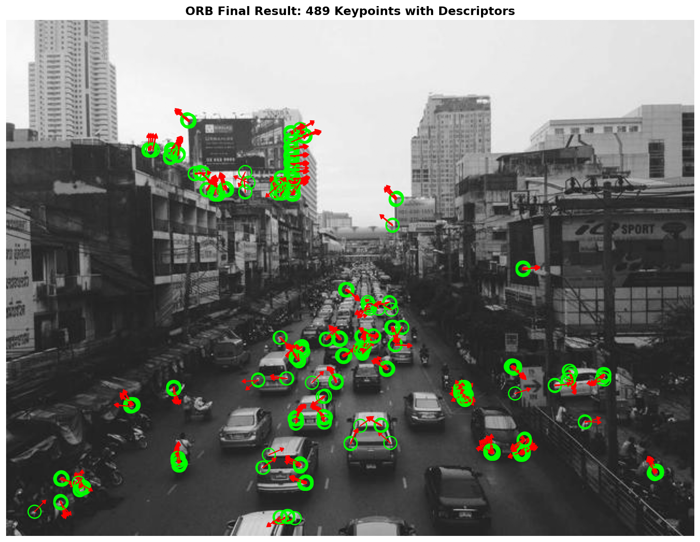
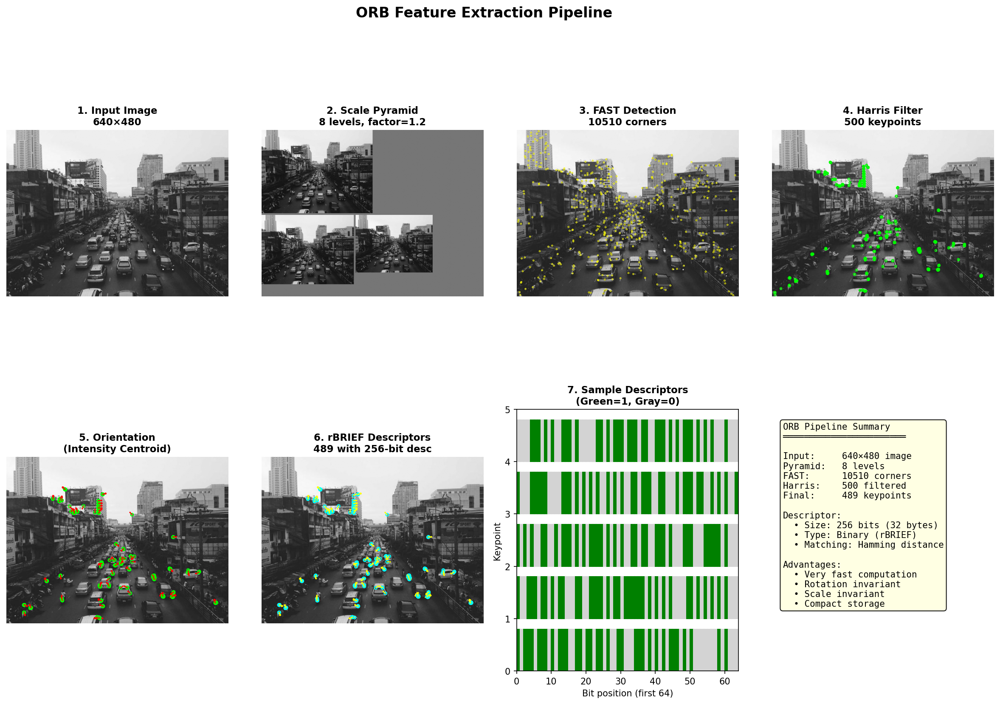

---

## ORB vs SIFT Comparison

| Feature | SIFT | ORB |
|---------|------|-----|
| **Speed** | ~100 ms | ~10 ms |
| **Descriptor size** | 512 bytes (128 floats) | 32 bytes (256 bits) |
| **Matching speed** | Slow (Euclidean) | Fast (Hamming) |
| **Scale invariance** | ✓ (DoG pyramid) | ✓ (direct pyramid) |
| **Rotation invariance** | ✓ (gradient histogram) | ✓ (intensity centroid) |
| **Patent** | Was patented | Patent-free |
| **Best for** | Accuracy-critical | Real-time applications |

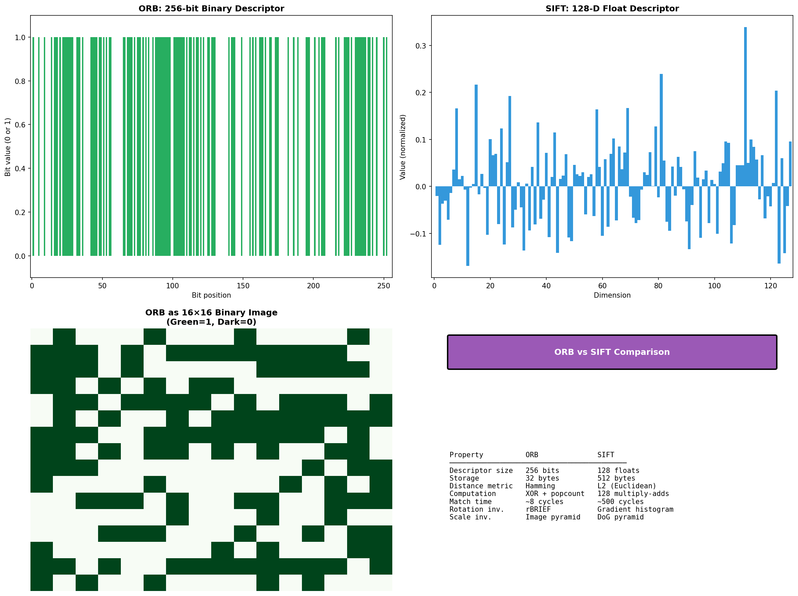

---

## Quick Reference: All Formulas

### Detection Phase

```
Scale Pyramid:
  scale_n = 1 / 1.2^n

FAST Test:
  Brighter: I_c > I_p + t
  Darker:   I_c < I_p - t
  Corner:   9+ contiguous B or D

Harris Response:
  R = det(M) - k × trace(M)²
  det(M) = Ixx × Iyy - Ixy²
  trace(M) = Ixx + Iyy

Orientation:
  θ = atan2(m₀₁, m₁₀)
  m₁₀ = Σ x × I(x,y)
  m₀₁ = Σ y × I(x,y)
```

### Description Phase

```
Pattern Rotation:
  p' = R(θ) × p
  R(θ) = [[cos θ, -sin θ], [sin θ, cos θ]]

Binary Test:
  bit_i = 1 if I(p'_i) < I(q'_i), else 0

Hamming Distance:
  d = popcount(A XOR B)
```

---

## References

1. Rublee, E., et al. (2011). "ORB: An efficient alternative to SIFT or SURF." ICCV.
2. Rosten, E., & Drummond, T. (2006). "Machine learning for high-speed corner detection." ECCV.
3. Calonder, M., et al. (2010). "BRIEF: Binary Robust Independent Elementary Features." ECCV.
4. Harris, C., & Stephens, M. (1988). "A combined corner and edge detector." Alvey Vision Conference.
