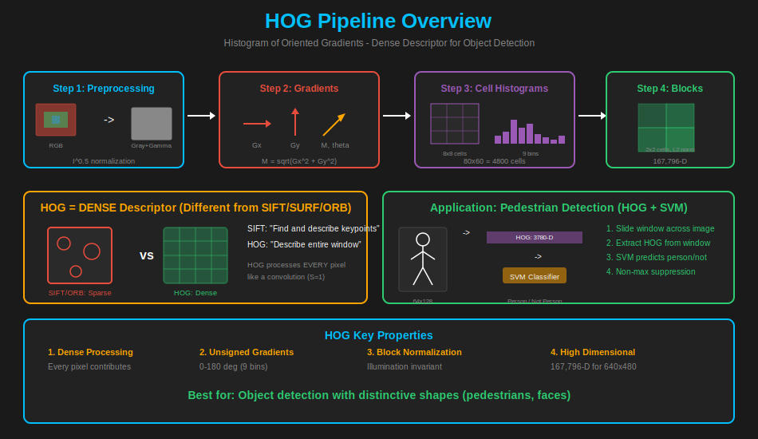
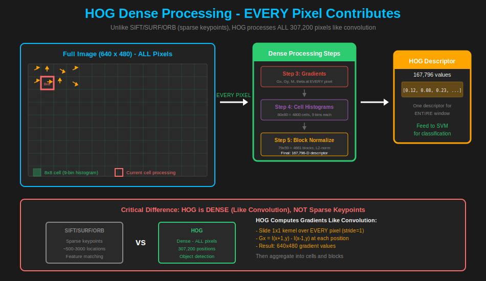

# Understanding HOG: Histogram of Oriented Gradients

*A comprehensive guide to implementing HOG from scratch*

---

The **Histogram of Oriented Gradients (HOG)** is a powerful feature descriptor widely used for object detection, introduced by Dalal & Triggs in 2005. Unlike keypoint-based methods like SIFT, HOG creates a **dense** description of an entire image window, capturing local shape information through gradient distributions—famously used for pedestrian detection.

This article walks through the complete HOG pipeline, from mathematical foundations to practical implementation.

---

## Table of Contents

1. [Overview](#1-overview)
   - [1.1 What is HOG?](#11-what-is-hog)
   - [1.2 What is a Dense Descriptor?](#12-what-is-a-dense-descriptor)
   - [1.3 Why HOG?](#13-why-hog)
   - [1.4 Input Image](#14-input-image-used-in-this-tutorial)
   - [1.5 Pipeline Summary](#15-hog-pipeline-summary)
2. [Preprocessing Phase](#2-preprocessing-phase)
   - [2.1 Grayscale Conversion](#21-grayscale-conversion)
   - [2.2 Gamma Correction](#22-gamma-correction)
3. [Gradient Computation](#3-gradient-computation)
   - [3.1 Gradient Computation Overview](#31-gradient-computation-overview)
   - [3.2 Horizontal Gradient (Gx)](#32-horizontal-gradient-gx)
   - [3.3 Vertical Gradient (Gy)](#33-vertical-gradient-gy)
   - [3.4 Gradient Magnitude](#34-gradient-magnitude)
   - [3.5 Gradient Direction](#35-gradient-direction)
4. [Cell Histograms](#4-cell-histograms)
   - [4.1 Divide into Cells](#41-divide-into-cells)
   - [4.2 9-Bin Histogram](#42-9-bin-histogram)
   - [4.3 Bilinear Interpolation](#43-bilinear-interpolation)
5. [Block Normalization](#5-block-normalization)
   - [5.1 Block Definition](#51-block-definition)
   - [5.2 L2 Normalization](#52-l2-normalization)
   - [5.3 Final Descriptor Assembly](#53-final-descriptor-assembly)
6. [Summary](#6-summary)
   - [6.1 Complete Pipeline](#61-complete-pipeline)
   - [6.2 Quick Reference: All Formulas](#62-quick-reference-all-formulas)
   - [6.3 Key Properties](#63-key-properties)
   - [6.4 Object Detection with HOG](#64-object-detection-with-hog)
7. [Common Mistakes & FAQ](#7-common-mistakes--faq)
8. [References](#8-references)

---

## 1. Overview

### 1.1 What is HOG?

**HOG (Histogram of Oriented Gradients)** is a feature descriptor that captures shape and appearance by describing local gradient distributions. It's fundamentally different from SIFT/SURF/ORB because it creates a **dense** description of an entire image window rather than sparse keypoint descriptions.

> **Real-World Analogy**: Imagine you're trying to identify a person by their silhouette. You don't need to see the color of their clothes or their face—just the outline (edges) tells you enough. HOG captures these outlines as histograms of edge directions, creating a "shape fingerprint" of whatever is in the image.

```
┌─────────────────────────────────────────────────────────────────────┐
│                    THE HOG PHILOSOPHY                                │
├─────────────────────────────────────────────────────────────────────┤
│                                                                     │
│   SIFT/SURF/ORB (Sparse):        HOG (Dense):                       │
│   ───────────────────────        ────────────                       │
│   Find special keypoints          Describe ENTIRE window            │
│   Describe each keypoint          Every pixel contributes           │
│   Match individual points         Match whole windows               │
│                                                                     │
│   Question: "Where is this        Question: "Is there a person      │
│   keypoint in the other image?"   in this window?"                  │
│                                                                     │
│   Good for: Image matching        Good for: Object detection        │
│                                                                     │
└─────────────────────────────────────────────────────────────────────┘
```

### 1.2 What is a Dense Descriptor?

```
┌─────────────────────────────────────────────────────────────────────┐
│                SPARSE vs DENSE DESCRIPTORS                           │
├─────────────────────────────────────────────────────────────────────┤
│                                                                     │
│   SPARSE (SIFT, SURF, ORB):       DENSE (HOG):                      │
│   ─────────────────────────       ────────────                      │
│                                                                     │
│   ┌─────────────────┐             ┌─────────────────┐               │
│   │                 │             │█████████████████│               │
│   │  ■    ■         │             │█████████████████│               │
│   │      ■    ■     │             │█████████████████│               │
│   │  ■        ■     │             │█████████████████│               │
│   │    ■  ■         │             │█████████████████│               │
│   └─────────────────┘             └─────────────────┘               │
│   Describe 5-6 keypoints          Describe EVERY pixel              │
│                                                                     │
│   Output: 5 × 128-D = 640 values  Output: 1 dense vector            │
│                                   (e.g., 3780-D for 64×128 window)  │
│                                                                     │
└─────────────────────────────────────────────────────────────────────┘
```

### 1.3 Why HOG?

| Problem | How HOG Solves It |
|---------|-------------------|
| Need to describe shape/silhouette | Gradient histograms capture edge orientations |
| Object detection in fixed windows | Dense descriptor covers entire window |
| Illumination changes | Block normalization removes lighting effects |
| Need compact representation | Cells compress gradients into histograms |

> **Key Insight**: HOG answers "What is the distribution of edge directions in this region?" This turns out to be perfect for detecting objects with distinctive shapes, like people, faces, or cars.

### 1.4 Input Image Used in This Tutorial


### 1.5 HOG Pipeline Summary



| Phase | Step | Description | Output |
|-------|------|-------------|--------|
| Preprocessing | 2.1 | Grayscale Conversion | 640×480 grayscale |
| Preprocessing | 2.2 | Gamma Correction | Normalized intensities |
| Gradient | 3.1-3.5 | Compute Gx, Gy, M, θ | 640×480 gradients |
| Histograms | 4.1-4.3 | Cell Histograms | 80×60 cells × 9 bins |
| Normalization | 5.1-5.3 | Block Normalization | Final HOG descriptor |

---

<div align="center">


### **Prepare the image for gradient computation**

`Grayscale` | `Gamma Correction`

</div>

---

## 2. Preprocessing Phase

**Goal**: Normalize image intensity to reduce lighting effects.

> **Intuition**: Before we can detect edges, we need to prepare the image. Color doesn't help identify shapes (a red person and a blue person have the same silhouette), and lighting variations can make the same object look completely different. Preprocessing removes these distractions.

```
┌─────────────────────────────────────────────────────────────┐
│  INTUITION: Why Preprocessing?                               │
├─────────────────────────────────────────────────────────────┤
│                                                             │
│  Raw RGB Image:              After Preprocessing:           │
│  ┌───────────┐               ┌───────────┐                 │
│  │ Red shirt │               │   ░░░░░   │                 │
│  │ Blue jeans│    ───→       │   ░░░░░   │                 │
│  │ Shadows   │               │   ░░░░░   │                 │
│  └───────────┘               └───────────┘                 │
│                                                             │
│  Colors + lighting = noise   Grayscale + gamma = clean     │
│  for shape detection         intensity for gradients       │
│                                                             │
└─────────────────────────────────────────────────────────────┘
```

```
INPUT: Color Image (H × W × 3)
        ↓
Step 2.1: Grayscale Conversion
        ↓
Step 2.2: Gamma Correction (I^0.5)
        ↓
OUTPUT: Preprocessed Grayscale (H × W)
```

---

## 2.1 Grayscale Conversion

**Why?** HOG works on intensity gradients, not color.

### 2.1.1 The Mathematics

```
I(x,y) = 0.299 × R(x,y) + 0.587 × G(x,y) + 0.114 × B(x,y)
```

**Why these weights?**
- Human eye is most sensitive to green, least to blue
- Standard ITU-R BT.601 coefficients

### 2.1.2 Example Calculation

```
RGB values: R = 180, G = 120, B = 90

I(x,y) = 0.299 × 180 + 0.587 × 120 + 0.114 × 90
       = 53.82 + 70.44 + 10.26
       = 134.52

Normalized (0-1): 134.52 / 255 = 0.527
```


---

## 2.2 Gamma Correction

**Why?** Compress bright regions and expand dark regions, making gradients more uniform across the image regardless of lighting.

### 2.2.1 The Mathematics

```
I_corrected(x,y) = I(x,y)^γ

where γ = 0.5 (square root) is commonly used
```

> **Intuition**: Gamma correction compresses bright regions and expands dark regions, making gradients more uniform across the image regardless of lighting.

### 2.2.2 Example Calculation

```
Original pixels:
  I = 0.16  →  I_γ = 0.16^0.5 = 0.40  (enhanced!)
  I = 0.25  →  I_γ = 0.25^0.5 = 0.50
  I = 0.36  →  I_γ = 0.36^0.5 = 0.60
  I = 0.49  →  I_γ = 0.49^0.5 = 0.70
  I = 0.64  →  I_γ = 0.64^0.5 = 0.80
  I = 0.81  →  I_γ = 0.81^0.5 = 0.90  (compressed)

Effect: Dark regions enhanced, bright regions compressed
```

### 2.2.3 Pseudocode

```python
def preprocess(image):
    """
    Preprocess image: grayscale + gamma correction.
    """
    # Convert to grayscale
    if len(image.shape) == 3:
        gray = 0.299 * image[:,:,0] + 0.587 * image[:,:,1] + 0.114 * image[:,:,2]
    else:
        gray = image
    
    # Normalize to [0, 1]
    gray = gray / 255.0
    
    # Gamma correction
    gamma = 0.5
    corrected = np.power(gray, gamma)
    
    return corrected
```


> **Key Takeaway**: Preprocessing makes HOG more robust to lighting variations. Grayscale removes color dependency, gamma correction normalizes intensity distributions.

---

<div align="center">


### **Compute edge information at every pixel**

`Gx` | `Gy` | `Magnitude` | `Direction`

</div>

---

## 3. Gradient Computation

**Goal**: Capture edge information—the boundaries of objects.

> **Intuition**: An edge is where intensity changes rapidly. The gradient tells us both HOW MUCH it changes (magnitude) and in WHAT DIRECTION (orientation). These are the building blocks of HOG.

```
┌─────────────────────────────────────────────────────────────┐
│  INTUITION: What Are Gradients?                              │
├─────────────────────────────────────────────────────────────┤
│                                                             │
│  Think of gradients as "edge detectors":                    │
│                                                             │
│  Flat region:          Edge (vertical):    Edge (diagonal): │
│  ░░░░░░░░░░             ░░░░░████████       ░░░░░░░░░░      │
│  ░░░░░░░░░░             ░░░░░████████       ░░░░░████       │
│  ░░░░░░░░░░     vs      ░░░░░████████   vs  ░░████████      │
│  ░░░░░░░░░░             ░░░░░████████       ████████░░      │
│                                                             │
│  M ≈ 0                  M = large          M = large        │
│  θ = undefined          θ = 0° (horiz)     θ = 45° (diag)   │
│                                                             │
│  Strong gradients (high M) = edges = shape boundaries!      │
└─────────────────────────────────────────────────────────────┘
```

```
INPUT: Preprocessed Image (H × W)
        ↓
Step 3.2: Horizontal Gradient Gx (detects vertical edges)
        ↓
Step 3.3: Vertical Gradient Gy (detects horizontal edges)
        ↓
Step 3.4: Magnitude M = √(Gx² + Gy²)
        ↓
Step 3.5: Direction θ = arctan(Gy/Gx) mod 180°
        ↓
OUTPUT: Gradient images M and θ (H × W each)
```

---

## 3.1 Gradient Computation Overview



**HOG is DIFFERENT from SIFT/SURF/ORB**—it computes gradients at **EVERY pixel** (like a convolution), not just at keypoint locations:

```
HOG Gradient Computation:              SIFT/SURF Filtering:
Compute at EVERY pixel                 Compute only at keypoint locations
Slides like Conv with S=1              Sparse locations only

┌─────────────────┐                    ┌─────────────────┐
│█████████████████│                    │                 │
│█████████████████│                    │  ■    ■        │
│█████████████████│  307,200           │      ■    ■    │  ~1000
│█████████████████│  positions         │  ■        ■    │  positions
│█████████████████│                    │    ■  ■        │
└─────────────────┘                    └─────────────────┘
  Process ALL pixels                    Process ONLY keypoints (■)
```

**This is why HOG is called a "dense" descriptor**—it describes the entire image, not just sparse keypoints.

> **Key Takeaway**: Unlike SIFT/SURF/ORB which compute features at sparse keypoints, HOG computes gradients at every pixel. This dense approach is what makes HOG ideal for object detection—it captures the complete shape information of a detection window.

---

## 3.2 Horizontal Gradient (Gx)

**Formula (Central Difference):**
```
Gx(x,y) = I(x+1, y) - I(x-1, y) = East - West
```

**Kernel:** `[-1, 0, +1]`

**Detects:** Vertical edges (intensity changes left-to-right)

```
Image patch around (150, 200):

       x=149  x=150  x=151
      ┌──────┬──────┬──────┐
y=200 │ 0.25 │ 0.50 │ 0.75 │   ← Strong horizontal gradient!
      └──────┴──────┴──────┘

Gx(150, 200) = 0.75 - 0.25 = 0.50   ← Strong positive (bright on right)
```


---

## 3.3 Vertical Gradient (Gy)

**Formula:**
```
Gy(x,y) = I(x, y+1) - I(x, y-1) = South - North
```

**Kernel:**
```
[-1]
[ 0]
[+1]
```

**Detects:** Horizontal edges (intensity changes top-to-bottom)


---

## 3.4 Gradient Magnitude

**Formula:**
```
M(x,y) = √(Gx(x,y)² + Gy(x,y)²)
```

**Interpretation:**
- Large M → Strong edge
- Small M → Flat region

### 3.4.1 Example Calculation

```
Given: Gx = 0.50, Gy = 0.20

M(150, 200) = √(0.50² + 0.20²)
            = √(0.25 + 0.04)
            = √0.29
            = 0.539   ← Moderate-strong edge
```


---

## 3.5 Gradient Direction

**Formula:**
```
θ(x,y) = arctan(Gy / Gx) mod 180°
```

**Why unsigned (0° to 180°)?**

```
┌─────────────────────────────────────────────────────────────┐
│  INTUITION: Why Unsigned Gradients?                          │
├─────────────────────────────────────────────────────────────┤
│                                                             │
│  Consider a vertical edge in two different images:          │
│                                                             │
│  Image 1:              Image 2 (inverted):                  │
│  ░░░░░████             ████░░░░░                            │
│  ░░░░░████    vs       ████░░░░░                            │
│  ░░░░░████             ████░░░░░                            │
│  (dark→light)          (light→dark)                         │
│                                                             │
│  Signed: θ = 0°        Signed: θ = 180° (DIFFERENT!)        │
│  Unsigned: θ = 0°      Unsigned: θ = 0° (SAME!)             │
│                                                             │
│  For pedestrian detection, both are the SAME edge shape!    │
│  Unsigned gradients make HOG robust to contrast inversion.  │
│                                                             │
└─────────────────────────────────────────────────────────────┘
```

### 3.5.1 Example Calculation

```
Given: Gx = 0.50, Gy = 0.20

θ(150, 200) = arctan(0.20 / 0.50)
            = arctan(0.40)
            = 21.8°  (nearly horizontal edge)
```

### 3.5.2 Pseudocode

```python
def compute_gradients(image):
    """
    Compute gradient magnitude and direction at every pixel.
    """
    H, W = image.shape
    Gx = np.zeros((H, W))
    Gy = np.zeros((H, W))
    M = np.zeros((H, W))
    theta = np.zeros((H, W))
    
    # Compute gradients at EVERY pixel (excluding borders)
    for y in range(1, H-1):
        for x in range(1, W-1):
            # Central difference
            Gx[y, x] = image[y, x+1] - image[y, x-1]
            Gy[y, x] = image[y+1, x] - image[y-1, x]
            
            # Magnitude
            M[y, x] = np.sqrt(Gx[y,x]**2 + Gy[y,x]**2)
            
            # Direction (unsigned: 0 to 180 degrees)
            theta[y, x] = np.arctan2(Gy[y,x], Gx[y,x]) * 180 / np.pi
            if theta[y, x] < 0:
                theta[y, x] += 180
    
    return M, theta
```


> **Key Takeaway**: Gradients capture edge information—magnitude tells us edge strength, direction tells us edge orientation. Using unsigned directions (0°-180°) makes HOG robust to contrast inversion.

---

<div align="center">


### **Aggregate gradients into compact histograms**

`8×8 Cells` | `9 Bins` | `Bilinear Interpolation`

</div>

---

## 4. Cell Histograms

**Goal**: Aggregate local gradients into compact histogram representations.

> **Intuition**: Instead of storing millions of individual gradient values, we divide the image into cells and count how many gradients point in each direction. This is like asking "In this 8×8 region, are most edges vertical, horizontal, or diagonal?"

```
┌─────────────────────────────────────────────────────────────┐
│  CELL HISTOGRAM CONCEPT                                      │
├─────────────────────────────────────────────────────────────┤
│                                                             │
│   8×8 pixel cell with gradients:     9-bin histogram:       │
│   ┌─────────────────┐                                       │
│   │ → → ↗ ↑ ↑ ↗ → → │                Bin   Value   Dir      │
│   │ → → ↗ ↑ ↑ ↗ → → │                ───   ─────   ───      │
│   │ → → ↗ ↑ ↑ ↗ → → │                 0     8      0°-20°   │
│   │ → → ↗ ↑ ↑ ↗ → → │        →        1     4      20°-40°  │
│   │ → → ↗ ↑ ↑ ↗ → → │                 ...                   │
│   │ → → ↗ ↑ ↑ ↗ → → │                 4     24     80°-100° │
│   │ → → ↗ ↑ ↑ ↗ → → │                 ...   (peak!)         │
│   │ → → ↗ ↑ ↑ ↗ → → │                                       │
│   └─────────────────┘                                       │
│                                                             │
│   64 gradients compressed into 9 numbers!                   │
│                                                             │
└─────────────────────────────────────────────────────────────┘
```

---

## 4.1 Divide into Cells

**Parameters:**
```
Image: 640 × 480 pixels
Cell:  8 × 8 pixels

Cells per row:    640 ÷ 8 = 80 cells
Cells per column: 480 ÷ 8 = 60 cells
Total cells:      80 × 60 = 4800 cells
```

### 4.1.1 Cell Grid Visualization

```
Image (640 × 480):
┌───┬───┬───┬───┬───┬───┬─ ... ─┬───┬───┐
│0,0│1,0│2,0│3,0│4,0│5,0│       │78,0│79,0│  ← 80 cells wide
├───┼───┼───┼───┼───┼───┼─ ... ─┼───┼───┤
│0,1│1,1│2,1│   ...  (60 cells tall)  ...│
├───┼───┼───┼───┼───┼───┼─ ... ─┼───┼───┤
│   │   │   ...  (4800 cells total)  ... │
├───┼───┼───┼───┼───┼───┼─ ... ─┼───┼───┤
│0,59│1,59│   │   │   │   │     │78,59│79,59│
└───┴───┴───┴───┴───┴───┴─ ... ─┴───┴───┘

Each cell: 8×8 = 64 pixels
```


---

## 4.2 9-Bin Histogram

**Parameters:**
- Range: 0° to 180° (unsigned)
- Bins: 9
- Bin width: 180° ÷ 9 = 20°

```
Bin   Range          Center
───   ─────────────  ──────
 0    [0°, 20°)       10°
 1    [20°, 40°)      30°
 2    [40°, 60°)      50°
 3    [60°, 80°)      70°
 4    [80°, 100°)     90°
 5    [100°, 120°)   110°
 6    [120°, 140°)   130°
 7    [140°, 160°)   150°
 8    [160°, 180°)   170°
```

### 4.2.1 Histogram Structure

```
For each cell (8×8 pixels):
  - Extract 64 gradient (M, θ) pairs
  - Accumulate into 9-bin histogram
  - Each pixel votes with weight = magnitude M
  - Vote goes to bins based on direction θ
```

> **Key Takeaway**: The 9-bin histogram with 20° bins captures edge orientations while providing robustness to small variations. Weighting by magnitude ensures strong edges contribute more than weak ones.

---

## 4.3 Bilinear Interpolation

**Why bilinear interpolation?**
- Hard binning (all vote to one bin) causes aliasing
- Soft binning (vote split between bins) is smoother

> **Intuition**: If a gradient direction is 35° (exactly between bin 1 at 30° and bin 2 at 50°), why should it vote 100% for one bin? Bilinear interpolation splits the vote based on distance to each bin center.

```
┌─────────────────────────────────────────────────────────────┐
│  INTUITION: Hard vs Soft Binning                             │
├─────────────────────────────────────────────────────────────┤
│                                                             │
│  Hard Binning:                 Soft Binning (Bilinear):     │
│  ────────────                  ─────────────────────        │
│                                                             │
│  θ = 35°                       θ = 35°                      │
│  Bin 1 [20°-40°] gets 100%     Bin 1 gets 25% (closer)      │
│  Bin 2 [40°-60°] gets 0%       Bin 2 gets 75% (farther)     │
│                                                             │
│  Problem: Small angle change   Better: Smooth transition    │
│  at 40° causes big histogram   Vote proportional to         │
│  jump → aliasing artifacts     distance to bin centers      │
│                                                             │
│       ┌─────────────┐                ┌─────────────┐        │
│  Bin1 │█████████████│ vs       Bin1 │████         │        │
│  Bin2 │             │          Bin2 │█████████████│        │
│       └─────────────┘                └─────────────┘        │
│       Abrupt (bad)                   Smooth (good)          │
└─────────────────────────────────────────────────────────────┘
```

### 4.3.1 The Mathematics

```
bin_index = θ / 20

lower_bin = floor(bin_index) mod 9
upper_bin = (lower_bin + 1) mod 9

upper_weight = bin_index - floor(bin_index)
lower_weight = 1 - upper_weight

Histogram[lower_bin] += M × lower_weight
Histogram[upper_bin] += M × upper_weight
```

### 4.3.2 Worked Example: Pixel with θ = 35°, M = 0.40

```
Step 1: bin_index = 35 / 20 = 1.75

Step 2: Find bins
  lower_bin = floor(1.75) = 1   → [20°, 40°)
  upper_bin = 2                 → [40°, 60°)

Step 3: Compute weights
  upper_weight = 1.75 - 1 = 0.75
  lower_weight = 1 - 0.75 = 0.25

Step 4: Add votes
  Histogram[1] += 0.40 × 0.25 = 0.10
  Histogram[2] += 0.40 × 0.75 = 0.30

Visual:
  θ = 35° is 75% toward bin 2 center from bin 1 center
  So 75% vote goes to bin 2, 25% to bin 1
```

### 4.3.3 Wraparound at θ = 170°

```
bin_index = 170 / 20 = 8.5

lower_bin = 8    → [160°, 180°)
upper_bin = 9 mod 9 = 0 → [0°, 20°) ← WRAPS AROUND!

Why? Because 180° = 0° (opposite directions = same edge)
```

### 4.3.4 Pseudocode

```python
def compute_cell_histograms(M, theta, cell_size=8, n_bins=9):
    """
    Compute 9-bin histogram for each cell.
    """
    H, W = M.shape
    cells_y = H // cell_size
    cells_x = W // cell_size
    
    histograms = np.zeros((cells_y, cells_x, n_bins))
    bin_width = 180.0 / n_bins  # 20 degrees
    
    for cy in range(cells_y):
        for cx in range(cells_x):
            # Cell boundaries
            y_start = cy * cell_size
            x_start = cx * cell_size
            
            # Process each pixel in cell
            for dy in range(cell_size):
                for dx in range(cell_size):
                    y, x = y_start + dy, x_start + dx
                    
                    magnitude = M[y, x]
                    direction = theta[y, x]
                    
                    # Bilinear interpolation
                    bin_idx = direction / bin_width
                    lower_bin = int(np.floor(bin_idx)) % n_bins
                    upper_bin = (lower_bin + 1) % n_bins
                    
                    upper_weight = bin_idx - np.floor(bin_idx)
                    lower_weight = 1 - upper_weight
                    
                    histograms[cy, cx, lower_bin] += magnitude * lower_weight
                    histograms[cy, cx, upper_bin] += magnitude * upper_weight
    
    return histograms  # 4800 cells × 9 bins = 43,200 values
```

### 4.3.5 Compression Achieved

```
INPUT:
  - 640 × 480 pixels × 2 values (M, θ)
  - Total: 614,400 gradient values

OUTPUT:
  - 4800 cells × 9 bins
  - Total: 43,200 histogram values

COMPRESSION: 14.2:1

PRESERVED: Edge orientations, strengths, spatial layout
LOST: Exact pixel positions, fine gradient details
```


> **Key Takeaway**: Cell histograms compress 64 gradient values into 9 histogram bins while preserving the essential edge orientation information. This 14:1 compression makes HOG computationally tractable.

---

<div align="center">


### **Make descriptor robust to lighting changes**

`2×2 Blocks` | `L2 Normalization` | `50% Overlap`

</div>

---

## 5. Block Normalization

**Goal**: Make HOG invariant to illumination changes.

> **Intuition**: A cell in a bright image has larger histogram values than the same cell in a dark image. By normalizing blocks of cells to unit length, we make the descriptor lighting-independent.

```
┌─────────────────────────────────────────────────────────────┐
│  WHY BLOCK NORMALIZATION WORKS                               │
├─────────────────────────────────────────────────────────────┤
│                                                             │
│   Same scene, different lighting:                           │
│                                                             │
│   Dark image:                  Bright image:                │
│   Histogram [1, 2, 3, 4]       Histogram [2, 4, 6, 8] (2×)  │
│   ‖H‖ = 5.48                   ‖H‖ = 10.95                  │
│                                                             │
│   After normalization:         After normalization:         │
│   [0.18, 0.36, 0.55, 0.73]     [0.18, 0.37, 0.55, 0.73]     │
│   ‖H‖ = 1.0                    ‖H‖ = 1.0                    │
│                                                             │
│   SAME descriptor despite different lighting!               │
│                                                             │
└─────────────────────────────────────────────────────────────┘
```

---

## 5.1 Block Definition

**Block = 2 × 2 cells = 16 × 16 pixels**

```
┌─────────────┬─────────────┐
│  Cell (0,0) │  Cell (1,0) │
│   9 bins    │   9 bins    │
├─────────────┼─────────────┤
│  Cell (0,1) │  Cell (1,1) │
│   9 bins    │   9 bins    │
└─────────────┴─────────────┘

Block vector = [Cell(0,0) | Cell(1,0) | Cell(0,1) | Cell(1,1)]
             = [9 bins | 9 bins | 9 bins | 9 bins]
             = 4 × 9 = 36 values per block
```

### 5.1.1 50% Block Overlap

**Why overlap?** Each cell contributes to multiple blocks, providing redundancy and robustness.

```
┌─────────────────────────────────────────────────────────────┐
│  INTUITION: Why Overlapping Blocks?                          │
├─────────────────────────────────────────────────────────────┤
│                                                             │
│  Without overlap: Each cell normalized in only 1 context    │
│  With overlap: Each cell normalized in 4 different contexts │
│                                                             │
│  Why this helps:                                            │
│  ─────────────                                              │
│  • A cell at the edge of a bright region might have         │
│    different optimal normalization than one in the middle   │
│  • Overlap captures BOTH contexts for border cells          │
│  • More robust to exact positioning of detection window     │
│                                                             │
│  Example: Cell C1 appears in blocks 0, 1 (and 2, 3 below)   │
│           ┌──────────┐┌──────────┐                         │
│           │  Block 0 ││  Block 1 │                         │
│           │ C0 │ C1  ││ C1 │ C2  │                         │
│           │ C3 │ C4  ││ C4 │ C5  │                         │
│           └──────────┘└──────────┘                         │
│                  ↑  C1 normalized twice, different context! │
│                                                             │
└─────────────────────────────────────────────────────────────┘
```

```
Stride = 1 cell (50% overlap)

cells_x = 80 cells
cells_y = 60 cells
block_size = 2 cells

blocks_x = 80 - 2 + 1 = 79
blocks_y = 60 - 2 + 1 = 59

Total blocks = 79 × 59 = 4661 blocks
```

```
Cells:     C0    C1    C2    C3    C4    ...
           ├────┴────┤
           ← Block 0 →
                 ├────┴────┤
                 ← Block 1 →
                       ├────┴────┤
                       ← Block 2 →

Each cell (except edges) appears in 4 different blocks!
```

---

## 5.2 L2 Normalization

**Formula:**
```
v_normalized = v / √(‖v‖₂² + ε²)

where:
  v = 36-element block vector
  ‖v‖₂ = √(Σᵢ vᵢ²) = L2 norm
  ε = 1e-6 (small constant for numerical stability)
```

### 5.2.1 Example: Normalizing a Block

```
Step 1: Extract 4 cell histograms (each 9 bins)
  Cell (40, 30): [1.24, 0.89, 0.45, 0.78, 2.31, 0.92, 0.56, 0.38, 0.87]
  Cell (41, 30): [0.95, 1.12, 0.67, 0.82, 1.89, 0.74, 0.48, 0.52, 0.93]
  Cell (40, 31): [1.08, 0.76, 0.54, 0.91, 2.05, 0.88, 0.61, 0.45, 0.79]
  Cell (41, 31): [0.88, 0.94, 0.72, 0.85, 1.76, 0.69, 0.53, 0.58, 0.86]

Step 2: Concatenate into 36-element vector
  v = [1.24, 0.89, 0.45, ..., 0.58, 0.86]

Step 3: Compute L2 norm
  ‖v‖₂ = √(1.24² + 0.89² + ... + 0.86²) = 5.34

Step 4: Normalize
  v_normalized = v / 5.34
               = [0.232, 0.167, 0.084, ..., 0.109, 0.161]

Step 5: Verify
  ‖v_normalized‖₂ ≈ 1.0 ✓
```

### 5.2.2 Illumination Invariance Proof

```
Original image: I(x,y)
Brighter image: I'(x,y) = k × I(x,y)  where k > 1

Gradients scale:
  Gx' = k × Gx
  Gy' = k × Gy

Magnitude scales:
  M' = k × M

Histogram scales:
  H' = k × H

L2 Norm scales:
  ‖H'‖₂ = k × ‖H‖₂

After L2 Normalization:
  H'_normalized = (k×H) / (k×‖H‖₂)
                = H / ‖H‖₂
                = H_normalized  ← SAME AS ORIGINAL!

CONCLUSION: L2 normalization cancels brightness scaling!
```

---

## 5.3 Final Descriptor Assembly

```
Total blocks: 79 × 59 = 4661 blocks
Values per block: 36

HOG Descriptor = [Block(0,0) | Block(1,0) | ... | Block(78,58)]
               = 4661 × 36 = 167,796 dimensions
```

### 5.3.1 Pseudocode

```python
def normalize_blocks(histograms, block_size=2, eps=1e-6):
    """
    Apply L2 normalization to 2×2 blocks with 50% overlap.
    """
    cells_y, cells_x, n_bins = histograms.shape
    
    blocks_y = cells_y - block_size + 1
    blocks_x = cells_x - block_size + 1
    
    descriptor = []
    
    for by in range(blocks_y):
        for bx in range(blocks_x):
            # Extract 2×2 block
            block = histograms[by:by+block_size, bx:bx+block_size, :]
            
            # Flatten to 36-element vector
            block_vector = block.flatten()
            
            # L2 normalize
            norm = np.sqrt(np.sum(block_vector**2) + eps**2)
            block_normalized = block_vector / norm
            
            descriptor.extend(block_normalized)
    
    return np.array(descriptor)  # 167,796-D vector
```


> **Key Takeaway**: Block normalization makes HOG robust to lighting changes by ensuring each block has unit length. This is crucial for detecting objects under varying illumination conditions.

---

<div align="center">


### **Complete HOG Pipeline Overview**

`Preprocessing` | `Gradients` | `Cells` | `Blocks` | `Descriptor`

</div>

---

## 6. Summary

### 6.1 Complete Pipeline


```
INPUT: RGB Image (640 × 480 × 3 = 921,600 values)

═══════════════════════════════════════════════════════════════════
                        PREPROCESSING
═══════════════════════════════════════════════════════════════════
        ↓
STEP 2.1: Grayscale Conversion → 640 × 480 = 307,200 values
        ↓
STEP 2.2: Gamma Correction (I^0.5)

═══════════════════════════════════════════════════════════════════
                        GRADIENT COMPUTATION
═══════════════════════════════════════════════════════════════════
        ↓
STEP 3.2-3.5: Compute Gx, Gy, M, θ at EVERY pixel
        ↓
OUTPUT: 614,400 gradient values (M, θ for each pixel)

═══════════════════════════════════════════════════════════════════
                        CELL HISTOGRAMS
═══════════════════════════════════════════════════════════════════
        ↓
STEP 4.1-4.3: Divide into 8×8 cells, 9-bin histograms
        ↓
OUTPUT: 80 × 60 = 4800 cells × 9 bins = 43,200 values

═══════════════════════════════════════════════════════════════════
                        BLOCK NORMALIZATION
═══════════════════════════════════════════════════════════════════
        ↓
STEP 5.1-5.3: 2×2 blocks with 50% overlap, L2 normalize
        ↓
OUTPUT: 79 × 59 = 4661 blocks × 36 values = 167,796-D descriptor
```

### 6.2 Quick Reference: All Formulas

**Step 2: Preprocessing**
```
Grayscale: I = 0.299R + 0.587G + 0.114B
Gamma: I_γ = I^0.5
```

**Step 3: Gradient Computation**
```
Gx = I(x+1,y) - I(x-1,y)
Gy = I(x,y+1) - I(x,y-1)
M = √(Gx² + Gy²)
θ = arctan(Gy/Gx) mod 180°
```

**Step 4: Cell Histograms**
```
Cell size = 8×8 pixels
Bins = 9 (20° each)
bin_idx = θ / 20
Bilinear interpolation for soft binning
```

**Step 5: Block Normalization**
```
Block = 2×2 cells = 36 values
Overlap = 50% (stride = 1 cell)
‖v‖₂ = √(Σᵢ vᵢ²)
v_normalized = v / √(‖v‖₂² + ε²)
```

### 6.3 Key Properties

| Property | Value |
|----------|-------|
| Year | 2005 (Dalal & Triggs) |
| Type | Dense descriptor |
| Cell size | 8×8 pixels |
| Block size | 2×2 cells (16×16 pixels) |
| Histogram bins | 9 (unsigned, 0°-180°) |
| Normalization | L2-norm per block |
| Application | Object detection (pedestrians, faces, cars) |

### 6.4 Object Detection with HOG

```
HOG + SVM Pedestrian Detection:

1. TRAINING:
   • Collect positive examples (pedestrian windows, e.g., 64×128)
   • Collect negative examples (background windows)
   • Extract HOG descriptor from each
   • Train SVM classifier

2. DETECTION:
   • Slide detection window across image at multiple scales
   • At each position, extract HOG descriptor
   • Classify with SVM
   • If positive with high confidence → Detection!

3. POST-PROCESSING:
   • Non-maximum suppression (NMS)
   • Output final bounding boxes
```

**HOG Descriptor Size for 64×128 Window:**
```
Cells:  64/8 × 128/8 = 8 × 16 = 128 cells
Blocks: (8-1) × (16-1) = 7 × 15 = 105 blocks
Descriptor: 105 × 36 = 3780 dimensions
```

---

## 7. Common Mistakes & FAQ

### 7.1 Frequently Asked Questions

| Question | Answer |
|----------|--------|
| **Why 8×8 cells?** | Balance between spatial precision and noise robustness. Smaller = more precise but noisier |
| **Why 9 bins?** | 20° resolution captures edge directions well. 18 bins (10°) showed minimal improvement |
| **Why 2×2 blocks?** | Captures local contrast patterns. 3×3 works but increases descriptor size |
| **Why unsigned gradients?** | Makes HOG robust to contrast inversion (dark→light vs light→dark edges) |
| **Why overlap blocks?** | Provides redundancy and smoother descriptor; each cell appears in 4 blocks |
| **Can HOG detect rotated objects?** | No, HOG is not rotation-invariant. Use rotation-normalized patches |

### 7.2 Common Implementation Mistakes

```
❌ WRONG: Using signed gradients (0°-360°)
✓ RIGHT: Use unsigned (0°-180°) for robustness to contrast inversion

❌ WRONG: Skipping gamma correction
✓ RIGHT: Apply gamma (0.5) before gradients for lighting robustness

❌ WRONG: Hard binning instead of soft (bilinear)
✓ RIGHT: Use bilinear interpolation to avoid aliasing

❌ WRONG: Forgetting ε in normalization
✓ RIGHT: Always add small ε (1e-6) for numerical stability

❌ WRONG: No block overlap
✓ RIGHT: Use 50% overlap (stride = 1 cell) for smooth descriptors
```

### 7.3 HOG vs SIFT

| Feature | HOG | SIFT |
|---------|-----|------|
| **Purpose** | Object detection | Feature matching |
| **Descriptor type** | Dense (entire window) | Sparse (keypoints) |
| **Dimension** | ~3780-D (for 64×128) | 128-D per keypoint |
| **Gradient bins** | 9 bins (0°-180°, unsigned) | 8 bins (0°-360°, signed) |
| **Scale invariance** | No (needs multi-scale sliding window) | Yes (built-in) |
| **Rotation invariance** | No | Yes |
| **Normalization** | L2 per 2×2 block | L2 per descriptor |
| **Use case** | "Is there a person here?" | "Where is this feature?" |

### 7.4 When NOT to Use HOG

| Situation | Better Alternative |
|-----------|-------------------|
| Feature matching | SIFT, SURF, ORB |
| Scale-invariant detection | Multi-scale HOG or SIFT-based |
| Rotation-invariant detection | Rotation-normalized patches |
| Real-time on mobile | Deep learning (MobileNet) |
| Complex backgrounds | CNN-based detectors (YOLO, SSD) |

### 7.5 HOG Parameters Cheat Sheet

```
Standard HOG Parameters (Dalal & Triggs 2005):

Cell size:        8 × 8 pixels
Block size:       2 × 2 cells (16 × 16 pixels)
Block stride:     1 cell (50% overlap)
Histogram bins:   9 (unsigned, 0°-180°)
Gamma:            0.5 (square root)
Normalization:    L2-norm

For 64×128 pedestrian window:
  - 8 × 16 = 128 cells
  - 7 × 15 = 105 blocks
  - 105 × 36 = 3780-D descriptor
```

---

## 8. References

1. Dalal, N., & Triggs, B. (2005). "Histograms of oriented gradients for human detection." CVPR 2005.
2. Felzenszwalb, P. F., et al. (2010). "Object detection with discriminatively trained part-based models." PAMI 2010.
3. [OpenCV HOG Documentation](https://docs.opencv.org/4.x/d5/d33/structcv_1_1HOGDescriptor.html)
4. [scikit-image HOG](https://scikit-image.org/docs/stable/api/skimage.feature.html#skimage.feature.hog)
