# Understanding HOG: Histogram of Oriented Gradients

*A complete guide to feature descriptors for object detection*

---

**HOG (Histogram of Oriented Gradients)** is a powerful feature descriptor widely used for object detection, particularly famous for pedestrian detection as introduced by Dalal & Triggs in 2005. Unlike keypoint-based methods like SIFT, HOG creates a dense description of an entire image window, capturing local shape information through gradient distributions.

This article provides a detailed walkthrough of the HOG algorithm with mathematical foundations and visual examples.

## Table of Contents

1. [Overview](#overview)
2. [Step 1: Preprocessing](#step-1-preprocessing)
3. [Step 2: Gradient Computation](#step-2-gradient-computation)
4. [Step 3: Cell Histograms](#step-3-cell-histograms)
5. [Step 4: Block Normalization](#step-4-block-normalization)
6. [Complete Pipeline Summary](#complete-pipeline-summary)
7. [HOG vs SIFT Comparison](#comparison-hog-vs-sift)

---

## Overview

HOG transforms an image into a feature vector that captures local shape and appearance information:

| Step | Description | Output |
|------|-------------|--------|
| 1 | Preprocessing (Grayscale + Gamma) | 640×480 grayscale image |
| 2 | Gradient Computation | 640×480 magnitude + direction |
| 3 | Cell Histograms | 80×60 = 4800 cells × 9 bins |
| 4 | Block Normalization | 79×59 = 4661 blocks × 36 values |
| 5 | Feature Vector | **167,796-D descriptor** |


### Project Structure

```
04_hog/
├── README.md                      ← Documentation
├── HOG_Algorithm.ipynb            ← Interactive notebook
├── code/
│   ├── hog_pipeline.py            ← Main implementation
│   ├── hog_real_steps.py          ← Real image visualizations
│   ├── hog_real_detailed.py       ← Detailed visualizations
│   └── ...                        ← Other scripts
└── images/
    ├── input_image.jpg
    └── hog_*.png                  ← 69 visualization images
```

### Running the Code

```bash
# Main pipeline
python code/hog_pipeline.py

# Real image step-by-step visualizations
python code/hog_real_steps.py

# Detailed visualizations
python code/hog_real_detailed.py
```

---

## The HOG Algorithm

**Goal**: Create a feature descriptor that captures shape and appearance by describing local gradient distributions.

```
INPUT: Image (640 × 480 pixels)
        ↓
Step 1: Preprocessing (Grayscale + Gamma Correction)
        → 640 × 480 grayscale image
        ↓
Step 2: Compute Gradients (Gx, Gy, Magnitude, Direction)
        → 614,400 gradient values
        ↓
Step 3: Build Cell Histograms (8×8 pixels → 9-bin histogram)
        → 4800 cells × 9 bins = 43,200 values
        ↓
Step 4: Block Normalization (2×2 cells → L2-norm)
        → 4661 blocks × 36 values = 167,796 values
        ↓
OUTPUT: 167,796-D HOG Feature Descriptor
```

---

## Step 1: Preprocessing

**Why?** Normalize image intensity to reduce lighting effects.

### Step 1.1: Grayscale Conversion

Convert color images to grayscale:

```
I(x,y) = 0.299 × R(x,y) + 0.587 × G(x,y) + 0.114 × B(x,y)
```

**Why these weights?**
- Human eye is most sensitive to green, least to blue
- Standard ITU-R BT.601 coefficients

**Example:**

```
RGB values: R = 180, G = 120, B = 90

I(x,y) = 0.299 × 180 + 0.587 × 120 + 0.114 × 90
       = 53.82 + 70.44 + 10.26
       = 134.52

Normalized: 134.52 / 255 = 0.527
```

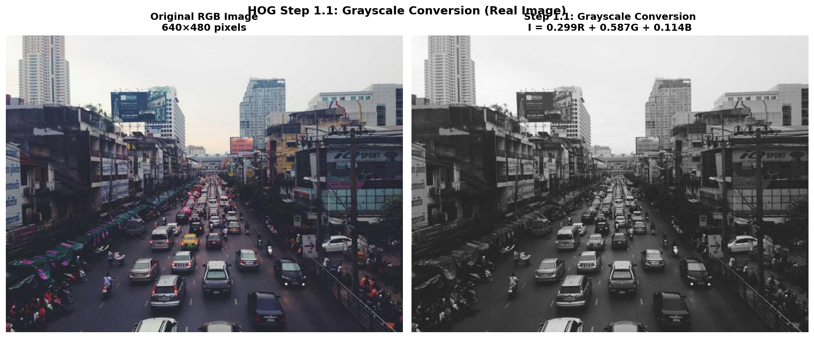
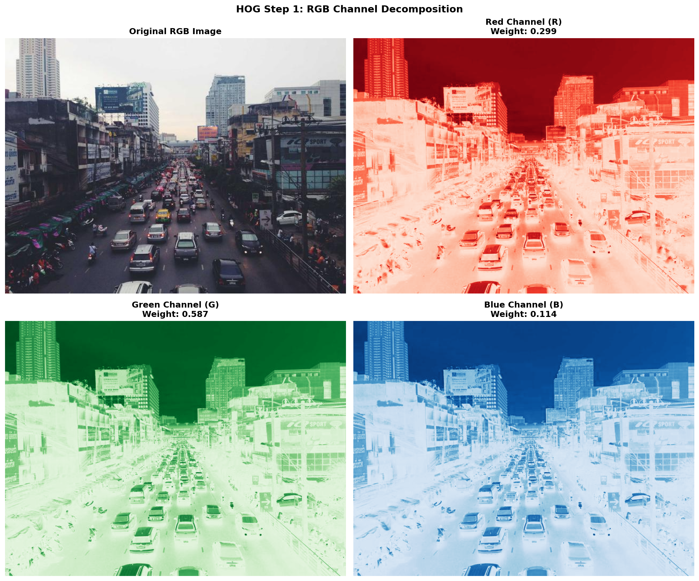

### Step 1.2: Gamma Correction

```
I_corrected(x,y) = I(x,y)^γ
```

where γ = 0.5 (square root) is commonly used.

**Example:**

```
Original pixels:
  I = 0.16  →  I_γ = 0.16^0.5 = 0.40
  I = 0.25  →  I_γ = 0.25^0.5 = 0.50
  I = 0.36  →  I_γ = 0.36^0.5 = 0.60
  I = 0.49  →  I_γ = 0.49^0.5 = 0.70

Effect: Dark regions enhanced, bright regions compressed.
```

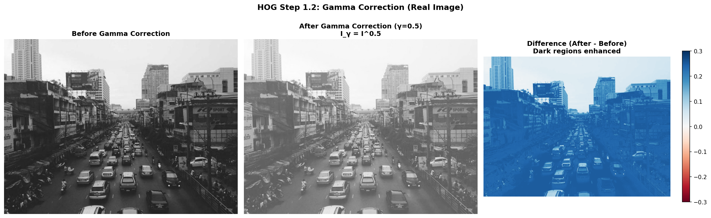
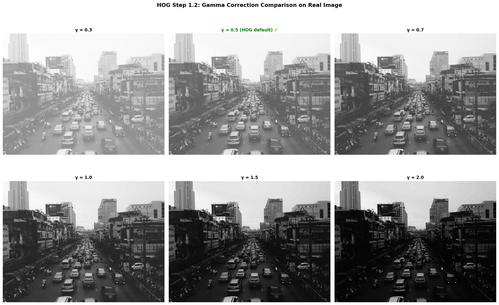

---

## Step 2: Gradient Computation

**Why?** Gradients capture edge information—the boundaries of objects.

### Understanding the 3×3 Neighborhood

```
Pixel at (x, y):

       x-1    x    x+1
      ┌─────┬─────┬─────┐
y-1   │ NW  │  N  │ NE  │
      ├─────┼─────┼─────┤
y     │  W  │  C  │  E  │   C = center pixel
      ├─────┼─────┼─────┤
y+1   │ SW  │  S  │ SE  │
      └─────┴─────┴─────┘

For HOG gradients:
  - Gx uses W and E (horizontal neighbors)
  - Gy uses N and S (vertical neighbors)
```

### Step 2.1: Horizontal Gradient (Gx)

**Formula (Central Difference):**

```
Gx(x,y) = I(x+1, y) - I(x-1, y) = E - W
```

**Kernel:** `[-1, 0, +1]`

**Detects:** Vertical edges (intensity changes left-to-right)

**Example:**

```
Image patch around (150, 200):

       x=149  x=150  x=151
      ┌──────┬──────┬──────┐
y=200 │ 0.25 │ 0.50 │ 0.75 │   ← Strong horizontal gradient!
      └──────┴──────┴──────┘

Gx(150, 200) = 0.75 - 0.25 = 0.50   ← Strong positive
```

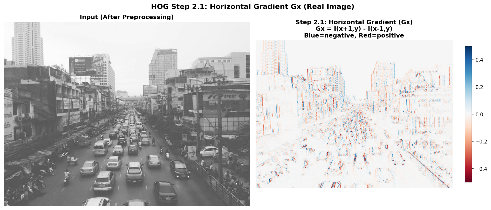

### Step 2.2: Vertical Gradient (Gy)

**Formula:**

```
Gy(x,y) = I(x, y+1) - I(x, y-1) = S - N
```

**Kernel:**
```
[-1]
[ 0]
[+1]
```

**Detects:** Horizontal edges (intensity changes top-to-bottom)

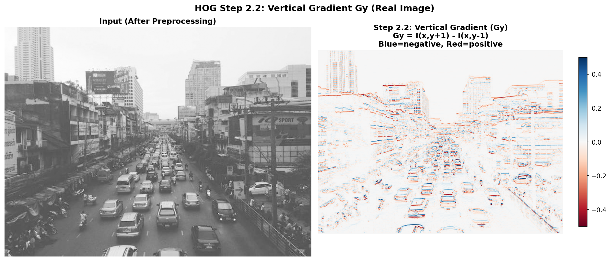
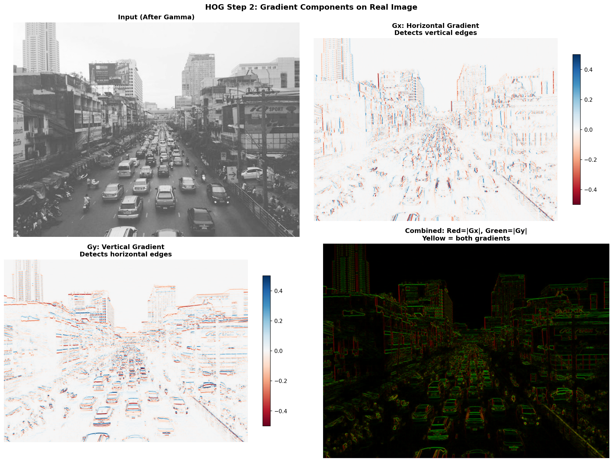

### Step 2.3: Gradient Magnitude

**Formula:**

```
M(x,y) = √(Gx(x,y)² + Gy(x,y)²)
```

**Interpretation:**
- Large M → Strong edge
- Small M → Flat region

**Example:**

```
Given: Gx = 0.50, Gy = 0.20

M(150, 200) = √(0.50² + 0.20²)
            = √(0.25 + 0.04)
            = √0.29
            = 0.539   ← Moderate-strong edge
```

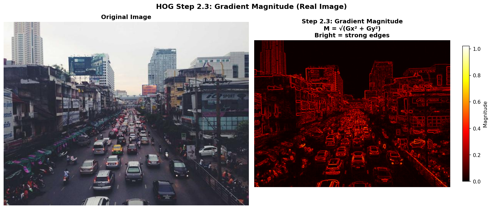

### Step 2.4: Gradient Direction (Unsigned)

**Formula:**

```
θ(x,y) = arctan(Gy / Gx) mod 180°
```

**Why unsigned (0° to 180°)?**
- A vertical dark-to-light edge (→) has θ = 0°
- A vertical light-to-dark edge (←) has θ = 180°
- Both are the SAME vertical edge! We want them in the same bin.

**Example:**

```
Given: Gx = 0.50, Gy = 0.20

θ(150, 200) = arctan(0.20 / 0.50)
            = arctan(0.40)
            = 21.8°  (nearly horizontal edge)
```

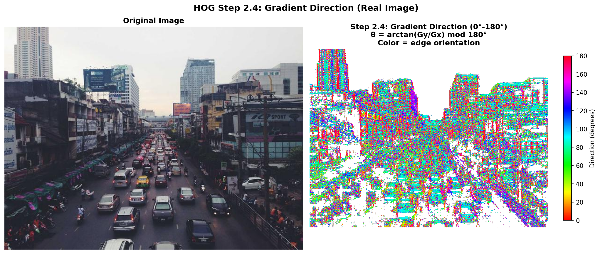
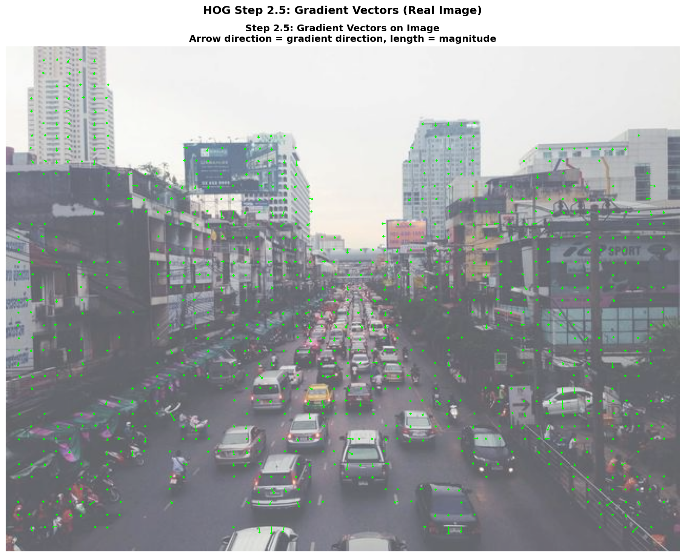

---

## Step 3: Cell Histograms

### Step 3.1: Divide Image into 8×8 Cells

```
Image: 640 × 480 pixels
Cell:  8 × 8 pixels

Cells per row:    640 ÷ 8 = 80 cells
Cells per column: 480 ÷ 8 = 60 cells
Total cells:      80 × 60 = 4800 cells
```

**Visual:**

```
Image (640 × 480):
┌───┬───┬───┬───┬───┬───┬─ ... ─┬───┬───┐
│0,0│1,0│2,0│3,0│4,0│5,0│       │78,0│79,0│  ← 80 cells wide
├───┼───┼───┼───┼───┼───┼─ ... ─┼───┼───┤
│   │   │   ...  (60 cells tall)  ...   │
└───┴───┴───┴───┴───┴───┴─ ... ─┴───┴───┘

Each cell: 8×8 = 64 pixels
```

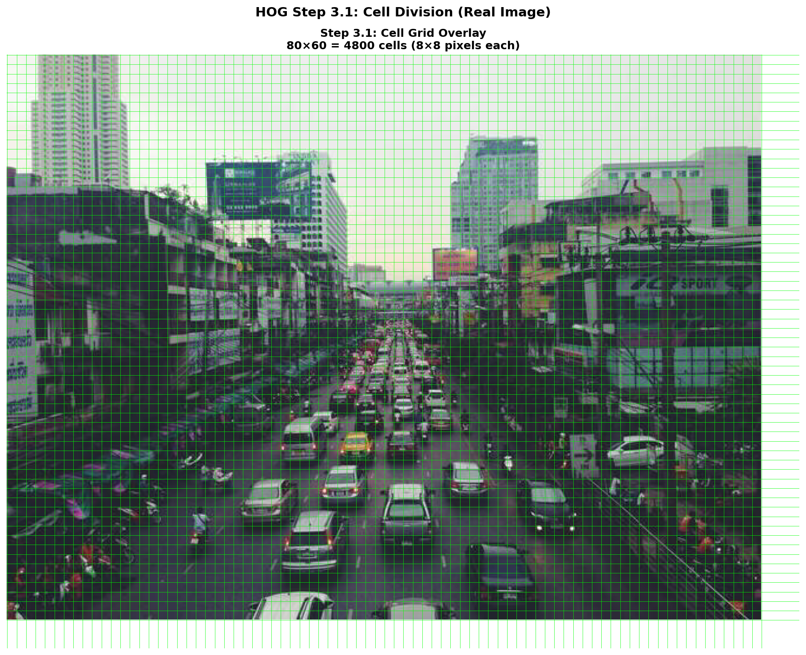

### Step 3.2: Single Cell Analysis

Each cell contains 64 pixels with gradient (M, θ) pairs:

```
Cell (40, 30) has 64 pixels:
┌─────────────────────────────────────────────────────────────┐
│ Pixel      Magnitude   Direction                            │
├─────────────────────────────────────────────────────────────┤
│ (320,240)     0.13        7.6°                              │
│ (321,240)     0.15       24.0°                              │
│ (322,240)     0.20       50.2°                              │
│ ...                                                         │
│ (64 pixels total)                                           │
└─────────────────────────────────────────────────────────────┘

These 64 (M, θ) pairs → 9-bin histogram
```

### Step 3.3: 9-Bin Histogram Structure

**Parameters:**
- Range: 0° to 180° (unsigned)
- Bins: 9
- Bin width: 180° ÷ 9 = 20°

```
Bin   Range          Center
───   ─────────────  ──────
 0    [0°, 20°)       10°
 1    [20°, 40°)      30°
 2    [40°, 60°)      50°
 3    [60°, 80°)      70°
 4    [80°, 100°)     90°
 5    [100°, 120°)   110°
 6    [120°, 140°)   130°
 7    [140°, 160°)   150°
 8    [160°, 180°)   170°
```

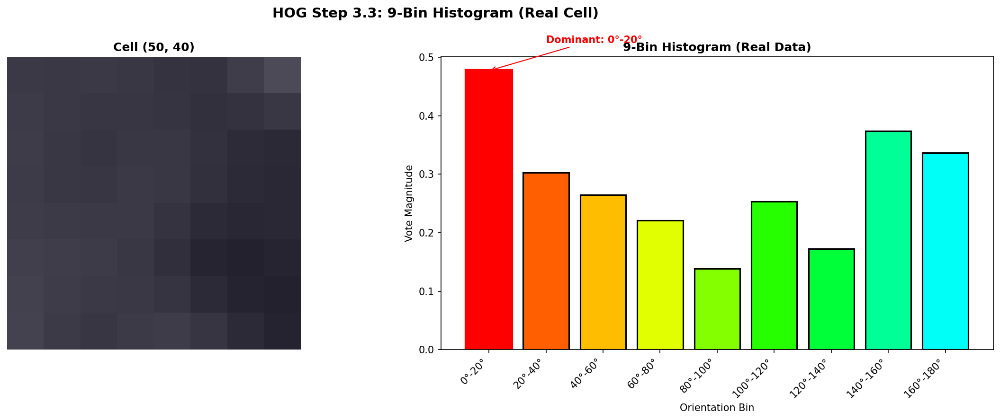

### Step 3.4: Voting Process - Bilinear Interpolation

**Why bilinear interpolation?**
- Hard binning (all vote to one bin) causes aliasing
- Soft binning (vote split between bins) is smoother

**Formula:**

```
bin_index = θ / 20

lower_bin = floor(bin_index) mod 9
upper_bin = (lower_bin + 1) mod 9

upper_weight = bin_index - floor(bin_index)
lower_weight = 1 - upper_weight

Histogram[lower_bin] += M × lower_weight
Histogram[upper_bin] += M × upper_weight
```

### Example 1: Pixel with θ = 35°, M = 0.40

```
Step 1: bin_index = 35 / 20 = 1.75

Step 2: Find bins
  lower_bin = floor(1.75) = 1   → [20°, 40°)
  upper_bin = 2                 → [40°, 60°)

Step 3: Compute weights
  upper_weight = 1.75 - 1 = 0.75
  lower_weight = 1 - 0.75 = 0.25

Step 4: Add votes
  Histogram[1] += 0.40 × 0.25 = 0.10
  Histogram[2] += 0.40 × 0.75 = 0.30

Visual:
  θ = 35° is 75% toward bin 2 center from bin 1 center
  So 75% vote goes to bin 2, 25% to bin 1
```

### Example 2: Wraparound at θ = 170°

```
bin_index = 170 / 20 = 8.5

lower_bin = 8    → [160°, 180°)
upper_bin = 9 mod 9 = 0 → [0°, 20°) ← WRAPS AROUND!

Why? Because 180° = 0° (opposite directions = same edge)
```

### Complete Cell Histogram Example

```
Final Histogram for Cell (40, 30):
┌─────┬─────────┬─────────────────────┐
│ Bin │  Value  │ Dominant Edge Dir   │
├─────┼─────────┼─────────────────────┤
│  0  │  1.24   │ ~10° (horiz right)  │
│  1  │  0.89   │ ~30°                │
│  2  │  0.45   │ ~50°                │
│  3  │  0.78   │ ~70°                │
│  4  │  2.31   │ ~90° (vertical!) ← PEAK
│  5  │  0.92   │ ~110°               │
│  6  │  0.56   │ ~130°               │
│  7  │  0.38   │ ~150°               │
│  8  │  0.87   │ ~170° (horiz left)  │
└─────┴─────────┴─────────────────────┘

This cell has strong vertical edges (Bin 4 highest)
```

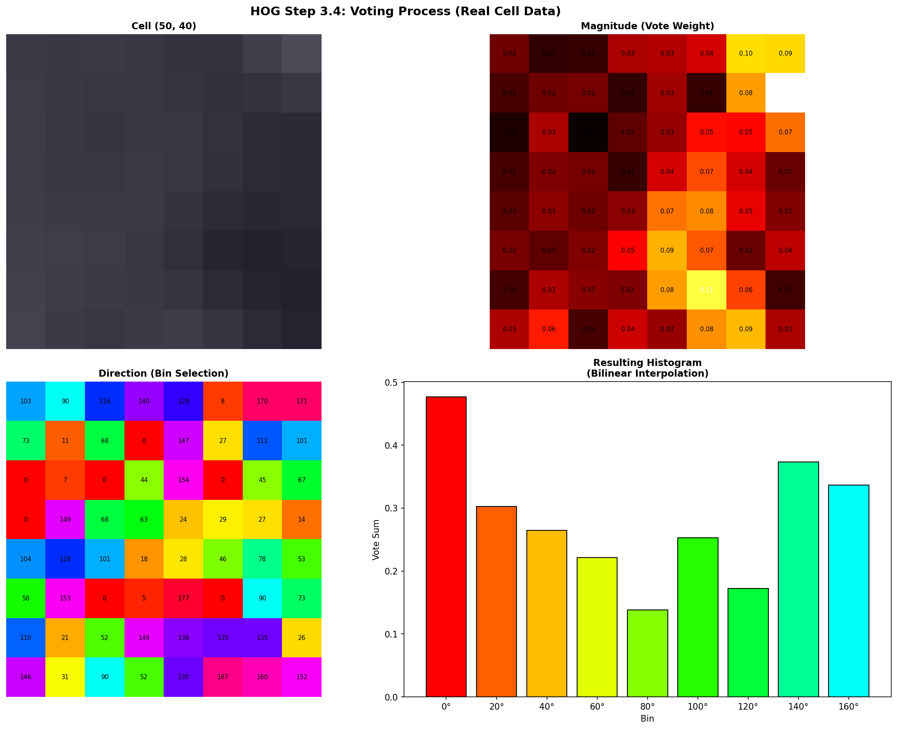
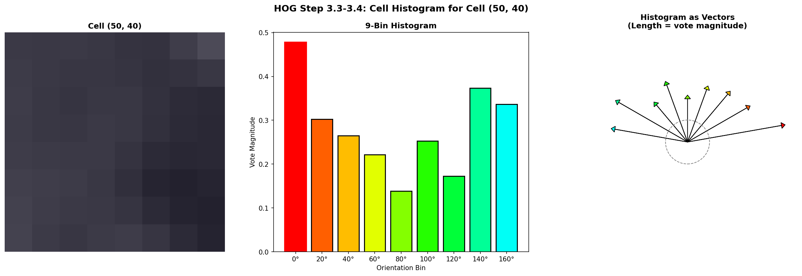

### Step 3.5: Compression Achieved

```
INPUT:
  - 640 × 480 pixels × 2 values (M, θ)
  - Total: 614,400 gradient values

OUTPUT:
  - 4800 cells × 9 bins
  - Total: 43,200 histogram values

COMPRESSION: 14.2:1

PRESERVED: Edge orientations, strengths, spatial layout
LOST: Exact pixel positions, fine gradient details
```

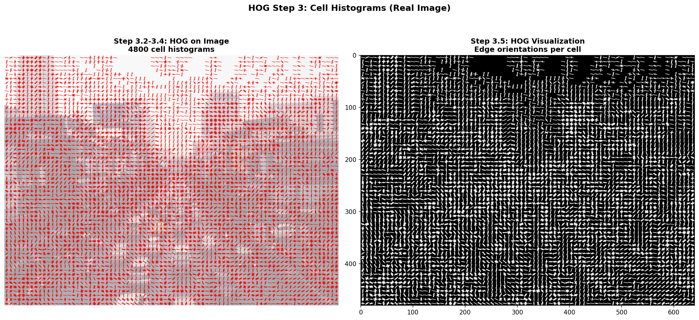
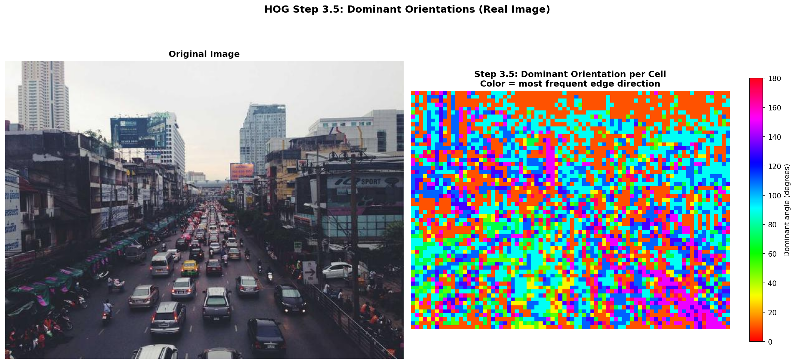

---

## Step 4: Block Normalization

**Why normalize?** Different lighting produces different gradient magnitudes. Normalization makes HOG invariant to illumination.

### Step 4.1: Block Definition (2×2 cells)

```
Block = 2 × 2 cells = 16 × 16 pixels

Each cell has 9 histogram bins.
Block vector = [Cell(0,0) | Cell(1,0) | Cell(0,1) | Cell(1,1)]
             = [9 bins | 9 bins | 9 bins | 9 bins]
             = 4 × 9 = 36 values per block
```

```
┌─────────────┬─────────────┐
│  Cell (0,0) │  Cell (1,0) │
│   9 bins    │   9 bins    │
├─────────────┼─────────────┤
│  Cell (0,1) │  Cell (1,1) │
│   9 bins    │   9 bins    │
└─────────────┴─────────────┘

Block vector = 36 values
```

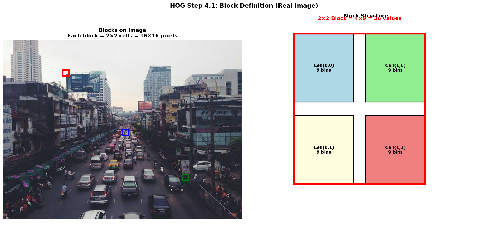
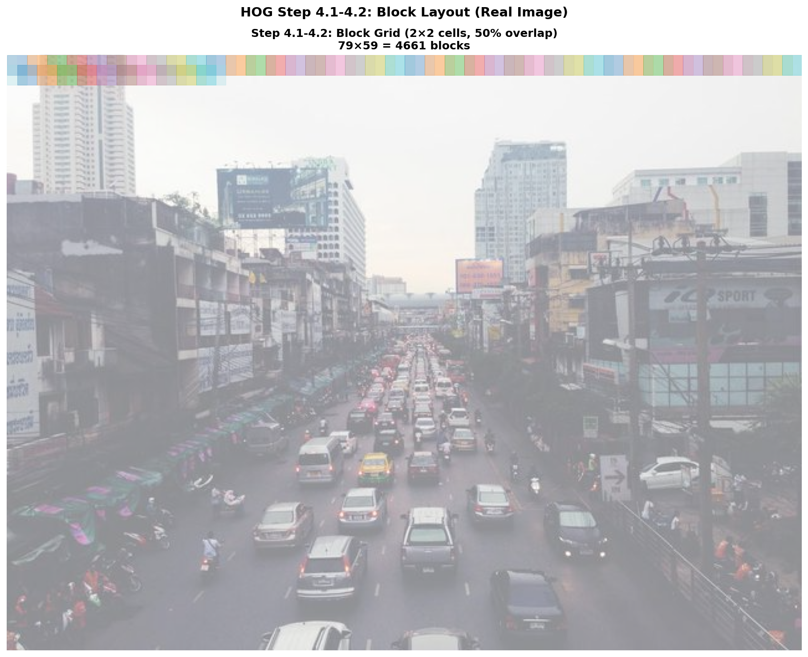

### Step 4.2: 50% Block Overlap

**Why overlap?** Each cell contributes to multiple blocks, providing redundancy.

```
Stride = 1 cell (50% overlap)

cells_x = 80 cells
cells_y = 60 cells
block_size = 2 cells

blocks_x = 80 - 2 + 1 = 79
blocks_y = 60 - 2 + 1 = 59

Total blocks = 79 × 59 = 4661 blocks
```

```
Cells:     C0    C1    C2    C3    C4    ...
           ├────┴────┤
           ← Block 0 →
                 ├────┴────┤
                 ← Block 1 →

Each cell (except edges) appears in 4 different blocks!
```

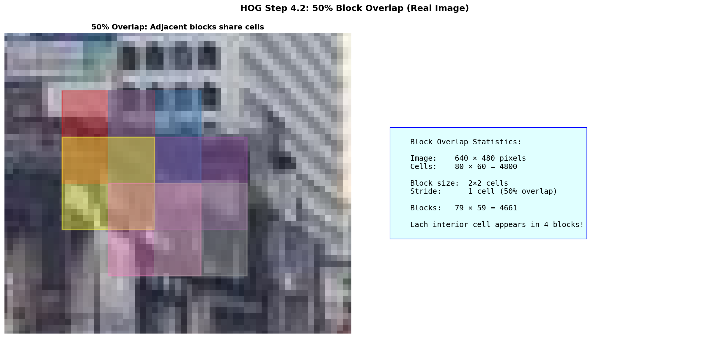

### Step 4.3: L2 Normalization

**Formula:**

```
v_normalized = v / √(‖v‖₂² + ε²)

where:
  v = 36-element block vector
  ‖v‖₂ = √(Σᵢ vᵢ²) = L2 norm
  ε = 1e-6 (small constant for numerical stability)
```

### Example: Normalizing a Block

```
Step 1: Extract 4 cell histograms
  Cell (40, 30): [1.24, 0.89, 0.45, 0.78, 2.31, 0.92, 0.56, 0.38, 0.87]
  Cell (41, 30): [0.95, 1.12, 0.67, 0.82, 1.89, 0.74, 0.48, 0.52, 0.93]
  Cell (40, 31): [1.08, 0.76, 0.54, 0.91, 2.05, 0.88, 0.61, 0.45, 0.79]
  Cell (41, 31): [0.88, 0.94, 0.72, 0.85, 1.76, 0.69, 0.53, 0.58, 0.86]

Step 2: Concatenate into 36-element vector
  v = [1.24, 0.89, 0.45, ..., 0.58, 0.86]

Step 3: Compute L2 norm
  ‖v‖₂ = √(1.24² + 0.89² + ... + 0.86²) = 5.34

Step 4: Normalize
  v_normalized = v / 5.34
               = [0.232, 0.167, 0.084, ..., 0.109, 0.161]

Step 5: Verify
  ‖v_normalized‖₂ ≈ 1.0 ✓
```

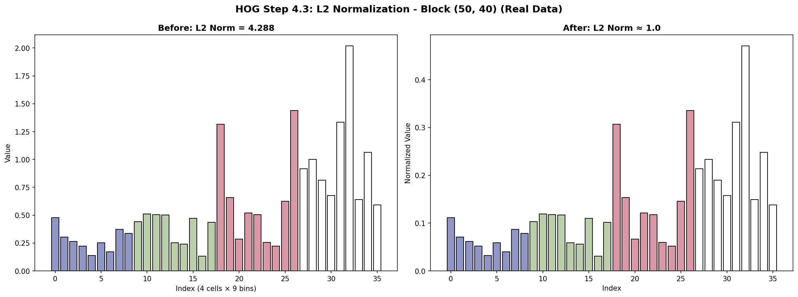
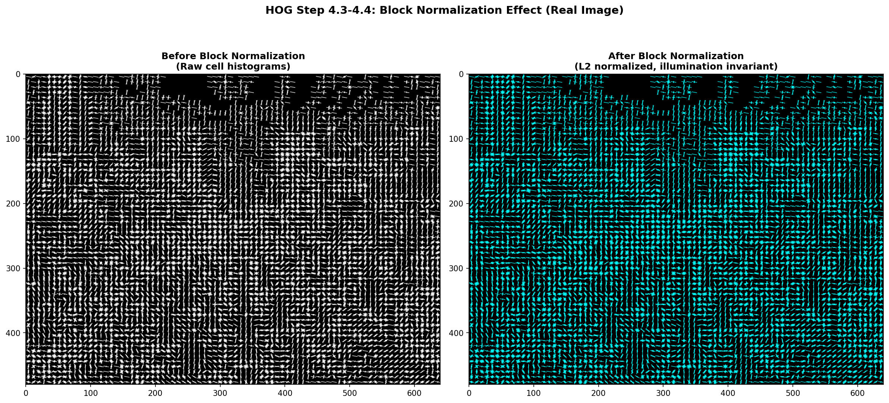

### Step 4.4: Illumination Invariance

**Key insight:** If brightness changes by factor k, gradients scale by k, but normalized vectors stay the same!

```
Original image: I(x,y)
Brighter image: I'(x,y) = k × I(x,y)  where k > 1

Gradients scale:
  Gx' = k × Gx
  Gy' = k × Gy

Magnitude scales:
  M' = k × M

Histogram scales:
  H' = k × H

L2 Norm scales:
  ‖H'‖₂ = k × ‖H‖₂

After L2 Normalization:
  H'_normalized = (k×H) / (k×‖H‖₂)
                = H / ‖H‖₂
                = H_normalized  ← SAME AS ORIGINAL!

CONCLUSION: L2 normalization cancels brightness scaling!
```

### Numerical Example

```
Same scene, two lighting conditions:

DARK SCENE (k = 0.5):
  Cell histogram: [0.62, 0.45, 0.23, ...]
  ‖H‖₂ = 2.67
  Normalized: [0.232, 0.169, 0.086, ...]

BRIGHT SCENE (k = 1.5):
  Cell histogram: [1.86, 1.34, 0.68, ...]  (3× dark)
  ‖H‖₂ = 8.01 (3× dark)
  Normalized: [0.232, 0.167, 0.085, ...]  ← NEARLY IDENTICAL!

The normalized vectors match despite 3× brightness difference!
```

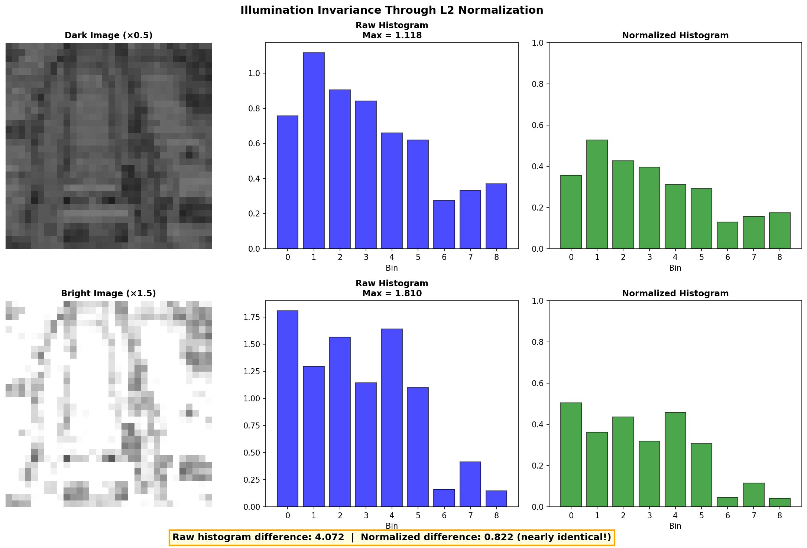

### Step 4.5: Final Descriptor Assembly

```
Total blocks: 79 × 59 = 4661 blocks
Values per block: 36

HOG Descriptor = [Block(0,0) | Block(1,0) | ... | Block(78,58)]
               = 4661 × 36 = 167,796 dimensions
```

```
HOG Descriptor (167,796-D):
┌────────────────────────────────────────────────────────────────────┐
│ Block 0    │ Block 1    │ Block 2    │ ... │ Block 4660           │
│ (36 values)│ (36 values)│ (36 values)│     │ (36 values)          │
├────────────┼────────────┼────────────┼─────┼──────────────────────┤
│ [0-35]     │ [36-71]    │ [72-107]   │ ... │ [167760-167795]      │
└────────────┴────────────┴────────────┴─────┴──────────────────────┘
```

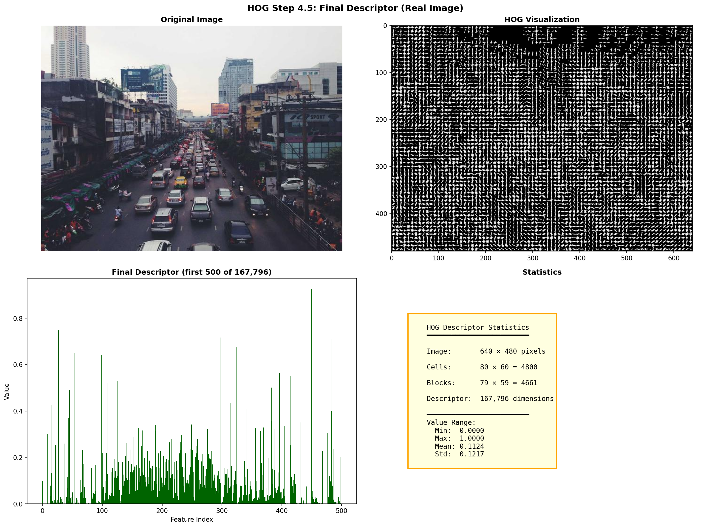

---

## Complete Pipeline Summary

```
HOG ALGORITHM COMPLETE PIPELINE
━━━━━━━━━━━━━━━━━━━━━━━━━━━━━━━━━━━━━━━━━━━━━━━━━━━━━━━━━━━━━━━━━━━━━━━━━

INPUT: RGB Image (640 × 480 × 3 = 921,600 values)
       ↓
STEP 1: Preprocessing
       • Grayscale: 640 × 480 = 307,200 values
       • Gamma correction: I^0.5
       ↓
STEP 2: Gradient Computation
       • Gx, Gy at each pixel
       • M = √(Gx² + Gy²)
       • θ = arctan(Gy/Gx) mod 180°
       • Output: 614,400 gradient values
       ↓
STEP 3: Cell Histograms
       • Divide into 8×8 cells: 80 × 60 = 4800 cells
       • 9-bin histogram per cell (bilinear interpolation)
       • Output: 43,200 histogram values
       ↓
STEP 4: Block Normalization
       • 2×2 blocks with 50% overlap: 79 × 59 = 4661 blocks
       • L2 normalization per block
       • Output: 167,796 normalized values
       ↓
OUTPUT: 167,796-D HOG Descriptor

COMPRESSION: 921,600 → 167,796 (5.5:1 ratio)
━━━━━━━━━━━━━━━━━━━━━━━━━━━━━━━━━━━━━━━━━━━━━━━━━━━━━━━━━━━━━━━━━━━━━━━━━
```


---

## Comparison: HOG vs SIFT

| Feature | HOG | SIFT |
|---------|-----|------|
| **Purpose** | Object detection | Feature matching |
| **Descriptor type** | Dense (entire window) | Sparse (keypoints) |
| **Dimension** | 167,796-D (for 640×480) | 128-D per keypoint |
| **Gradient bins** | 9 bins (0°-180°) | 8 bins (0°-360°) |
| **Scale invariance** | No (needs multi-scale) | Yes (built-in) |
| **Rotation invariance** | No | Yes |
| **Normalization** | L2 per 2×2 block | L2 per descriptor |
| **Use case** | "Is there a person?" | "Find this object" |

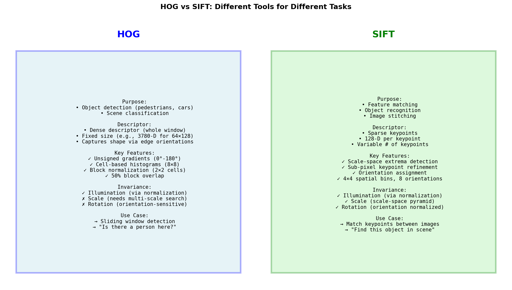

---

## Object Detection with HOG

```
HOG + SVM Pedestrian Detection:

1. TRAINING:
   • Collect positive examples (pedestrian windows 64×128)
   • Collect negative examples (background windows)
   • Extract HOG descriptor from each
   • Train SVM classifier

2. DETECTION:
   • Slide 64×128 window across image
   • At each position, extract HOG descriptor
   • Classify with SVM
   • If positive with high confidence → Detection!

3. POST-PROCESSING:
   • Non-maximum suppression
   • Output final bounding boxes
```

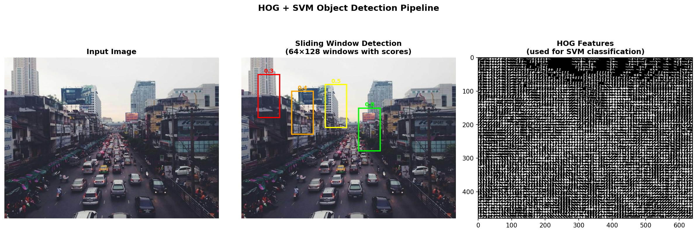

---

## Mathematical Summary

### Derivative Formulas

| Formula | Description |
|---------|-------------|
| `Gx = I(x+1,y) - I(x-1,y)` | Horizontal gradient (central difference) |
| `Gy = I(x,y+1) - I(x,y-1)` | Vertical gradient (central difference) |
| `M = √(Gx² + Gy²)` | Gradient magnitude |
| `θ = arctan(Gy/Gx) mod 180°` | Gradient direction (unsigned) |

### Histogram Construction

| Formula | Description |
|---------|-------------|
| `bin_width = 180° / 9 = 20°` | Angular resolution |
| `bin_idx = θ / bin_width` | Continuous bin index |
| `lower_weight = 1 - (bin_idx - floor(bin_idx))` | Interpolation weight |
| `H[bin] += M × weight` | Vote accumulation |

### Block Normalization

| Formula | Description |
|---------|-------------|
| `‖v‖₂ = √(Σᵢ vᵢ²)` | L2 norm |
| `v_norm = v / √(‖v‖₂² + ε²)` | L2 normalization with stability |

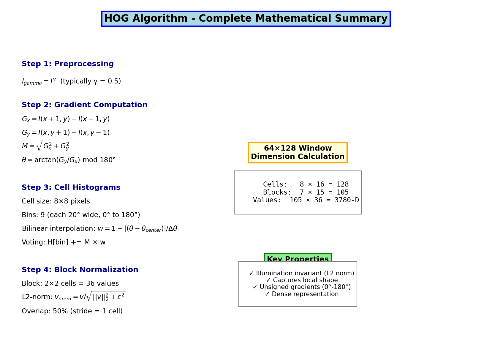

---

## References

1. Dalal, N., & Triggs, B. (2005). "Histograms of oriented gradients for human detection." CVPR 2005.
2. Felzenszwalb, P. F., et al. (2010). "Object detection with discriminatively trained part-based models." PAMI 2010.
